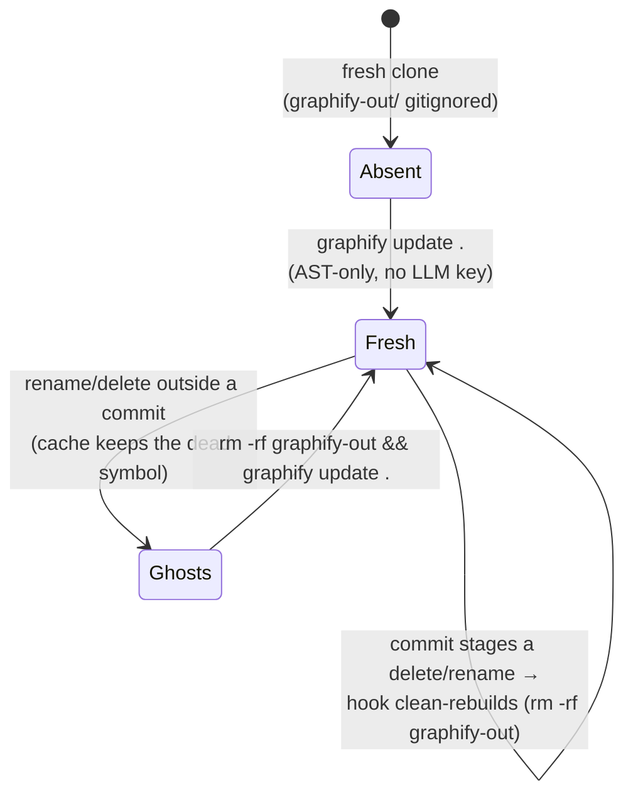

# /graphify (Estormi)

Tree-sitter-driven knowledge graph over the repo. Complements the area
skills (`infra`, `ingestion`, `mcp-server`, `testing`, `web-ui`, `mobile`):
**they own *how* to change a subsystem; this skill owns *finding* what's
related.** Reach for it for "where is X", "what calls Y", "what touches
the briefing pipeline" — not for "how do I add a new connector" (that's
the `ingestion` skill).

## Usage

```
/graphify                                        # build the graph for the repo
/graphify <path>                                 # build for a subfolder
/graphify update <path>                           # incremental — re-extract changed files
/graphify query "<question>"                     # BFS traversal — broad context
/graphify query "<question>" --dfs               # DFS — trace a specific path
/graphify path "<from>" "<to>"                   # shortest path between two symbols
/graphify explain "<symbol>"                     # plain-language explanation of a node
```

`graphify-out/` is **local-only and gitignored** (the graph embeds absolute
build paths, so it is never committed — see `.gitignore`). A fresh clone has no
graph until you build one. Treat `graphify query` as the default for code
questions in this repo.

## Estormi-specific defaults

Run from the repo root. The walker honours `.gitignore`, so the heavy
Estormi noise dirs are already excluded with no flags — a fresh graph
carries **zero** nodes from `apps/estormi-macos/target`, `.claude/worktrees`,
`packages/web-ui/node_modules`, `packages/web-ui/dist`,
`apps/estormi-ios/build*`, or `data/`. Don't hand-pass excludes — the walker
honours `.gitignore`, and there is no `--exclude` flag on any subcommand.

## Graph lifecycle

One canonical picture of how the graph is born, kept fresh, and self-heals:



**Why ghosts happen:** `graphify update` is incremental — it merges into the
existing `graph.json` and reuses `graphify-out/cache/`, so it never
garbage-collects symbols whose code was renamed or deleted (even `--force`
keeps them, because it reuses the cache). Symptom: a query surfaces a path that
no longer exists (`git ls-files | grep <path>` → nothing). The cure is the
cache-free rebuild above. `.githooks/pre-commit` runs it automatically on any
commit that stages a deletion or rename — and keeps `graph.json` /
`GRAPH_REPORT.md` in sync with HEAD on every other commit (AST-only, no LLM
key) once `scripts/setup-graphify-skill.sh` has set `core.hooksPath`. So
day-to-day the graph self-heals; you only rebuild by hand after editing between
commits.

## What You Must Do When Invoked

If the user passed `--help` / `-h`, print the Usage block above and stop.

If no path was given, default to the **repo root** (the directory
containing this `.claude/`). Do not ask.

**Fast path — existing graph:** if `graphify-out/graph.json` exists at
the repo root AND the user's request is a natural-language question
about the code, run `graphify query "<question>"` straight away. Skip
everything else.

Otherwise:

1. **Ensure graphify is installed.** Try `.venv/bin/graphify` first (the
   project venv is the canonical install), then `command -v graphify`.
   If neither resolves, point the user at `scripts/setup-graphify-skill.sh`
   — it installs the CLI, sets `core.hooksPath = .githooks` (so the
   pre-commit hook fires), and seeds `graphify-out/graph.json` in one shot.
   Don't `pip install` ad-hoc.
2. **Build only if needed.** If `graphify-out/graph.json` is missing
   (it's gitignored, so a fresh clone has none), run `graphify update .`
   (AST-only, no LLM). Otherwise jump to step 3.
3. **Answer.** Run the matching subcommand (`query`, `path`, `explain`).
4. **Be honest about confidence.** Graphify tags edges as
   `EXTRACTED` / `INFERRED` / `AMBIGUOUS` — surface that distinction in
   your answer rather than treating all edges as ground truth.

## Common Estormi queries this skill handles well

- "Where does `search_memory` get called from?"
- "What modules does the Briefing engine depend on?"
- "Trace the data flow from `ingest_chunk` to the SPA's source view."
- "Show me all consumers of `_corpus_for_source`."
- "Which connector specs are registered with `ConnectorRegistry`?"

For changes (not lookups), hand off to the matching area skill.
