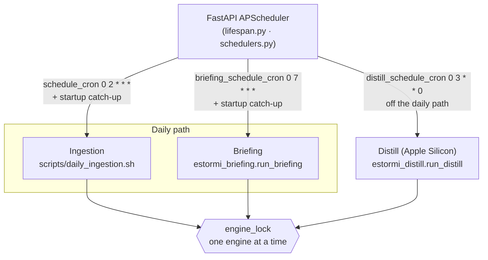

# Infrastructure & Scripts

## When to Use

- Modifying `scripts/daily_ingestion.sh`.
- Working with launchd plists in `scripts/`.
- Setting up the Distillation tooling (`scripts/setup_distill.sh` — MLX venv +
  llama.cpp converter under the data dir; see `docs/architecture/distillation.md`).
- Running health checks, smoke tests, or end-to-end validation.
- Understanding the WhatsApp Rust sidecar integration.
- Modifying the Makefile, release helpers, installer, or bundled Python setup.
- Working with ingestion pipeline logs.
- Rebuilding / installing / restarting the packaged macOS app.

## What needs a rebuild

The macOS app ships as a Tauri bundle with a bundled uvicorn sidecar, but
**the backend Python runs from the source tree** — `packages/estormi_server/server/jobs.py`
resolves `ROOT` from `ESTORMI_REPO_ROOT` when set, otherwise from
`Path(__file__).resolve().parent.parent.parent.parent` (four `.parent` hops:
`jobs.py` is four levels below the repo root). So:

| Edit | Action |
|---|---|
| `packages/estormi_ingestion/**`, `scripts/**`, `packages/connectors/**`, `prompts/**` | Hot — next pipeline run picks them up. No rebuild. |
| `packages/estormi_server/**` | Sidecar restart needed — run `zsh scripts/build.sh`. The uvicorn process is bundled and long-lived. |
| `packages/web-ui/**`, `packages/ui-kit/**` | Rebuild — Vite output is baked into the bundle. `zsh scripts/build.sh` runs `make bundle` which depends on `frontend-build`. |
| `assets/**` (brand, fonts, source-icons) | Rebuild — bundled as Tauri resources; `zsh scripts/build.sh` re-copies them into the app. |
| `packages/memory_core/**` | Sidecar restart (same as `packages/estormi_server/**`). |
| `apps/estormi-macos/**` | Full rebuild. |
| `apps/estormi-ios/**` | Native SwiftUI build — `cd apps/estormi-ios && xcodegen generate && open Estormi.xcodeproj` (then ⌘R in Xcode). Not part of the macOS bundle. |

`zsh scripts/build.sh` is the canonical rebuild entry.
It runs `make bundle` (Vite + Tauri), kills the running app via
`pkill -f '/Applications/Estormi.app'` (also kills any in-flight pipeline run
under the bundled Python — fine for normal rebuilds), copies the new
`.app` to `/Applications/`, and relaunches. Verify with
`curl http://127.0.0.1:8000/health`.

Auto-commit is opt-in via `ESTORMI_AUTO_COMMIT=1`; default is off so
half-finished work isn't swept into a `chore: pre-build sweep` commit.

## Script Inventory

| Script | Type | Purpose | Triggered by |
|---|---|---|---|
| `build.sh` | Zsh | Canonical rebuild + install + relaunch. See "What needs a rebuild" above. | Manual |
| `daily_ingestion.sh` | Bash | Source ingestion pipeline, run with bounded parallelism (the Ingestion engine) | In-app APScheduler cron + startup catch-up, sources panel, `make daily-dag` |
| `health_check.sh` | Bash | Server health check | `make health` |
| `freshness_check.py` | Python | Per-source freshness check | `make health` |
| `smoke_test.py` | Python | Quick API/search validation | `make test-local` |
| `test_suite.sh` | Bash | Installed-machine validation | `make test-suite` |
| `reset_data.py` | Python | Wipe Qdrant collection + truncate chunks | `make reset` |
| `install.sh` | Bash | Installs the prebuilt `Estormi.app` (strips quarantine, copies to `/Applications`, launches); staged into `dist/Estormi.zip` by `make bundle` | Manual / zip |
| `setup.sh` | Bash | Environment setup helper | Manual |
| `setup_branch_protection.sh` | Bash | Apply GitHub branch protection to `main` (one-time, maintainer) | Manual (`./scripts/setup_branch_protection.sh <owner>/<repo>`) |
| `setup_distill.sh` | Bash | Install the optional Distill engine's deps (Apple Silicon, one-time) | Manual; see `docs/architecture/distillation.md` |
| `run_prompt.sh` | Bash | Runs companion prompts through Claude CLI | `make prompt-*` |
| `weekly_report.sh` | Bash | Weekly prompt/report generation | Optional launchd |
| `qa_metrics.py` | Python | Writes coverage + QA badges from coverage JSON | `make test-metrics`; CI `python-full` |
| `security_scan.py` | Python | Regex scan for personal identifiers, French mobile numbers, and short token-like secrets in staged/committed files | `security.yml`, manual |
| `detect_secrets_gate.py` | Python | Pre-commit / CI secret detection gate | pre-commit, `security.yml` |
| `gen_openapi.py` | Python | Regenerate `docs/specs/openapi.json` from the live FastAPI app; `--check` exits 1 if the committed spec is stale | `make openapi` / `openapi-check`, CI |
| `generate_caps.py` | Python | Render illuminated drop-cap SVGs for the design system | Manual |
| `generate_icons.sh` | Bash | Generate the macOS iconset + `icon.icns` in `apps/estormi-macos/icons/` from `assets/brand/estormi-app-icon.png` | `make bundle` |
| `fix_python_shebangs.sh` | Bash | Rewrite bundled-Python shebangs to point at the correct interpreter path | `make bundle-python` |
| `setup-graphify-skill.sh` | Bash | Install the graphify CLI into `.venv`, set `core.hooksPath=.githooks`, and seed `graphify-out/graph.json` (AST-only) | Manual |
| `vendor_fonts.py` | Python | Download and vendor web fonts into `assets/fonts/` | Manual |

## Engines & scheduling

Three engines (`ENGINES = ("ingestion", "briefing", "distill")` in
`packages/estormi_server/server/jobs.py`) are all serialized through one
DB-backed mutex (`memory_core.engine_lock`) — only one runs at a time. The
FastAPI APScheduler owns every cron; each engine runs as a child process.
Canonical reference: `docs/architecture/engines.md`.



A briefing composes identically whether or not Distill has ever run. The
sources panel and `make daily-dag` also trigger Ingestion on demand.

### Source ingestion pipeline

The Ingestion engine dispatches stages through the connector registry:
`daily_ingestion.sh` derives its stage list from `python -m connectors stages`
and runs each via `python -m connectors run <stage>`.

Ingestion-script paths below are under `packages/estormi_ingestion/`:

| `dag_order` | Stage | Default | Ingestion script |
|:---:|---|:---:|---|
| 1 | `notes` | yes | `packages/estormi_ingestion/apple_notes/watch_and_ingest.sh` |
| 2 | `mail` | yes | `packages/estormi_ingestion/apple_mail/watch_and_ingest.sh` |
| 4 | `gcal` | no | `packages/estormi_ingestion/google_calendar/sync.py` |
| 5 | `reminders` | yes | `packages/estormi_ingestion/reminders/watch_and_ingest.sh` |
| 6 | `imessage` | yes | `packages/estormi_ingestion/imessage/watch_and_ingest.sh` |
| 7 | `whatsapp` | yes | `packages/estormi_ingestion/whatsapp/watch_and_ingest.sh` |
| 8 | `documents` | yes | `packages/estormi_ingestion/documents/ingest_documents.py` |
| 11 | `knowledge` | yes | `packages/estormi_ingestion/knowledge/ingest_world.py` (world corpus: RSS / YouTube) |
| 12 | `whoop` | no | `packages/estormi_ingestion/whoop/sync.py` |

The default nightly pipeline runs the **seven** stages marked *default*.
`gcal` and `whoop` carry `default_stage=False`, so they run only on demand
(`connectors stages --all` lists all nine). The `knowledge` stage ingests the
external *world* corpus and **is** a source stage — distinct from the Briefing
composition engine (`estormi_briefing.run_briefing`), which is not a pipeline
stage.

## Pipeline Logs

`daily_ingestion.sh` writes logs under `$ESTORMI_DATA_DIR/logs/`:

```text
estormi-daily-dag.log                       # canonical live log (rotated at the start of each run)
estormi-daily-dag-error.log                 # stderr/error log (surfaced by the UI's "Open error log" button)
estormi-stage-YYYYMMDD-HHMMSS-<stage>.log   # per-stage log
```

Run/stage *state* is recorded in the canonical `dag_runs` / `dag_stages`
SQLite tables via the `memory_core.dag_state` CLI. The Ingestion-page pipeline
widget and `GET /api/pipeline` read those tables (`packages/estormi_server/services/pipeline_status.py`),
not the raw logs. The cross-process "one engine at a time" guard is the
DB-backed `engine_lock` (`memory_core.engine_lock`) — the shell DAG and the
server both acquire it, replacing the former `/tmp` pid file.

## Key Environment Variables

```bash
ESTORMI_DATA_DIR              # Data directory
MCP_SERVER_URL               # API endpoint used by ingestion scripts
MCP_SERVER_HOST              # Source-server Uvicorn host before startup
MCP_SERVER_PORT              # Source-server Uvicorn port before startup
STAGES                       # Space-separated pipeline stages
PY                           # Python interpreter path
WHATSAPP_SYNC_ONCE           # Whether WhatsApp stage triggers bounded sidecar sync
WHATSAPP_SYNC_ONCE_SECONDS   # Bounded WhatsApp sync duration
ESTORMI_WHATSAPP_ALWAYS_ON    # Keep WhatsApp sidecar bot running continuously
DAG_LOG_DIR                  # Directory read by pipeline log parser
```

## launchd Agents

The daily ingestion pipeline is **not** a launchd agent. It is scheduled in-process by the
FastAPI server's APScheduler (default cron `0 2 * * *`), with a startup
catch-up in `packages/estormi_server/server/lifespan.py` for the case the app wasn't running
at cron time. This keeps the pipeline's macOS-permission grants attributed to
Estormi rather than a detached launchd job — see the permission preflight in
`packages/estormi_server/server/permission_preflight.py`. `make install-agents` retires any
previously-installed `app.estormi.local.daily-dag` agent.

The one remaining optional launchd plist lives in `scripts/`:

| Plist | Purpose |
|---|---|
| `app.estormi.local.weekly-report.plist` | Runs `weekly_report.sh` |

Manage it through the Makefile:

```bash
make install-agents
make agents
make uninstall-agents
```

## WhatsApp Integration

WhatsApp is handled by the `apps/estormi-macos/src/whatsapp/` module, a `whatsapp-rust`
task inside the Tauri binary. It exposes a local Axum API at `127.0.0.1:9877`.

The ingestion shell triggers `/api/whatsapp/sync-once` by default, then ingests
staged `.txt` and `.meta.json` files through `ingest_conversations.py`.

## Makefile Targets

```bash
make start             # Start FastAPI from source
make health            # Health + freshness checks
make daily-dag         # Run the source ingestion pipeline
make test              # Pytest with coverage
make test-suite        # Installed-machine validation
make lint              # Ruff check and format check
make bundle-python     # Build bundled Python runtime
make bundle            # Build unsigned local app bundle/zip
make tag V=vX.Y        # Update badge, commit, tag, push (the Release workflow then builds + publishes the DMG)
```

## How to Add a New Pipeline Stage

A new stage *is* a new data source: the connector registry
(`packages/connectors/`) is the single source of truth and `daily_ingestion.sh`
hardcodes nothing. Follow the **"How to Add a New Data Source"** recipe in the
`ingestion` skill — register a `ConnectorSpec` with `dag_stage=True` and a
`dag_order`, then run `make test`.

## CI Workflows

GitHub Actions are split by stack so each PR runs a focused, fast subset. The
repo is **public**, so standard GitHub-hosted runners are **free with unlimited
minutes** — minutes are no longer a budget constraint. Jobs stay path-filtered
and split for **fast feedback and low noise** (not cost), while the security and
full-coverage gates run on **every PR**.

| Workflow | Trigger | Scope |
|---|---|---|
| `.github/workflows/test.yml` | push to `main` + PR (skips docs-only) | Python lint, unit, integration, e2e, contract, runtime suite + web-ui Vitest & Playwright e2e (`frontend` job). Full-coverage (`--cov-fail-under`) runs on **every PR** and push to `main`. |
| `.github/workflows/rust.yml` | push/PR with `apps/estormi-macos/**` changes | Rust fmt, clippy, cargo-audit. Caches `cargo-audit` binary. |
| `.github/workflows/js.yml` | push/PR with `packages/web-ui/**`, `packages/ui-kit/**`, or root JS manifests | `pnpm -r typecheck` + `pnpm -r test`. |
| `.github/workflows/ios.yml` | push/PR with `apps/estormi-ios/**`, `packages/ui-kit/src/briefing.css`, or `.github/workflows/ios.yml` | `xcodegen generate` + `xcodebuild build` + `xcodebuild test` on macOS. |
| `.github/workflows/security.yml` | every PR + push + nightly schedule + `workflow_dispatch` | bandit, pip-audit, detect-secrets, TruffleHog (gating diff scan + non-gating deep `unverified` sweep — both run on every PR now). A secret/CVE must not reach `main`. |
| `.github/workflows/release.yml` | git tags `v*` + manual `workflow_dispatch` | macOS DMG build. A `v*` tag builds **and publishes** the GitHub Release (auto); a manual run only builds + uploads the DMG as an artifact (publishing is tag-only). |

Hard rules when editing CI:

- **`release.yml` publishes on tags only; never on `pull_request:` or a branch
  push.** A manual build is fine (`workflow_dispatch`, artifact only), but the
  `Publish GitHub Release` step is gated on a tag ref — a non-tag ref must never
  create a Release. (`security.yml` runs on every PR — a secret/CVE introduced
  in a PR must not reach `main`.)
- **Never duplicate the lint job.** `python-lint` in `test.yml` is the single
  ruff gate; do not re-add a standalone `lint.yml`.
- **Path-filter heavy stacks for fast feedback** (not cost — minutes are free on
  this public repo). Rust/JS/iOS jobs run when their stack changed; the nightly
  `security.yml` schedule catches dependency drift regardless.
- **`python-full` (full pytest + coverage) runs on every PR.** Public repo →
  free minutes, so the coverage gate (`--cov-fail-under`) guards every PR, not
  just merges. It only uploads artifacts (no commit), so it runs with
  least-privilege `contents: read`.
- **Workflow renames are contracts.** `tests/contract/test_quality_contracts.py`
  asserts on workflow content; update the test in the same commit.

## Known Issues

| Issue | Impact | Notes |
|---|---|---|
| `STAGES` has no preflight validation | Typos fail only when the stage runs | Add a whitelist before execution |
| Uvicorn host/port settings are startup-time values | Settings UI cannot change the bind of a running bundled sidecar | Add restart/apply flow before promising live LAN mode |
| macOS DMG build is heavy (~slow, but free on a public repo) | A manual `workflow_dispatch` build is opt-in; tag pushes publish releases | Keep it off `pull_request:`; see the "CI Workflows" rules above |
