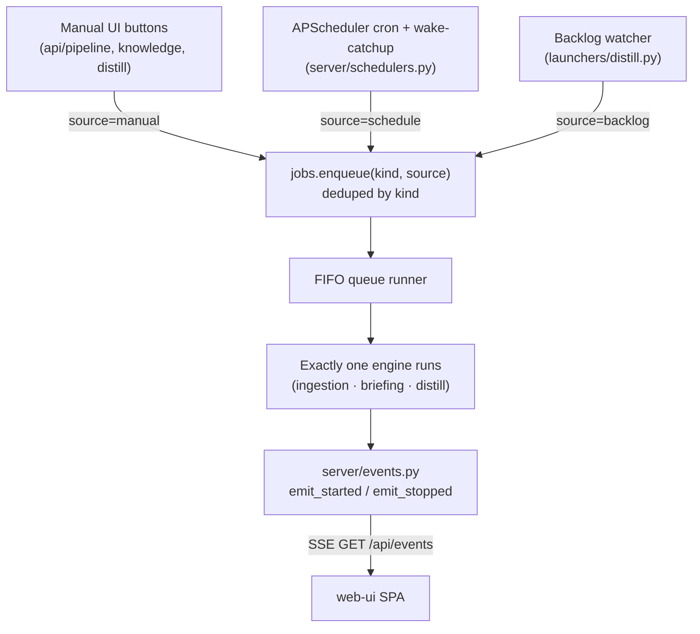

# MCP Server — Backend Development

## When to Use

- Adding or modifying MCP tools.
- Adding or changing REST endpoints (routers under `packages/estormi_server/api/`).
- Changing DB schema, queries, or search/retrieval logic.
- Working with embeddings, the local LLM, prompt sanitization, or audit logs.
- Touching server lifecycle, the security boundary, rate limiting, or jobs.

## Layout

`main.py` is a thin shell (well under 200 LOC): it loads `.env`, builds the FastAPI app,
wires the middleware / lifespan / static mounts, and `include_router`s every
module under `packages/estormi_server/api/`. Behaviour lives in four packages plus a few root modules.

### `packages/estormi_server/api/` — one router per HTTP surface

| Module | Owns |
|---|---|
| `mcp_rpc.py` | MCP JSON-RPC + SSE transport. Hosts the `TOOLS` catalog and `_dispatch_tool()`. |
| `ingest.py` / `search.py` | Plain-REST shims (`POST /ingest_chunk`, `POST /search_memory`) for pipeline scripts. |
| `knowledge.py` | Briefing engine REST (status / run / stop / log). |
| `pipeline.py` | Ingestion pipeline control endpoints (`/api/pipeline`, `/run`, `/stop`, `/stage-log`, watermark reset). |
| `jobs.py` | Engine queue endpoints (`/api/jobs/stop`, `/queue/clear`, `/queue/remove`, `/wake-catchup`, `/state`). Reads from `estormi_server.server.jobs`. |
| `events.py` | SSE stream (`GET /api/events`) carrying engine lifecycle + queue snapshots to the UI. |
| `overview.py` | Cross-engine summary metrics for the dashboard. |
| `settings.py` / `settings_ui.py` | `/api/settings`, plus the JSON endpoints behind the Settings UI. |
| `dashboard.py` | Root `/` redirect to the SPA. |
| `system.py` | `/health`, `/api/open-url`. |
| `model.py` | Local LLM model status + download. |
| `calendar_oauth.py` | Google Calendar OAuth + calendar picker. |
| `whoop_oauth.py` | WHOOP Cloud OAuth (credential upload, consent, status, disconnect). Delegates token storage/refresh to `estormi_ingestion.whoop.auth`. |
| `permissions.py` | macOS per-source permission HTTP endpoint (`/api/permissions/recheck-fda`, the iMessage Full Disk Access re-check). Distinct from `packages/estormi_server/server/permissions.py` helpers. |
| `admin.py` | Maintenance endpoints. |
| `sources_admin.py` | Add / remove / reset connector sources at runtime. |
| `knowledge_sources.py` | Briefing source roster (toggle which sources feed Briefing). |
| `whatsapp_settings.py` | WhatsApp-sidecar settings + pairing endpoints. |
| `apple_folder_picker.py` | Native folder-picker bridge for Apple-source paths. |
| `tts.py` | TTS voice-model catalog + download (`/api/tts/catalog`, `/delete`, `/download`). |

### `packages/estormi_server/server/` — app infrastructure

| Module | Owns |
|---|---|
| `lifespan.py` | App startup / shutdown. |
| `security.py` | Request security-boundary middleware. |
| `limiter.py` | Shared SlowAPI limiter. |
| `jobs.py` | The single FIFO engine queue + runner. **Only one engine runs at a time.** |
| `events.py` | In-process event bus → SSE; broadcasts engine lifecycle and queue snapshots. |
| `permissions.py` | macOS per-source permissions. |
| `permission_preflight.py` | macOS permission grant check at startup. |
| `sources.py` | Source-command helpers. |
| `static.py` | Static mounts + the SPA at `/app/`. |
| `schedulers.py` | APScheduler cron wiring + the system-wake catch-up. |
| `log_tail.py` | Stage-log tail helper. |
| `vault_metrics.py` | Vault metrics reader. |
| `launchers/` | Per-engine subprocess launchers (`ingestion.py`, `briefing.py`, `distill.py`). |

**One door in.** Every engine launch funnels through
`estormi_server.server.jobs.enqueue(kind, source)` so the FIFO runner can
enforce one-engine-at-a-time; `estormi_server.server.events` then fans state
out over SSE. Don't bypass the queue with direct subprocess launches.



`packages/estormi_server/api/jobs.py` is the queue's HTTP surface:
`/api/jobs/queue/clear`, `/api/jobs/queue/remove`, `/api/jobs/stop`,
`/api/jobs/wake-catchup`, `/api/jobs/state`.

### `packages/estormi_server/services/` — domain service layer

Business logic shared across routers: `whatsapp.py`, `knowledge.py`,
`knowledge_sources.py`, `chunks.py`, `overview.py`, `pipeline_status.py`,
`settings.py`, `calendar_oauth.py`.

### Correlation via retrieval

There is **no** correlation engine — the old entity-catalogue and per-entity
dossier engines were removed. Correlation is emergent from time-window
retrieval: every chunk carries a real-world `date_ts` (plus `end_date_ts` for
spanning items) and a `corpus` tag (`personal` | `world`, mapped by
`_corpus_for_source` in `writers.py`). A `fetch_around(date, window_days, sources?,
corpus?)` MCP tool returns every chunk whose interval overlaps the window;
`search_memory` takes a `corpus` filter. The model in front weaves threads and
follow-ups from that bundle. See `docs/architecture/engines.md`.

### Root modules

`tools.py` — the shared mutable state only: the SQLite + Qdrant singletons,
the write lock, and the collection config. The behaviour lives in focused
modules imported directly: the write paths (`ingest_chunk` / `delete_by_source`
/ `delete_chunk`, plus the `_corpus_for_source` mapper) in `writers.py`, the
retrieval functions `search_memory` / `fetch_around` in `search_api.py`,
`INIT_SQL` / `MIGRATION_SQL` in `packages/estormi_server/sql/schema.py`, and
`retag_chunks` / `reset_db` in `chunk_admin.py`. `pipeline_status.py` (in
`services/`) — the ingestion pipeline status data layer. The Distillation engine's endpoints
(`packages/estormi_server/api/distill.py`) and launcher
(`packages/estormi_server/server/launchers/distill.py`) are thin views over
`packages/estormi_distill/` — see `docs/architecture/distillation.md`; the
`ministral3-14b-estormi` catalog tier is local-only (no download source —
`packages/memory_core/llm_local.py`).

Shared, framework-free logic (embedder, audit log, sanitizer, settings store,
in-process LLM inference via `packages/memory_core/llm_local.py`, and the shared
Jinja2 prompt environment in `packages/memory_core/prompt_templates.py`) lives in
`packages/memory_core/` — not here.

## DB Access Pattern

All modules access SQLite through `estormi_server.storage.tools.sqlite_conn()`, a synchronous
call returning the shared `aiosqlite.Connection`:

```python
from estormi_server.storage.tools import sqlite_conn

db = sqlite_conn()  # synchronous; do not await
cursor = await db.execute("SELECT ... WHERE id = ?", (item_id,))
rows = await cursor.fetchall()
await cursor.close()

await db.execute("INSERT INTO ... VALUES (...)", params)
await db.commit()
```

Never use `async with db:` on the shared connection; it closes it.

## Qdrant Access Pattern

```python
from estormi_server.storage.tools import COLLECTION, _client

client = _client()
result = await client.query_points(
    collection_name=COLLECTION,
    prefetch=[dense_prefetch, sparse_prefetch],
    query=FusionQuery(fusion=Fusion.RRF),
    limit=limit,
)
```

## MCP Tool Catalog

`packages/estormi_server/api/mcp_rpc.py` registers the MCP tools in the `TOOLS` list and dispatches
them in `_dispatch_tool()`:

```text
search_memory
ingest_chunk
delete_by_source
delete_chunk
get_chunk
fetch_around
```

When adding a tool:

1. Implement the behaviour in `tools.py` or a focused module.
2. Add the schema to `TOOLS` in `packages/estormi_server/api/mcp_rpc.py`.
3. Wire it into `_dispatch_tool()`.
4. Add a REST shim only if scripts need plain HTTP access.
5. Add tests in the relevant file under `tests/estormi_server/`.
6. Run `make test`.

## How to Add a REST Endpoint

1. Add the route to the `packages/estormi_server/api/` router that owns the surface, or create a new
   module exposing its own `APIRouter`.
2. `include_router` it in `main.py`.
3. Add `@limiter.limit(...)` to anything externally reachable — including
   destructive endpoints (reset/delete).
4. The user-facing UI is the React SPA in `packages/web-ui/`; new backend work
   is JSON endpoints, not server-rendered HTML.

## How to Change DB Schema

1. Add new fresh-install DDL to `INIT_SQL` in `packages/estormi_server/sql/schema_init.py`.
2. Add idempotent migration DDL to `MIGRATION_SQL` in `packages/estormi_server/sql/schema_migrations.py`.
3. Test fixtures import `INIT_SQL` / `MIGRATION_SQL` from
   `packages/estormi_server/sql/schema.py` — see `tests/helpers/database.py`. No
   mirroring needed; just verify fixtures still apply cleanly.
4. Verify affected routes and helpers with focused tests.
5. Run `make test`.

## Critical Patterns

- Patch at the module under test, for example `patch("estormi_server.storage.chunk_admin.retag_chunks", ...)`.
- Use `_get_setting()` for runtime settings that support `ESTORMI_<KEY>` env
  overrides.
- Sanitize untrusted text before it reaches an LLM prompt (`sanitizer` in
  `memory_core`).
- Keep MCP tool calls auditable through the audit log.
- Add `@limiter.limit(...)` to externally reachable REST endpoints.
- Use parameterized SQL for user input.
- **No soft-hide.** Chunks are either kept or deleted — do not add
  suppress/hidden/archived flags to mask them. If a record should not
  appear, the user gets a delete or reset path.

## Architecture Debt to Avoid Worsening

| Issue | Rule |
|---|---|
| Residual monoliths | `tools.py` (a thin module, under 200 LOC) holds only shared singletons (DB/Qdrant handles, write lock, collection config) — all behaviour was split into focused modules; keep it that way. Add new tables as their own module under `packages/estormi_server/sql/`, not by ballooning an existing one. |
| Global singletons | Do not add new mutable global connection/client state. |
| Bare exception swallowing | Catch specific exceptions and log context; never `except Exception: pass` silently. |
| Settings vs startup config drift | Be explicit about values that require a restart. |
| Direct engine subprocess launches | Always go through `estormi_server.server.jobs.enqueue()`; bypassing the queue lets two engines run at once and corrupts shared state. |
