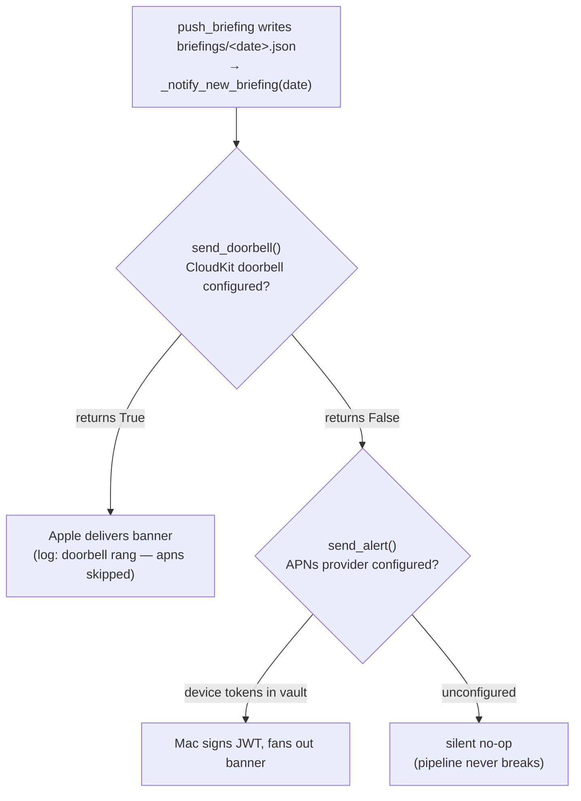

# Mobile — Native iOS Companion

The companion is a **read-only viewer** written in SwiftUI for iOS 26+.
All ingestion and briefing composition happen on the Mac. The phone reads
JSON files the Mac drops into the iCloud Drive vault folder picked by the user
on first launch.

Full layout / build reference: [apps/estormi-ios/README.md](../../../apps/estormi-ios/README.md).

## When to Use

- Adding or modifying a page in `Sources/Briefings/` or `Sources/Metrics/`.
- Adding design primitives in `Sources/Design/` (tokens, typography, ornaments).
- Wiring a new vault payload from the Mac through `Sources/Vault/` (`VaultReader`, `VaultStore`).
- Bundling new fonts or assets into `Sources/Resources/` or `Sources/Assets.xcassets/`.
- Regenerating the Xcode project from `project.yml` (`xcodegen generate`).
- Building / installing on the paired iPhone.
- Wiring new-briefing push alerts (`Sources/Notifications/RemotePushRegistrar.swift`, `Sources/Notifications/CloudKitDoorbell.swift`, `packages/estormi_ingestion/shared/delivery/apns_push.py`, `packages/estormi_ingestion/shared/delivery/cloudkit_doorbell.py`).

## Hard rules

- **Read-only.** Never add write paths (ingestion, mutation, settings that mutate the vault) — the phone consumes the vault, the Mac owns the data.
- **No CloudKit for data.** Sync is a plain iCloud Drive folder picked by the user — the vault never touches a CloudKit database. The read-only viewer needs no paid Apple Developer Program account; the **only** exception is new-briefing alerts (below), where both channels need it (APNs for the `aps-environment` entitlement, the CloudKit doorbell for the iCloud container entitlement) — and CloudKit there is a notification *doorbell* only, never a data store.
- **iOS 26 only.** The Liquid Glass tab bar is the stock iOS 26 `TabView` — the platform renders it as a floating glass bar automatically; there is no custom `GlassEffectContainer` wiring for the tab bar itself. Don't backport to older SDKs.
- **Vault schema is upstream.** The canonical writer is `packages/estormi_ingestion/shared/delivery/vault_sync.py` and the schema reference is `docs/specs/vault-schema.md`. The iOS app reads what the Mac writes — don't invent new on-disk shapes here.
- **Regenerable project.** The `.xcodeproj` is generated from `project.yml`. Don't hand-edit it; rerun `xcodegen generate` after touching `project.yml` or adding new `Sources/` subdirectories.

## Build / install

Prereqs: Xcode 26 (ships with iOS 26 SDK) + `xcodegen` (`brew install xcodegen`).

```bash
cd apps/estormi-ios
xcodegen generate
open Estormi.xcodeproj
```

In Xcode, select the `Estormi` scheme, set the real iPhone as run destination, hit ⌘R. The app installs and launches.

When the user says "rebuild / start / deploy the iOS app" without qualification, they mean **their paired iPhone**.

Unit tests are the `EstormiTests` target (`apps/estormi-ios/Tests/`), run from Xcode and in CI via `.github/workflows/ios.yml`.

## Fonts

The design system uses Cinzel (display) and EB Garamond (body). All three
faces are already bundled under `Sources/Resources/Fonts/`
(`Cinzel-Regular.ttf` — bold derived from its variable weight axis —
`EBGaramond-Regular.ttf`, `EBGaramond-Italic.ttf`), with their `UIAppFonts`
keys wired in `project.yml`. To swap a face, replace the `.ttf` in place
(same filename); to add one, drop the new `.ttf` in, add its `UIAppFonts`
entry in `project.yml`, and re-run `xcodegen generate`.

## Briefing narration audio

When the Mac synthesises a briefing TTS narration (`tts_local.py` via Voxtral
mlx-audio), it writes a `briefings/<date>.m4a` alongside the JSON in the vault.
`Sources/Vault/VaultReader.swift` resolves the `.m4a` to a playable local URL
(it copies the iCloud-scoped file to a temp path for `AVAudioPlayer`), and
`Sources/Briefings/BriefingAudioBar.swift` renders the play/pause/scrub bar; its
parent `BriefingsView` shows it only when `audioPath` is non-nil, so briefings
with no audio have no bar.

## Vault sync — adding a new payload

The Mac writes vault files via `packages/estormi_ingestion/shared/delivery/vault_sync.py`; the phone reads them through `Sources/Vault/VaultReader.swift` and exposes them via `VaultStore`.

1. **Mac side** — add the writer in `packages/estormi_ingestion/shared/delivery/vault_sync.py` (mirror `push_briefing` / `push_engine_run`).
2. **iOS reader** — add a parsing method to `VaultReader` and a published property on `VaultStore`.
3. **View** — render via `@EnvironmentObject var store: VaultStore` in the page that owns the section.

Sync is not live — files appear after iCloud Drive propagates. Refresh by pulling down on the Metrics page or re-opening the app.

## Push notifications (new-briefing alerts)

The one exception to "not live". A fresh briefing triggers `_notify_new_briefing`
in `packages/estormi_ingestion/shared/delivery/vault_sync.py`, which tries two
channels **in order, never both** (two channels would mean two banners):



| | CloudKit doorbell (preferred) | Direct APNs (fallback) |
| --- | --- | --- |
| Who delivers | **Apple** — Mac helper writes a `Briefing` record into the user's private DB | **The Mac as provider** — signs the JWT and POSTs to Apple over HTTP/2 |
| Push key on Mac | None — no `.p8` anywhere | `.p8` auth key + Key ID + Team ID |
| Entitlement (`Estormi.entitlements`) | `com.apple.developer.icloud-services` = `CloudKit` (container `iCloud.app.estormi.ios`) | `aps-environment` (`development` from Xcode, rewritten to `production` on archive) |
| Store-distributable? | Yes (no key to ship) | Yes, but needs the provider Mac running |
| Mac file | `cloudkit_doorbell.py` (`send_doorbell`) + helper in `apps/estormi-cloud/` | `apns_push.py` (`send_alert`) |
| iOS file | `Sources/Notifications/CloudKitDoorbell.swift` (saves the `briefing-created` subscription; banner text from `Sources/Localizable.strings`) | `Sources/Notifications/RemotePushRegistrar.swift` + the `AppDelegate` in `Sources/EstormiApp.swift` (registers, writes device token to vault) |
| Default | Opt-in, off by default | — |
| Setup doc | [docs/cloudkit-doorbell.md](../../../docs/cloudkit-doorbell.md) (Development/Production matrix) | [docs/ios-push-notifications.md](../../../docs/ios-push-notifications.md) (sandbox/production gotcha) |

Both require the Apple Developer Program and both degrade to silent no-ops when
unconfigured. An *edit* to an already-delivered briefing takes the APNs path only
(`notify_briefing_updated`): the doorbell's text is fixed to "new briefing".

## Bundle identity

- App name `Estormi`, bundle id defined in `project.yml`.
- macOS Tauri bundle id is `app.estormi.local` — keep the iOS bundle id distinct.
- Vault folder: a user-picked subfolder of `~/Library/Mobile Documents/com~apple~CloudDocs/` (the user chooses on first launch).
