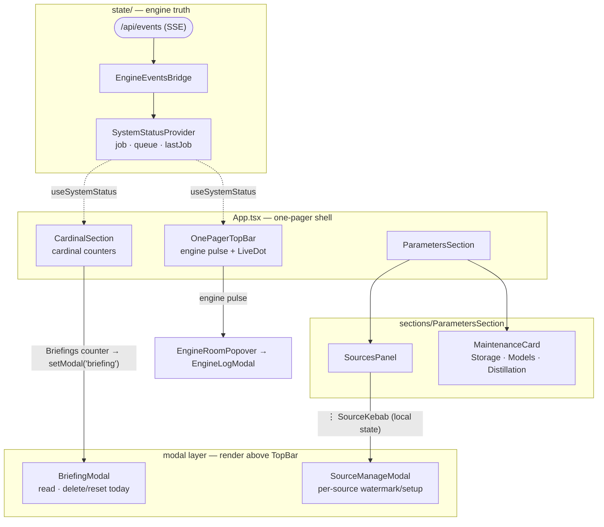

# Web UI — Ars Memoriae SPA

React 18 + Vite, dark-only, English-only. Mounted by FastAPI at `/app/` and
baked into the Tauri bundle. The SPA is a **single 520 × 900 one-pager** —
no hash routes, no sidebar, no Codex/markdown viewer. Entry is `App.tsx`.

## Shape

Regions of the one-pager overlaid onto their owning files, plus the
engine-state flow. `App.tsx` is the shell; SSE is the only writer of engine
state.



- `BriefingModal` carries no cron picker — recompose lives in
  `BriefingBuildControls`, reached through `MaintenanceCard`.
- `SourceManageModal` is **not** in the `App.tsx` `ModalId` union (which is just
  `'briefing' | null`); `SourcesPanel` opens it from its own local state.

## When to Use

- Wiring a new section onto the one-pager (in `src/sections/`).
- Adding a typed API client in `src/api/`.
- Touching engine-state plumbing (`SystemStatusProvider`,
  `EngineEventsBridge`, SSE consumption).
- Anything visual — but design primitives live in `@estormi/ui-kit`, not here.

## Hard rules

- **Visual primitives come from `@estormi/ui-kit`.** Don't reinvent fleurons, gilded panels, illuminated titles, or buttons here. Extend `ui-kit` and import.
- **`fetch` only in `api/client.ts`.** Every other module uses `apiGet` / `apiSend`. CSRF/origin headers belong in one place.
- **SSE is the sole authority for engine state.** Sections mirror server state into `SystemStatusProvider`, never the other way round. Do not fake-run an engine in the UI when it's only enqueued — the queue runner publishes the transition via `/api/events`.
- **No soft-hide.** Chunks are either kept or deleted — never add an archive/mute/hidden toggle (project-wide rule).
- **English only.** `react-i18next` is gone. Don't reintroduce a locale layer.
- **Modals render above TopBar.** TopBar sits at a high `z-index`; modals trapped underneath was a real bug. Use the existing modal portal pattern.

## Architecture cheat sheet

Where each part of `src/` lives:

| Path | Holds |
| --- | --- |
| `main.tsx` | Entry; loads `@estormi/ui-kit/tokens.css`, mounts `<App>` |
| `App.tsx` | One-pager shell + `ModalId` dispatch (`'briefing' \| null`) |
| `api/` | Typed HTTP clients, one file per server router |
| `hooks/` | `useSettings`, `usePipeline` |
| `state/SystemStatus.tsx` | Engine state (`job` + `queue` + `lastJob`) |
| `state/EngineEventsBridge.tsx` | SSE `/api/events` → `SystemStatus` |
| `state/prefetch.ts` | Warms snapshot caches on boot |
| `state/snapshotCache.ts` | In-memory cache shared by sections |
| `sections/` | `CardinalSection`, `ParametersSection`, `BriefingModal`, `MaintenanceCard` |
| `components/` | `AppFrame`, `OnePagerTopBar`, `Modal`, `SourcesPanel`, `SourceManageModal`, `SourceHistoryModal`, `EngineRoomPopover`, `MemoriaPulse`, … |
| `components/engineroom/` | `EngineLogModal` — full-screen per-engine log view, opened from `EngineRoomPopover`; hosts `BriefingAtelier` for the briefing engine |
| `components/briefing/` | `BriefingAtelier` — two-pane agent-flow DAG + formatted log for the briefing engine; polls latest run ≤30/min |

## Adding a section or modal

1. New section → drop a component under `src/sections/` and mount it in
   `App.tsx`'s main column. Compose from ui-kit primitives.
2. New modal → add a discriminator to the `ModalId` union in `App.tsx`,
   render it conditionally, and trigger from a cardinal counter.
3. New route group? Add a typed client in `api/<router>.ts` — never call
   `fetch` directly.
4. If a control triggers an engine, call `useSystemStatus().start(...)` /
   `.stop(...)` so the TopBar reflects it. SSE will overwrite the optimistic
   state when the queue runner actually picks it up.

## Backend contract

Same-origin (the SPA is served by FastAPI — no CORS). Engine lifecycle and
queue snapshots arrive via `GET /api/events` (SSE); REST endpoints under
`/api/...` follow the per-router split documented in the `mcp-server` skill.

## Build & rebuild

```bash
pnpm --filter @estormi/web-ui typecheck
pnpm --filter @estormi/web-ui build          # vite build → packages/web-ui/dist/
```

The packaged Tauri app bakes `packages/web-ui/dist/` as a resource (see
`apps/estormi-macos/tauri.conf.json`). **Edits here require a rebuild** —
`zsh scripts/build.sh` runs `make bundle`, which depends on
`frontend-build`. Hot-reload only works in `make dev`. See the `infra`
skill's "What needs a rebuild" table.

## Theming

- Tokens come from `@estormi/ui-kit/tokens.css` (CSS custom properties). Don't hardcode hex values in the SPA.
- Dark-only. There is no light mode and no theme switcher.
- The native iOS companion's `apps/estormi-ios/Sources/Design/Tokens.swift` is **generated** from `tokens.css` by `make tokens` (`packages/ui-kit/gen_tokens_swift.py`); `make tokens-check` verifies the committed file is current. Edit `tokens.css` — never hand-edit `Tokens.swift`.
