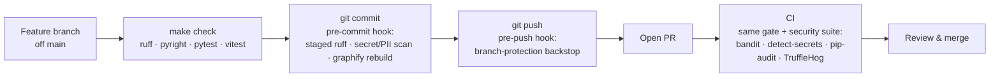

<p align="center">
  <picture>
    <source media="(prefers-color-scheme: dark)" srcset="assets/brand/estormi-wordmark-dark.svg">
    
  </picture>
</p>

<p align="center">
  <picture>
    <source media="(prefers-color-scheme: dark)" srcset="assets/brand/estormi-divider.svg">
    
  </picture>
</p>

# Contributing to Estormi

<picture>
  <source media="(prefers-color-scheme: dark)" srcset="assets/brand/estormi-cap-T-dark.svg">
  
</picture>

hanks for your interest in improving Estormi — *Ars Memoriae*, a local-first
personal memory app for macOS.

## Getting started

1. Fork and clone the repository.
2. Follow [docs/setup.md](../docs/setup.md) to get from a fresh clone to a
   running development environment. **Python 3.12+ is required** — the test suite
   refuses to run on older interpreters, so run it through the project `.venv`
   (e.g. `.venv/bin/python -m pytest`) rather than a system `python3`.
3. Read [ARCHITECTURE.md](../ARCHITECTURE.md) for where each package lives and
   the layering invariants, and [CLAUDE.md](../CLAUDE.md) for the repository's
   conventions and core values.

## Where things live

Estormi is a polyglot monorepo. [ARCHITECTURE.md](../ARCHITECTURE.md) has the
full code map and a "where do I change X?" table; each subsystem also has a
task-scoped guide under `.claude/skills/` — the canonical "how to change X"
reference for that area:

| Working on… | Subsystem guide |
|---|---|
| The FastAPI + MCP backend (`packages/estormi_server/`) | [mcp-server](../.claude/skills/mcp-server/SKILL.md) |
| Data-source pipelines (`packages/estormi_ingestion/`) | [ingestion](../.claude/skills/ingestion/SKILL.md) |
| Scripts, Makefile, release workflow | [infra](../.claude/skills/infra/SKILL.md) |
| The pytest suite (`tests/`) | [testing](../.claude/skills/testing/SKILL.md) |
| The web one-pager (`packages/web-ui/`) | [web-ui](../.claude/skills/web-ui/SKILL.md) |
| The iPhone companion (`apps/estormi-ios/`) | [mobile](../.claude/skills/mobile/SKILL.md) |
| Cross-file code navigation | [graphify](../.claude/skills/graphify/SKILL.md) |

## Development workflow

`main` is protected — it never takes direct commits or pushes. Every change
lands through a reviewed pull request (enforced server-side by
`scripts/setup_branch_protection.sh` and locally by `.githooks/pre-push`).

- Create a feature branch off `main` (`git switch -c feat/your-change`). For
  parallel work on a single machine, use a **git worktree** per branch so
  checkouts never collide.
- Keep changes focused. A bug fix should not also refactor unrelated code.
- Follow the **Boy Scout Rule**: leave the code cleaner than you found it.
  Delete dead code and unused imports you touch; don't leave rot behind.
- **Commit messages** — use the imperative mood and focus on *why*, not *what*
  (`fix: reject empty Host header to prevent bypass`, not `changed security.py`).
  Reference related issues when they exist (`closes #42`). Conventional prefixes
  (`feat:`, `fix:`, `refactor:`, `docs:`, `test:`) are encouraged but not
  enforced.
- Keep `from __future__ import annotations` at the top of Python modules. The
  codebase targets 3.12+ but retains it for consistency and painless backports.
- When you add a **cross-cutting mechanism** — a subsystem that spans engines,
  like the memory-pressure governor — ship it with an internals page in
  [docs/](../docs/). A new mechanism must never land invisible.

### Before opening a pull request

A change passes through three enforcement layers — a local gate you run, the
commit/push hooks, and CI:



Run the full local gate — a single target runs Python + JS lint, typecheck,
and tests:

```bash
make check
```

This local gate is the authoritative pre-PR check. It runs `make lint` + `make typecheck` (ruff + pyright), the
web-ui ESLint, `pnpm -r typecheck`, the pytest suite, and the JS Vitest suites.
Run the individual pieces (`make lint`, `make test`, `make test-frontend`, …)
while iterating.

Wire up the git hooks so the fast checks run automatically on each commit
(ruff lint of staged Python + a secret/PII scan + a local code-graph rebuild):

```bash
scripts/setup-graphify-skill.sh   # one-time: sets core.hooksPath=.githooks
```

The active hook lives in `.githooks/` — do **not** run `pre-commit install`,
which conflicts with `core.hooksPath`. The full security suite (bandit,
detect-secrets, pip-audit, TruffleHog) runs in CI on every PR; to run the lint
config by hand you can use `pre-commit run --all-files`.

## Architecture rules

These boundaries are enforced in review (see [CLAUDE.md](../CLAUDE.md)):

- Do not put FastAPI routes in `memory_core` — it is the pure
  storage/retrieval layer. HTTP belongs in `packages/estormi_server/`.
- Do not duplicate connector logic across apps — `packages/connectors/` is the
  single source.
- Do not hardcode user-specific paths — resolve the repo root through
  `ESTORMI_REPO_ROOT` or the bundle-resource resolution in `packages/estormi_server/server/jobs.py`.

## Pull requests

- Reference any related issue in the description.
- Describe *why* the change is needed, not just *what* changed.
- Run `make check` locally before opening the PR — it reproduces the lint,
  typecheck, test, and contract checks. CI runs the same checks on every PR once
  the repository is public; keep it green.
- New behavior needs tests. Bug fixes should add a `regression`-marked test that
  fails before the fix. The test suite enforces a minimum **80 % line coverage**
  (`--cov-fail-under=80`).
- To **add a new connector**, see the framework guide in
  [`docs/connectors.md`](../docs/connectors.md) — it covers the `ConnectorSpec`,
  the registry, and the ingestion-script contract.

## AI-assisted development

The `.claude/skills/` directory contains task-scoped SKILL.md files with
YAML frontmatter used by Claude Code (Anthropic's AI coding assistant) to
navigate the codebase. They are documentation, not executable code — feel
free to ignore them if you are not using Claude Code.

## First contribution?

Look for issues labelled
[**good first issue**](https://github.com/francoisdeverdun/Estormi/labels/good%20first%20issue)
— they are scoped, self-contained, and have enough context to get started without
understanding the full architecture.

## Reporting bugs and requesting features

Use the GitHub issue templates. For security vulnerabilities, follow
[SECURITY.md](SECURITY.md) instead of opening a public issue.

## Code of Conduct

This project follows the [Contributor Covenant](CODE_OF_CONDUCT.md). By
participating, you are expected to uphold it.
