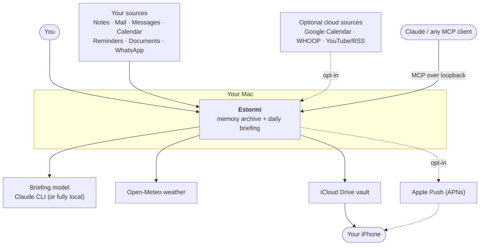
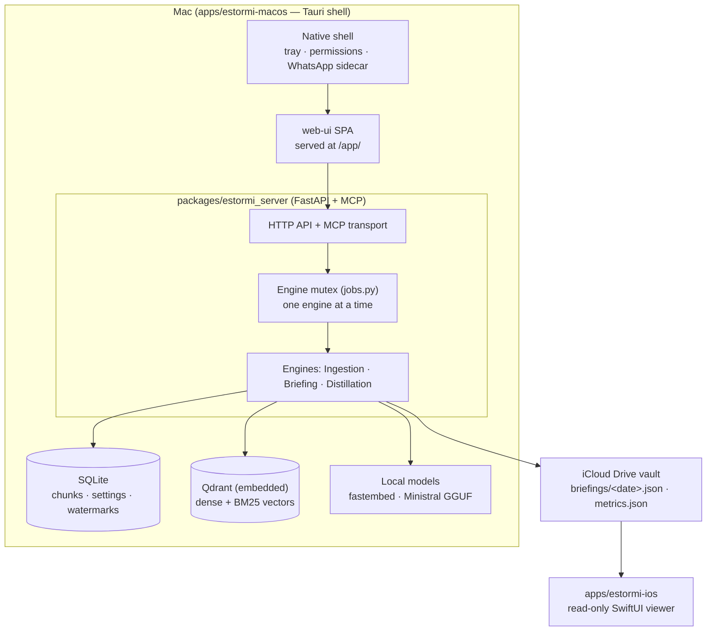
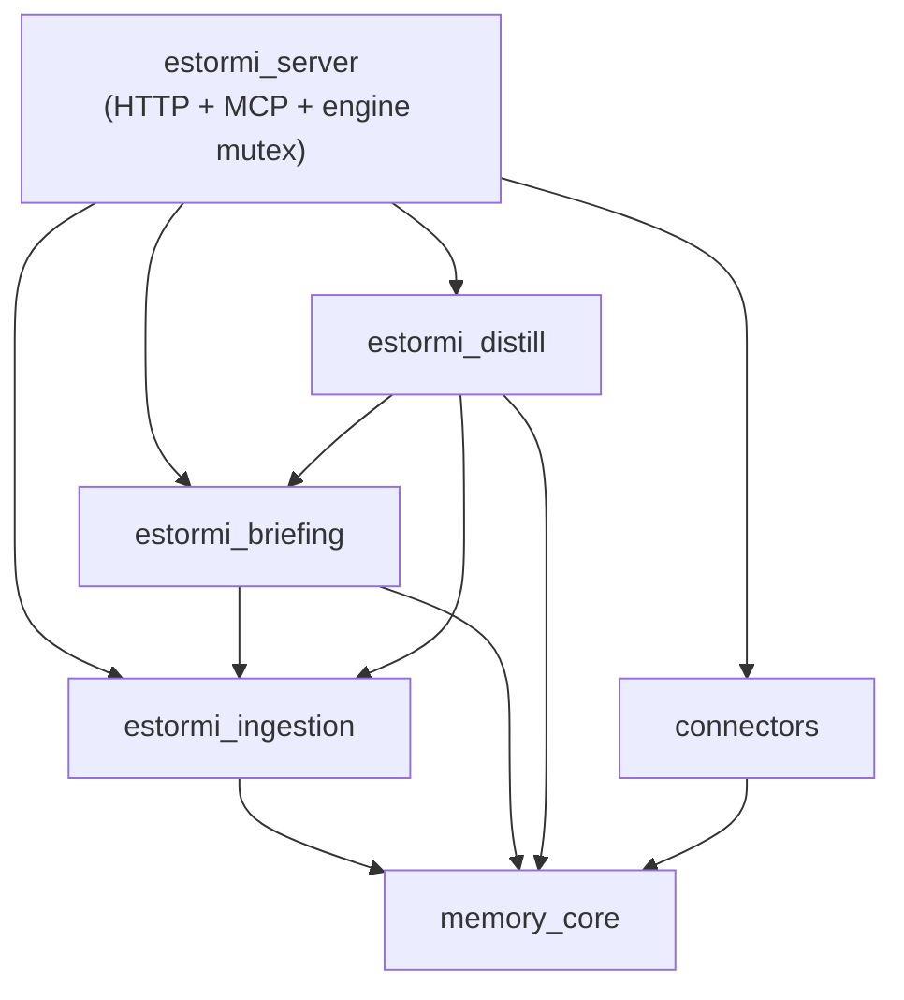

  <picture>
    <source media="(prefers-color-scheme: dark)" srcset="assets/brand/estormi-wordmark-dark.svg">
    
  </picture>

  <picture>
    <source media="(prefers-color-scheme: dark)" srcset="assets/brand/estormi-divider.svg">
    
  </picture>

# Architecture

The contributor map of Estormi: a bird's-eye view, **where each thing lives**,
and the **invariants** that must hold. It is deliberately high-level and stable —
it names modules in plain text (use symbol search, not line links) and does not
track code that changes often. For *how* the engines run see
[`docs/architecture/engines.md`](docs/architecture/engines.md); for *why* the
load-bearing choices were made see [`docs/adr/`](docs/adr/README.md).

## Bird's-eye view

Estormi is a **local-first personal memory app**. Everything that builds and
composes memory runs on the user's **Mac**; the **iPhone** is a read-only viewer.
Two engines do the work — **Ingestion** turns selected sources into deduplicated,
date-stamped chunks, and **Briefing** composes those into one daily briefing. A
third, optional **Distillation** engine retrains the local prose model offline.
Correlation is not stored: it is **emergent from time-window retrieval** (every
chunk carries a date and a `personal`/`world` tag, and a single `fetch_around`
query overlaps a window across sources).

## System context

Every outbound edge is enumerated, with its on/off default, in
[`SECURITY.md`](.github/SECURITY.md#network-egress).

## Containers

What actually runs, and the macOS → iCloud → iOS hand-off:

Storage lives under `$ESTORMI_DATA_DIR` (default
`~/Library/Application Support/Estormi`): `estormi.db` (SQLite, aiosqlite),
`qdrant/` (embedded vectors), and `audit.log` (JSONL). See
[`docs/architecture/overview.md`](docs/architecture/overview.md).

## Code map

First-party Python lives under `packages/` in `snake_case`; native deployable
surfaces live under `apps/` in `dash-case`
([ADR 0008](docs/adr/0008-python-under-packages-naming-law.md)).

| Where | Is | Must **not** |
|---|---|---|
| `packages/memory_core/` | Pure domain/support: settings, embeddings, sanitizer, audit, the engine lock, local-LLM client | Import any other first-party package (it is the bottom layer); contain FastAPI routes |
| `packages/connectors/` | Per-source connector adapters + the `ConnectorRegistry` (single source of ingestion logic) | Import the server/app layer, the ingestion scripts, or any engine package |
| `packages/estormi_ingestion/` | Per-source ingestion scripts + shared chunking, driven by `connectors` | Import the briefing or distillation engines, or reach up into `estormi_server` |
| `packages/estormi_briefing/` | The Briefing engine: composition, the deterministic correlation graph, narration | Import the distillation engine, or reach up into `estormi_server` |
| `packages/estormi_distill/` | The optional Distillation engine (offline prose-model retraining, Apple Silicon) | Reach up into `estormi_server` |
| `packages/estormi_server/` | FastAPI HTTP API, MCP transport, retrieval, the engine mutex/run-queue | — (top layer; it composes everything below) |
| `packages/web-ui/` · `packages/ui-kit/` | The React one-pager SPA and its component/design-token kit | Duplicate connector or server logic |
| `apps/estormi-macos/` | Tauri macOS shell: bundles + starts the server as a sidecar, owns permission prompts | Duplicate connector logic; hardcode user paths |
| `apps/estormi-ios/` | Native SwiftUI iPhone companion (read-only vault viewer: Briefings + Metrics) | Talk to the FastAPI server directly; do any ingestion |
| `apps/estormi-cloud/` | Signed CloudKit "doorbell" helper that triggers the new-briefing push | — |

## Layering & invariants

The first-party Python packages form a **one-way (acyclic) dependency DAG**.
`estormi_server` sits on top and may use everything below it; the engines and
pure libraries below it never reach back up:

The direction is enforced by **import-linter** (`[tool.importlinter]` in
`pyproject.toml`, [ADR 0009](docs/adr/0009-layering-dag-import-linter.md)) with
forbidden-import contracts: `memory_core` must not import upward; `connectors`
must not import the server/app, ingestion, or briefing; `estormi_ingestion` must
not import briefing or distill; `estormi_briefing` must not import distill; and
`estormi_distill` must not import the server/app. The runtime boundary mirrors
this — native apps and MCP clients reach the system only through
`estormi_server`, never around it.

These rules are also stated, with the rest of the project conventions, in
[`CLAUDE.md`](CLAUDE.md):

- **No FastAPI routes in `memory_core`** — it is the pure storage/retrieval layer; HTTP belongs in `estormi_server`.
- **Connectors live once** in `packages/connectors/` — never duplicated per surface.
- **No hardcoded user paths** — resolve through `ESTORMI_REPO_ROOT` or the bundle-resource resolution in `estormi_server/server/jobs.py` (the app runs both as a relocatable `.app` and from a dev checkout).
- **Only one heavy engine runs at a time** — serialized by the run-queue mutex in `estormi_server/server/jobs.py` (`ENGINES = ("ingestion", "briefing", "distill")`).
- **`main` is protected** — changes land through a reviewed PR ([ADR 0010](docs/adr/0010-main-branch-protection.md)).

## Where do I change…?

| To change… | Start in |
|---|---|
| A new data source / connector | `packages/connectors/` + a script in `packages/estormi_ingestion/` → [docs/connectors.md](docs/connectors.md) |
| An MCP tool or HTTP route | `packages/estormi_server/` → [docs/mcp.md](docs/mcp.md) |
| How the briefing reads | `packages/estormi_briefing/` → [docs/architecture/briefing-generation.md](docs/architecture/briefing-generation.md) |
| Search / retrieval / storage | `packages/estormi_server/storage/` + `packages/memory_core/` |
| The web one-pager | `packages/web-ui/` → [docs/design-system.md](docs/design-system.md) |
| The iPhone app | `apps/estormi-ios/` → [docs/estormi-ios.md](docs/estormi-ios.md) |
| The macOS shell / bundling | `apps/estormi-macos/` → [docs/release.md](docs/release.md) |

Each subsystem also has a task-scoped guide under
[`.claude/skills/`](docs/README.md#5-subsystem-guides) that the developer docs
index links.

## See also

- [docs/architecture/overview.md](docs/architecture/overview.md) — component map, storage, security boundary.
- [docs/architecture/engines.md](docs/architecture/engines.md) — the engines, the mutex, correlation via retrieval.
- [docs/adr/README.md](docs/adr/README.md) — the decision records behind these invariants.
