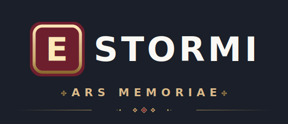
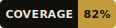
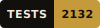
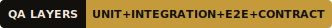
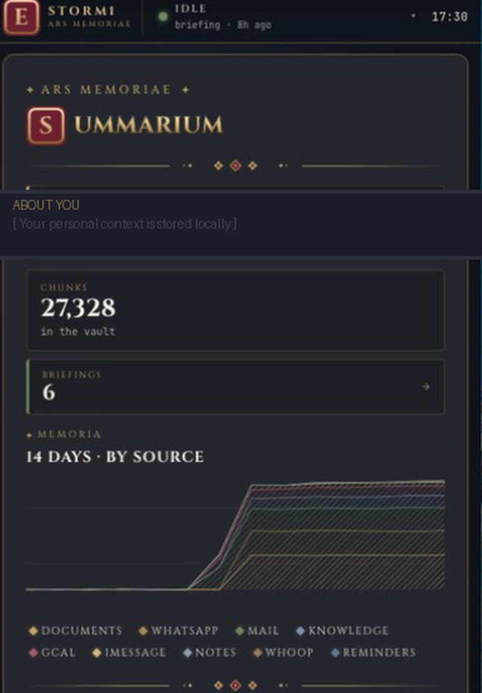
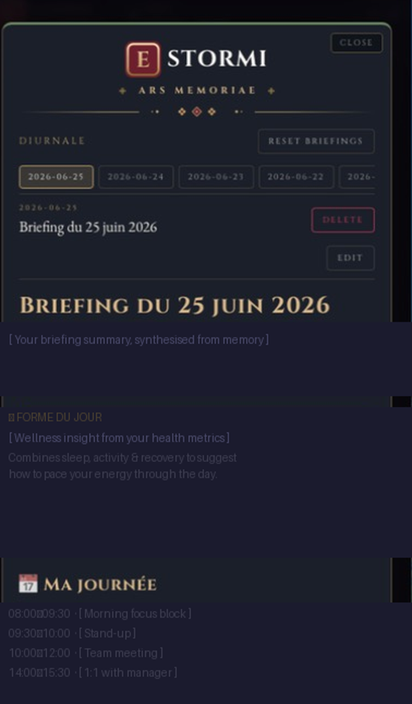
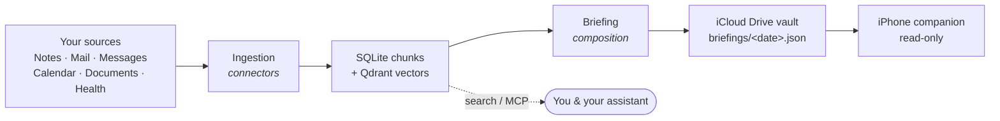

<p align="center">
  
</p>

<p align="center">
  <a href="https://github.com/francoisdeverdun/Estormi/releases/latest">
    
  </a>
  <a href="LICENSE">
    
  </a>
</p>

<p align="center">
  
  
  
</p>

<p align="center">
  <picture>
    <source media="(prefers-color-scheme: dark)" srcset="assets/brand/estormi-divider.svg">
    
  </picture>
</p>

# Estormi — *Ars Memoriae*

<picture>
  <source media="(prefers-color-scheme: dark)" srcset="assets/brand/estormi-cap-E-dark.svg">
  
</picture>

stormi is a **local-first personal memory app for macOS** — with a read-only
iPhone companion. It gathers the context already scattered across your Mac
(notes, mail, messages, calendar, reminders, documents, health) into one
private, searchable archive, and distills your day into a single briefing you
read each morning. **Your data stays on your Mac** — it is not uploaded to any
Estormi server, because there isn't one.

Ask *"what did I decide?"*, *"where did we discuss this?"*, or *"what context am
I missing?"* and Estormi answers from your own archive — in the app, or straight
inside an assistant like Claude through [MCP](docs/mcp.md).

> **Using vs. building.** Most people just want the app — see
> **[Get Estormi](#-get-estormi)**. If you want to read or contribute to the
> code, jump to **[Build from source](#-build-from-source)**,
> [`ARCHITECTURE.md`](ARCHITECTURE.md), and
> [`CONTRIBUTING.md`](.github/CONTRIBUTING.md). Estormi targets **macOS + iOS
> only**.

## Contents

- [✨ What you get](#-what-you-get)
- [🔒 Your data stays on your Mac](#-your-data-stays-on-your-mac)
- [🧭 How it works](#-how-it-works)
- [📖 Glossary](#glossary)
- [⬇️ Get Estormi](#-get-estormi)
- [🤖 Use it with your assistant (MCP)](#-use-it-with-your-assistant-mcp)
- [🏗️ Build from source](#-build-from-source)
- [🗺️ Repository map](#-repository-map)
- [📚 Architecture & documentation](#-architecture--documentation)
- [🤝 Contributing](#-contributing) · [License](#license)

## ✨ What you get

Estormi has two surfaces: the **Mac** does all the work, and the **iPhone** is a
read-only viewer for the briefing it produces.

| Capability | Estormi for macOS | iPhone companion |
|---|:---:|:---:|
| Build & search your memory archive | ✅ | — |
| Daily editorial briefing | ✅ composes | ✅ reads |
| Briefing read-aloud (audio narration) | ✅ generates | ✅ plays |
| Cross-source correlation (threads across sources) | ✅ | in the briefing |
| Local **MCP server** for assistants (Claude, …) | ✅ | — |
| "New briefing" push alert | ✅ sends | ✅ receives |
| Runs the engines (Ingestion · Briefing · Distillation) | ✅ | — |

**Sources it can ingest:** Apple Notes, Apple Mail, Apple Reminders, iMessage,
WhatsApp, Google Calendar, iCloud Drive documents, WHOOP health, and external
YouTube/RSS knowledge — turned into one archive that you search by **meaning and
by words** (semantic + keyword search), ranked by date and source.

## Screenshots

| Dashboard | Daily Briefing |
|-----------|----------------|
|  |  |

## 🔒 Your data stays on your Mac

Ingesting, indexing, and embedding are **fully local** — that data never leaves
the machine. The only network egress is the handful of paths below, each under
your control. A briefing composed with the `local` provider, no home location,
and no knowledge sources runs **fully offline**.

| Leaves your Mac | When | On by default? |
|---|---|:---:|
| Briefing LLM (Claude CLI, cloud) — opt-in | Composing the daily briefing, only if you set the briefing provider to the cloud Claude CLI (off by default; not exposed in the UI) | ⬚ (local Ministral 3 composes by default) |
| Weather (Open-Meteo, keyless) | Briefing, for your home city | ✅ (blank `briefing_home_location`) |
| iCloud Drive vault sync | Hand-off of the briefing to your iPhone | ✅ (point `ESTORMI_VAULT_DIR` outside iCloud) |
| Google Calendar · WHOOP (OAuth) | Only after you connect them | ⬚ opt-in |
| Knowledge (YouTube transcripts, RSS) | Only sources you add | ⬚ opt-in |
| APNs push alert (content-free, date only) | Only after you add an APNs key | ⬚ opt-in |

The server binds to **`127.0.0.1` (loopback)** and is reachable only from the
same Mac; remote access requires a bearer token. Full detail —
including the WhatsApp sidecar and one-time model downloads — is in
**[SECURITY.md](.github/SECURITY.md#network-egress)**.

## 🧭 How it works

Everything runs on the Mac. Connectors read your sources into one store; the
Briefing engine composes the day from it and writes a JSON file into an iCloud
Drive folder; the iPhone reads that folder.



Correlation isn't a stored index — it's **emergent from time-window retrieval**:
every chunk carries an accurate date and a `personal`/`world` tag, so one query
weaves threads across sources on demand. The deep version of this diagram, the
engines, and the layering live in
[`docs/architecture/`](docs/architecture/overview.md) and
[`ARCHITECTURE.md`](ARCHITECTURE.md).

### Glossary

| Term | Meaning |
|---|---|
| **Briefing** | A structured editorial summary of your day, composed each morning by the local LLM |
| **Ingestion** | The daily import of data from your Mac apps into the archive |
| **Vault** | The iCloud Drive folder where briefings land for the iPhone to read |
| **Chunk** | A timestamped fragment of text from any source — the unit of storage |
| **Connector** | A per-source adapter (one for Notes, one for Mail, etc.) that reads data into chunks |
| **Corpus** | A tag on each chunk: `personal` (your own data) or `world` (news/knowledge) |
| **MCP** | [Model Context Protocol](https://modelcontextprotocol.io) — an open standard for connecting AI assistants to tools |
| **Distillation** | Optional retraining of the local prose model on your own briefing history (QLoRA fine-tune) |

## ⬇️ Get Estormi

> [!NOTE]
> **Latest build — [Estormi v0.0.3](https://github.com/francoisdeverdun/Estormi/releases/latest).**
> Download **`Estormi.dmg`** from the release, open it, and drag `Estormi.app`
> to `/Applications`. Apple Silicon, macOS 13+.

> [!IMPORTANT]
> **Developer preview.** The release DMG ships the native macOS shell only —
> without a bundled Python runtime. You complete it once from a source clone at
> the same tag (see [Populate the Python runtime](#populate-the-python-runtime)
> below). A turnkey, fully-bundled DMG is planned for a future release.

**The DMG is distributed directly (not via the Mac App Store), so it is unsigned
and not Apple-notarized.** On first launch macOS Gatekeeper warns that the
developer "cannot be verified." Open the app via right-click (or Control-click)
`Estormi.app` → **Open**, or clear the quarantine flag yourself:

```bash
xattr -dr com.apple.quarantine /Applications/Estormi.app
```

Verify the download against the published digest first
(`shasum -a 256 -c Estormi.dmg.sha256` — the asset ships alongside the DMG on
each release).

### First run

**1 — Grant the macOS privacy permissions Estormi asks for** (each is requested
on first use):

| Permission | What it unlocks | If you skip it | Grant in |
|---|---|---|---|
| **Full Disk Access** | iMessage history (`~/Library/Messages/chat.db`) | iMessage ingestion is skipped | System Settings → Privacy & Security → Full Disk Access |
| **Automation / Apple Events** | Reading Calendar, Notes, Mail, Reminders | Those sources can't be exported | Prompted per app on first use |
| **Contacts · Calendars · Reminders** | Identifying people, reading events & tasks | Those details are unavailable | Prompted on first use |

**2 — Know where your data lives:**

| Data | Location | Override |
|---|---|---|
| SQLite DB, Qdrant vectors, audit log | `~/Library/Application Support/Estormi` | `ESTORMI_DATA_DIR` |
| iCloud Drive vault (iPhone reads this) | `~/Library/Mobile Documents/com~apple~CloudDocs/Estormi` | `ESTORMI_VAULT_DIR` |

**3 — Review what reaches the network** — see
[Your data stays on your Mac](#-your-data-stays-on-your-mac) above. To run fully
offline: set the Briefing provider to `local`, blank the home location, add no
knowledge sources, and keep the vault out of iCloud Drive.

### Populate the Python runtime

The tag-built `Estormi.dmg` ships an intentionally **empty `python/`** (building
the runtime in CI is impractical). Fill it from a clone of the source repo at the
**same tag**, then rebuild the app bundle so the runtime is embedded:

```bash
git clone https://github.com/francoisdeverdun/Estormi.git && cd Estormi
git checkout v0.0.3          # the tag you downloaded
make bundle-python           # downloads + verifies the pinned CPython runtime
make bundle                  # → dist/Estormi.zip (turnkey app + install.sh)
```

`make bundle` produces a turnkey `dist/Estormi.zip` with the runtime embedded;
unzip it and run the bundled `install.sh`. If you are cloning the source anyway,
[Build from source](#-build-from-source) below is the same path.

## 🤖 Use it with your assistant (MCP)

Estormi doubles as a local **MCP server**: Claude (Code or Desktop) — or any
MCP-capable client — can query the memory you've built, over loopback, with the
data never leaving your Mac. It exposes `search_memory` (hybrid search) and
`fetch_around` (time-window correlation), among others. There is nothing extra
to run: if Estormi is open, the endpoint is live.

→ **[docs/mcp.md](docs/mcp.md)** — tool catalog, transport, auth, and how to
connect a client.

## 🏗️ Build from source

Most people should use the macOS download above. Build from source to develop
Estormi. You'll need **Python 3.12+, Node.js 20+, pnpm 9+, and the nightly Rust
toolchain** (a transitive crate needs `portable_simd`; rustup auto-installs the
pinned nightly from `apps/estormi-macos/rust-toolchain.toml` when you build from
that directory) — full prerequisites and the canonical guide are in
**[docs/setup.md](docs/setup.md)**.

```bash
git clone https://github.com/francoisdeverdun/Estormi.git
cd Estormi
bash scripts/setup.sh   # one run: .env + .venv + Python deps + memory_core/connectors (editable) + graphify
# → edit .env if you need any API keys, then:
pnpm install            # web-UI dependencies
make frontend-build     # build the Ars Memoriae SPA → packages/web-ui/dist/
make model-download     # local LLM weights
make start              # FastAPI server on http://localhost:8000
```

Then open <http://localhost:8000/app/> — a compact one-pager SPA; enable sources
from the sources panel and start the first import there. (`make start` serves the
**built** SPA; if you skip `make frontend-build`, `/app/` explains how to build
it. `make dev` and `make bundle` build it for you.)

> **Just want a look?** Build the SPA with `VITE_DEMO_MODE=true` (or tap
> **Explore a sample** in the iOS companion) to browse every panel populated with
> a fictional sample dataset — no vault, no imports, no backend required.

Useful targets (run `make help` for the full list):

| Command | What it does |
|---|---|
| `make dev` | Tauri desktop app (FastAPI server + native shell) |
| `make start` | FastAPI server only (`MCP_SERVER_PORT`, default 8000) |
| `make install-dev` | Editable-install all **six** first-party Python packages |
| `make health` | Server and source-freshness checks |
| `make daily-dag` | Run the ingestion pipeline manually |
| `make test` | Pytest suite with the coverage gate |

## 🗺️ Repository map

```text
.
├── packages/          First-party Python packages + JS/asset workspaces:
│   ├── estormi_server/    FastAPI HTTP API, MCP transport, retrieval, engine mutex
│   ├── estormi_ingestion/ Per-source ingestion scripts and shared chunking
│   ├── estormi_briefing/  Daily-briefing engine (composition, correlation graph, narration)
│   ├── estormi_distill/   Optional distillation engine (offline prose-model retraining)
│   ├── memory_core/       Pure domain/support layer (settings, embeddings, sanitizer, audit)
│   ├── connectors/        Per-source connector adapters + registry
│   └── ui-kit/ web-ui/    React component kit and SPA
├── apps/              Native deployable surfaces:
│   ├── estormi-macos/     Tauri macOS shell (the active desktop build path)
│   ├── estormi-ios/       Native SwiftUI iOS companion (read-only vault viewer)
│   └── estormi-cloud/     CloudKit "doorbell" push helper
├── scripts/           Setup, launchd agents, model and validation helpers
├── tests/             Pytest suite mirroring the source tree (+ contract, e2e, performance)
├── assets/            Brand artwork, webfonts, source icons, and badges
├── prompts/           LLM prompt templates + companion prompts
└── docs/              Developer & architecture documentation
```

A one-page tour of *where each thing lives and why* — plus the layering
invariants — is in [`ARCHITECTURE.md`](ARCHITECTURE.md).

## 📚 Architecture & documentation

- **[ARCHITECTURE.md](ARCHITECTURE.md)** — the contributor codemap: where each
  package lives, the layering, and the invariants that must hold.
- **[Developer docs](docs/README.md)** — architecture, subsystems, the connector
  framework, the test suite, and the directory & subsystem guides.
- **[Architecture Decision Records](docs/adr/README.md)** — one MADR file per
  load-bearing decision.
- **[CONTRIBUTING.md](.github/CONTRIBUTING.md)** — workflow and the local checks
  to run before a pull request.

## 🤝 Contributing

Contributions are welcome. See [CONTRIBUTING.md](.github/CONTRIBUTING.md) for the
development workflow, local checks, and architecture rules, and
[docs/setup.md](docs/setup.md) for environment setup. All participants follow the
[Code of Conduct](.github/CODE_OF_CONDUCT.md).

To report a security vulnerability, follow [SECURITY.md](.github/SECURITY.md)
rather than opening a public issue.

## License

Estormi is released under the [Apache License 2.0](LICENSE). Third-party
components bundled or redistributed with Estormi are attributed in
[NOTICE](NOTICE); the service logos under `assets/source-icons/` are third-party
trademarks used nominatively and are **not** covered by the Apache license — see
[assets/source-icons/README.md](assets/source-icons/README.md).
