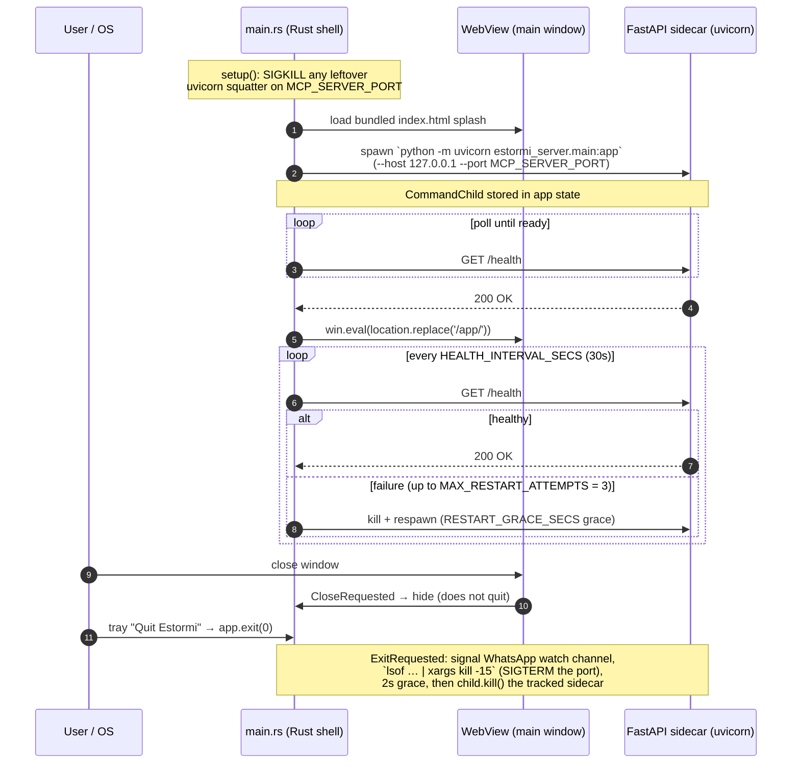

# Estormi for macOS

Tauri-based macOS packaged app for Estormi: Ars Memoriae. Shells the web UI
in a native WebView and supervises the server (`packages/estormi_server/`) process
lifecycle. Do not put business logic here — delegate to `packages/estormi_server/` and
`packages/estormi_ingestion/`.

End users install the packaged `.app` — see [docs/setup.md](../../docs/setup.md)
and [docs/release.md](../../docs/release.md). The rest of this file is for
contributors building the shell locally.

## Build / rebuild workflow

Rebuilding the packaged app is `make bundle` (release) or `pnpm --filter
@estormi/web-ui build && cargo tauri build` (manual). Gotcha:

- The old packaged app keeps running after a rebuild. Quit it from the tray
  (or `pkill -f Estormi`) before re-launching the new one. The launcher now
  `lsof`s `MCP_SERVER_PORT` and SIGKILLs a leftover
  `uvicorn estormi_server.main:app` squatter on startup (`main.rs`), so the
  new sidecar reliably owns the port — but quitting the old app first still
  avoids orphaned windows and stale per-launch tokens.
- `scripts/build.sh` runs `make bundle`, which has `frontend-build`
  as a prerequisite — the SPA is rebuilt automatically before the Tauri
  bundle.

## Key files (`apps/estormi-macos/src/`)

| File | Responsibility |
| --- | --- |
| `main.rs` | `tauri::Builder` setup, sidecar spawn, health-check loop, window lifecycle, `ExitRequested` teardown. |
| `tray.rs` | System tray menu (Open Estormi, Hide Dock Icon, Quit Estormi). Tray actions show/hide/focus the existing `main` window or toggle the Dock icon; they never navigate the WebView. |
| `imessage.rs` | Snapshots `~/Library/Messages/chat.db` (+ `-wal`/`-shm`) into the data dir and (re)writes the `imessage-fda.flag` the API reads. |
| `doorbell.rs` | On first run, extracts the bundled CloudKit doorbell helper (`EstormiCloud.app.zip`) to the config home — synchronously, before the sidecar spawn. See [docs/cloudkit-doorbell.md](../../docs/cloudkit-doorbell.md). |
| `whatsapp/` | Embedded WhatsApp bot (whatsapp-rust) as a Tokio task, plus an Axum HTTP API on `127.0.0.1:9877` (`WA_API_PORT`) for status, QR PNG, chats, and bounded sync windows. Split into `mod`, `types`, `auth`, `bot`, `http`, `sync`, `staging`, `helpers`. |

## Shell lifecycle

`main.rs` opens one window labelled `main`, spawns the FastAPI sidecar via
`tauri_plugin_shell`, polls `/health` until ready, then navigates the WebView
to `/app/`. A 30-second health-check loop (`HEALTH_INTERVAL_SECS`) supervises
the sidecar; on exit it tears down the loopback port. The sequence below is the
happy path plus the supervision/teardown branches.

Gotchas the diagram glosses:

- **No `Cmd-Q`.** No app menu / accelerator is registered, and the default
  Accessory (dock-hidden) policy has no menu bar, so the tray "Quit Estormi"
  item (`tray.rs` → `app.exit(0)`) is the reliable quit path.
- **Teardown is targeted.** On exit the SIGTERM goes only to the loopback
  `-sTCP:LISTEN` owner, then `child.kill()` force-kills the *tracked*
  `CommandChild` — there is deliberately no `kill -9` port sweep that could
  hit an unrelated process that rebound the port.

The WhatsApp sidecar runs in-process (Tokio task). Idle mode is the
default; `ESTORMI_WHATSAPP_ALWAYS_ON=1` keeps the bot connected
continuously. In idle mode, `POST /api/whatsapp/sync-once` opens a
bounded reconnect window.

## Native integration points

- Tray icon with menu actions that show/hide/focus the `main` window and
  toggle the Dock icon. The one-time navigation to `/app/` lives in
  `main.rs`'s startup health-check task (see Shell lifecycle), not the
  tray.
- iMessage FDA probe: `main.rs` reads `~/Library/Messages/chat.db`
  (which the Python subprocess cannot) and writes `imessage-fda.flag`
  under the data dir so the API can surface the boolean.
- WhatsApp staging files written under the Tauri app data dir (resolved
  via `app.path().app_data_dir()` — on macOS this is the per-bundle
  Application Support directory keyed off the `app.estormi.local` bundle
  identifier) in the same `.txt` + `.meta.json` format the ingestion
  pipeline already consumes.

## Bundle resource resolution

Bundled resources (the `packages/*` source trees, `python`, fonts, the SPA
`dist`; the authoritative list lives in `tauri.conf.json`) are declared there and
Tauri encodes each `../` as one `_up_/` inside the bundle. The shell lives at
`apps/estormi-macos/`, so its resources are `../../` and land under `_up_/_up_/`.
`main.rs` checks the bundled path first
(`resource_dir().join("_up_/_up_/python/bin/python3")` for Python;
`resource_dir().join("_up_/_up_/packages")`, taken when its `estormi_server`
subdir exists, for the sidecar CWD), then falls back to a dev tree. The dev
fallback root is `ESTORMI_REPO_ROOT`; if unset, `setup()` returns an error
rather than guessing a path.

## Code signing & entitlements

`Estormi.entitlements` is an **empty `<dict>`** — the app declares no
entitlements. It is intentionally **not sandboxed** (App Sandbox is incompatible
with how the app works: it reads `~/Library/Messages` under Full Disk Access,
spawns the uvicorn sidecar, drives Calendar/Mail/Notes/Reminders via AppleScript,
and runs `lsof`/`kill` on exit), and `make bundle` deliberately signs **without
the hardened runtime** (omits `--options runtime`) so TCC grants persist across
rebuilds and the unsigned bundled Python / llama.cpp dylibs load. The
direct-distribution path (download the zip + `install.sh`, which strips the
quarantine xattr) needs no `com.apple.security.cs.*` entitlements.

⚠️ **Keep this file comment-free.** `codesign`'s AMFI entitlements parser is
stricter than `plutil` and rejects XML comments (`AMFIUnserializeXML: syntax
error`), which breaks any path that feeds the file to `codesign --entitlements`
— notably `make notarize`. So the rationale lives here, not in the plist.

If the macOS app is ever **notarized** (`make notarize`, currently unused — see
[docs/release.md](../../docs/release.md)), the hardened runtime it mandates will
likely need entitlements added here: `com.apple.security.cs.disable-library-validation`
(load the unsigned bundled Python and llama.cpp dylibs), `com.apple.security.automation.apple-events`
(AppleScript), and possibly `com.apple.security.cs.allow-jit`. The CloudKit
doorbell helper (`apps/estormi-cloud/`) is a separate, independently
Developer-ID-signed + notarized artifact and does not share these entitlements.

## Hard rules

- No business logic in Rust. UI behavior belongs in the web app; data
  logic belongs in `estormi_server` / `estormi_ingestion`. The Tauri layer only
  shells, spawns, and bridges.
- Do not hardcode filesystem paths. Use `app.path().resource_dir()`,
  `app.path().home_dir()`, `app.path().app_data_dir()`, or
  `ESTORMI_REPO_ROOT` for the dev fallback.
- Keep all local servers bound to `127.0.0.1`. FastAPI on
  `MCP_SERVER_PORT` (default 8000), WhatsApp Axum on 9877.
- Do not bypass the health-check/restart loop with ad-hoc spawns; route
  through the state-managed `CommandChild` so ExitRequested can clean
  up.
