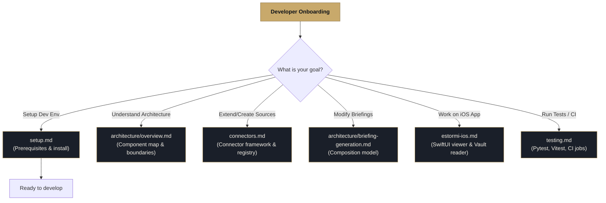

  <picture>
    <source media="(prefers-color-scheme: dark)" srcset="../assets/brand/estormi-wordmark-dark.svg">
    
  </picture>

  <picture>
    <source media="(prefers-color-scheme: dark)" srcset="../assets/brand/estormi-divider.svg">
    
  </picture>

# Estormi — Developer Documentation

Welcome to the Estormi developer documentation. This directory contains detailed guides, architecture specs, and technical references to help you contribute to and extend Estormi.

> **New here?** Start with the root [README](../README.md) for what Estormi is,
> then [`ARCHITECTURE.md`](../ARCHITECTURE.md) for where the code lives and the
> invariants that hold it together. **Want to use the app?** The root README's
> [Get Estormi](../README.md#-get-estormi) is your door — this tree is for
> people working on the code.

---

## Onboarding Path

To help you get oriented quickly, follow the path matching your current goal:

---

## Documentation Registry

### 1. Getting Started & Guidelines
Essential reading before making any code changes.

| Document | Purpose |
|---|---|
| [setup.md](setup.md) | Step-by-step developer environment setup. |
| [../ARCHITECTURE.md](../ARCHITECTURE.md) | The contributor codemap: where each package lives, the layering, and the invariants. |
| [../.github/CONTRIBUTING.md](../.github/CONTRIBUTING.md) | Contribution workflow, PR rules, and local git-hook checks. |
| [../.github/SECURITY.md](../.github/SECURITY.md) | Security policy, the network-egress disclosure, and how to report a vulnerability. |
| [../.github/CODE_OF_CONDUCT.md](../.github/CODE_OF_CONDUCT.md) | The Contributor Covenant all participants follow. |
| [../CLAUDE.md](../CLAUDE.md) | Repository layering rules, monorepo structure, and core values. |

### 2. Architecture & Design
Deep dives into the internal mechanics of the engines and decisions.

| Document | Purpose |
|---|---|
| [architecture/overview.md](architecture/overview.md) | System overview, component map, and layer boundaries. |
| [architecture/engines.md](architecture/engines.md) | Ingestion and Briefing engines, the engine mutex, and retrieval-based correlation. |
| [architecture/briefing-generation.md](architecture/briefing-generation.md) | How the Briefing engine composes the daily briefing (facts, writers, and critics). |
| [architecture/rationale.md](architecture/rationale.md) | Narrative index of the *why* behind load-bearing decisions — links each one to its ADR. |
| [adr/README.md](adr/README.md) | Architecture Decision Records — one MADR-format file per load-bearing decision. |
| [architecture/distillation.md](architecture/distillation.md) | Local-quill QLoRA fine-tuning pipeline (references → dataset → trainer → fuse/install). |

### 3. Extensibility & Subsystems
Guides for modifying specific features or cross-cutting systems.

| Document | Purpose |
|---|---|
| [connectors.md](connectors.md) | The connector framework and guide for adding a new data source. |
| [mcp.md](mcp.md) | Estormi as a local MCP server — the second feature: tool catalog, transport, auth, and how to connect Claude or any MCP client. |
| [google-calendar-sync.md](google-calendar-sync.md) | Details on Google Calendar OAuth, credentials, and incremental sync token management. |
| [governor.md](governor.md) | Memory-pressure governor (`resource_guard.py`) mechanics. |
| [ios-push-notifications.md](ios-push-notifications.md) | Remote push alert configuration (APNs via Mac as provider, CloudKit doorbell fallback). |
| [cloudkit-doorbell.md](cloudkit-doorbell.md) | CloudKit-based push fallback: the signed EstormiCloud.app helper writes a Briefing record so Apple pushes a banner. |
| [estormi-ios.md](estormi-ios.md) | Architecture of the native SwiftUI iOS companion app. |
| [migrations.md](migrations.md) | Database schema migrations, column checks, and SQLite constraints. |
| [design-system.md](design-system.md) | Colors, typography stacks, and primitive UI-kit components. |

### 4. Technical References & Specs
Exact technical contracts and pipeline procedures.

| Document | Purpose |
|---|---|
| [testing.md](testing.md) | Pytest layers (unit, integration, e2e, contract), Playwright, and CI jobs map. |
| [naming.md](naming.md) | Product names, TAGLINE styling, and internal URL endpoint routing conventions. |
| [release.md](release.md) | Cutting a release, local zip bundling, Tauri build flow, and CI release jobs. |
| [specs/whatsapp-rust-sidecar.md](specs/whatsapp-rust-sidecar.md) | Rust sidecar Axum API, staging file format, and offline queue draining contract. |
| [specs/vault-schema.md](specs/vault-schema.md) | Contract for the iCloud Drive vault JSON payloads (`manifest.json`, `metrics.json`, etc.). |
| [specs/openapi.json](specs/openapi.json) | OpenAPI specification schema (automatically checked by tests). |

### 5. Subsystem guides

Task-scoped guides under `.claude/skills/` — the canonical "how to change X"
references (they carry frontmatter and are contract-tested, so their cited paths
must stay real). Load the one matching your work instead of re-deriving the
layout.

| Guide | Area |
|---|---|
| [mcp-server](../.claude/skills/mcp-server/SKILL.md) | The FastAPI + MCP backend (`packages/estormi_server/`). |
| [ingestion](../.claude/skills/ingestion/SKILL.md) | Data-source pipelines (`packages/estormi_ingestion/`). |
| [infra](../.claude/skills/infra/SKILL.md) | Scripts, the ingestion pipeline, Makefile, release workflow. |
| [testing](../.claude/skills/testing/SKILL.md) | The pytest suite and its fixtures. |
| [web-ui](../.claude/skills/web-ui/SKILL.md) | The Ars Memoriae SPA (`packages/web-ui/`). |
| [mobile](../.claude/skills/mobile/SKILL.md) | The native iOS companion (`apps/estormi-ios/`). |
| [graphify](../.claude/skills/graphify/SKILL.md) | The navigable knowledge graph for cross-file lookups. |

### 6. Directory guides

Every top-level area carries its own orientation `README.md`:

| Directory | Guide |
|---|---|
| `packages/` | [packages/README.md](../packages/README.md) — the first-party package index. |
| `apps/` | [apps/README.md](../apps/README.md) — the three native surfaces. |
| `scripts/` | [scripts/README.md](../scripts/README.md) — ops, setup, and validation helpers. |
| `tests/` | [tests/README.md](../tests/README.md) — the suite layout and markers. |
| `prompts/` | [prompts/README.md](../prompts/README.md) — LLM prompt templates. |
| `assets/brand/` | [assets/brand/README.md](../assets/brand/README.md) — brand artwork and the logo system. |

---

> [!NOTE]
> If you add a new cross-cutting subsystem or file payload format to the repository, please document its internals here in `docs/` and update this registry page so other contributors can follow it. See [../.github/CONTRIBUTING.md](../.github/CONTRIBUTING.md).
