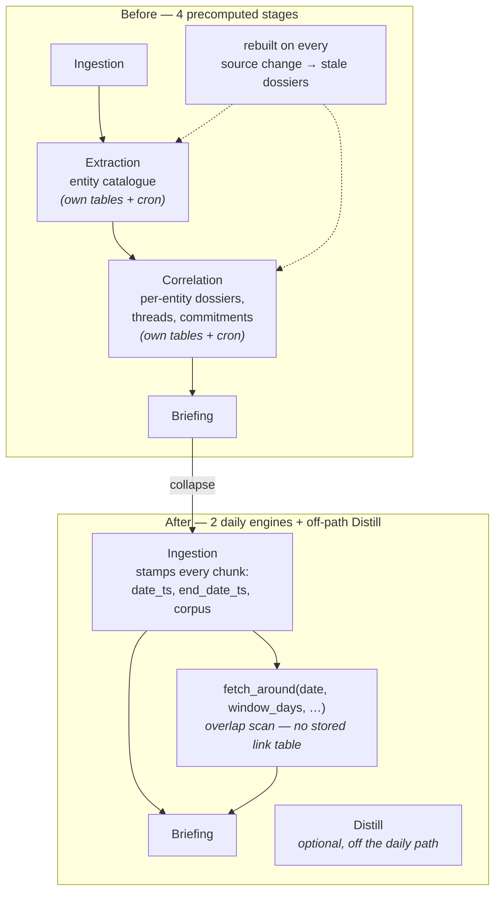

# 2. Collapse precomputation engines; correlation emerges from retrieval

- Status: Accepted

## Context

An earlier design had four stages: Ingestion, Extraction (an entity catalogue),
Correlation (per-entity dossiers, threads, commitments), and Briefing. The
middle two carried their own tables, cron jobs, and failure modes, and had to be
rebuilt whenever sources changed — producing stale dossiers.

## Decision

Delete the Extraction and Correlation engines, and replace their precomputed
tables with on-demand time-window retrieval:

Stamp **every chunk** with an accurate real-world `date_ts` (plus `end_date_ts`
for spanning items) and a `corpus` tag (`personal` | `world`), and answer
correlation questions on demand with one MCP tool,
`fetch_around(date, window_days, …)`, which returns every chunk whose
`[date_ts, end_date_ts]` interval overlaps a time window. The model in front
(Claude over MCP, or the Briefing engine) weaves the threads from that bundle.

The engine set that remains is **Ingestion** and **Briefing** on the daily path,
plus the optional, off-path **Distill** engine
(`ENGINES = ("ingestion", "briefing", "distill")`). A briefing composes
identically whether or not Distill has ever run.

## Consequences

Fewer engines, fewer crons, fewer tables, and a far smaller surface to keep
correct. Time is the one correlation key that is always accurate and never goes
stale, which removes an entire class of rebuild/invalidation bugs. The trade-off:
correlations are computed on demand instead of being queryable as stored rows —
cheap for one user's daily-briefing workload, but it would not scale to serving
precomputed graphs to many clients. The legacy tables are dropped on startup
(the `DROP TABLE` statements in `MIGRATION_SQL`, defined in
`packages/estormi_server/sql/schema_migrations.py` and re-exported from
`schema.py`).
