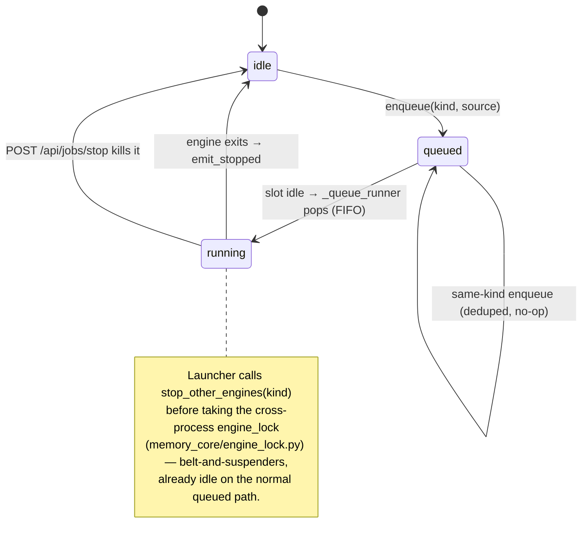

# 5. One heavy engine at a time (the run-queue mutex)

- Status: Accepted

## Context

The engines (Ingestion, Briefing, and the optional Distill) all contend for the
same local LLM, Qdrant client, and SQLite database. Running them concurrently is
slow at best and produces contradictory writes at worst.

## Decision

A single in-process **FIFO run-queue** in `packages/estormi_server/server/jobs.py`
(`ENGINES = ("ingestion", "briefing", "distill")`) lets only one engine run.
Every launch path funnels through `enqueue(kind, source)`, deduped by kind; the
`_queue_runner` drains the queue in order and waits for the running engine to
fully exit (`_await_engine_idle`) before launching the next. There is no
trigger-dependent fast path — manual and scheduled starts queue identically.

The three `QueueSource` values differ only in **origin**, not scheduling
behavior — all queue FIFO behind whatever is running:

| `source`   | Who enqueues                                                        |
| ---------- | ------------------------------------------------------------------ |
| `manual`   | UI buttons / REST (`api/pipeline.py`, `api/knowledge.py`, `api/distill.py`) |
| `schedule` | APScheduler crons + system-wake catch-up (`schedulers.wake_catchup`) |
| `backlog`  | the Distill engine re-enqueuing its own continuation               |

To make a queued entry run sooner the caller must **explicitly** stop the
incumbent: `POST /api/jobs/stop` kills the running engine, and the freed slot
lets the queue runner dispatch the next FIFO entry. (`stop_other_engines("reset")`
is the admin-reset variant that clears all engines before truncating tables.)

## Consequences

Serialising the engines is simpler and safer than fine-grained locking, and a
single queue means there is one place to reason about engine scheduling.
Distillation is optional and off the daily path, but shares the same resources
when it runs, so the mutex covers it too. The trade-off: a freshly launched run
never barges in — it waits in line, and the briefing runs in the gaps when
ingestion is idle rather than alongside it. Jumping the queue is a deliberate,
explicit act (`/api/jobs/stop`), never an implicit consequence of how the run was
triggered.
