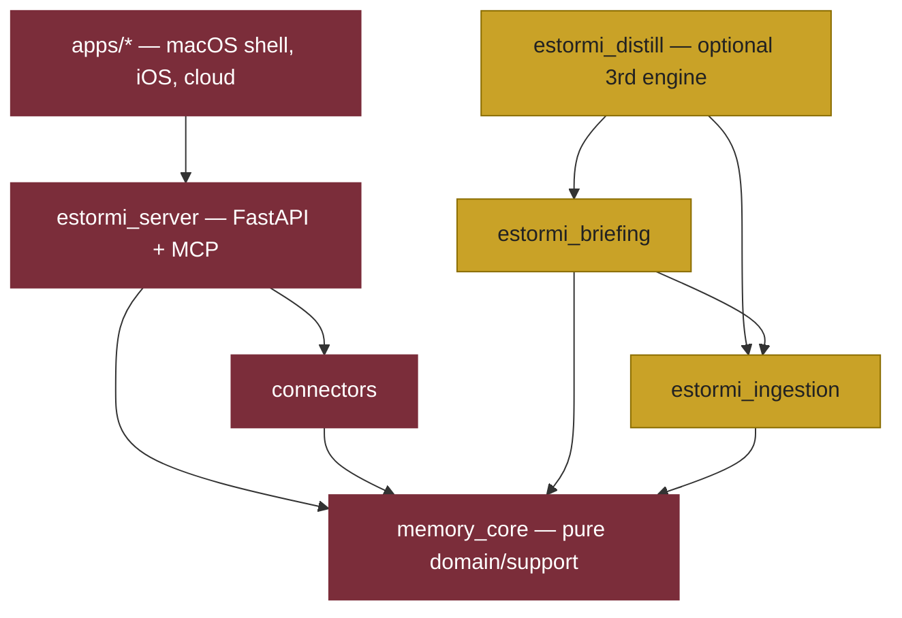

# 9. Layering is a one-way DAG enforced by import-linter

- Status: Accepted

## Context

Documented layering drifts; only an enforced rule cannot. The system has a clear
intended dependency direction that must not be violated by a stray import.

## Decision

Dependencies flow strictly downward. Every arrow below is an allowed import
direction; no arrow ever points back up. A higher layer may import any lower
layer directly (e.g. `estormi_server` imports `memory_core` without going
through `connectors`) — it is a DAG, not a linear pass-through.

The spine is `apps/* → estormi_server → connectors → memory_core`; the three
engines hang off it as acyclic descendants. `memory_core` is the pure bottom
layer and never reaches up. Among the engines, `estormi_briefing` imports down
into `estormi_ingestion` (never the reverse), and neither touches the optional
`estormi_distill` (which imports down into both) — so a briefing composes
identically whether distillation exists or not.

Enforcement is two-layered:

| Mechanism | Where | Catches |
| --- | --- | --- |
| `import-linter` (6 `forbidden` contracts over 6 root packages) | `[tool.importlinter]` in `pyproject.toml` | any upward import between layers/engines |
| AST contract tests | `tests/contract/test_no_fastapi_in_memory_core.py`, `tests/contract/test_no_server_imports_in_ingestion.py` | rules `grimp` cannot express (no FastAPI in `memory_core`; no engine imports the server) |

Run locally with `lint-imports`; CI exercises the contracts in-process via
`tests/contract/test_import_linter_layers.py`.

## Consequences

A violating import is caught at the local gate (and in CI when enabled), not in
review. HTTP/FastAPI code never belongs in `memory_core` (the pure
storage/retrieval layer); connector logic lives only in `packages/connectors/`
(see [0007](0007-connectors-single-source.md)). The cost is the up-front
maintenance of the contracts, paid back by never debugging a layering violation
in production.
