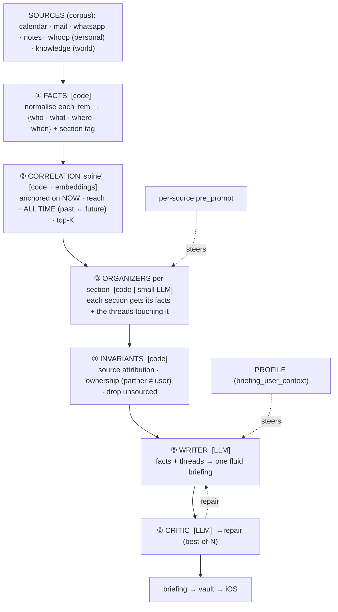
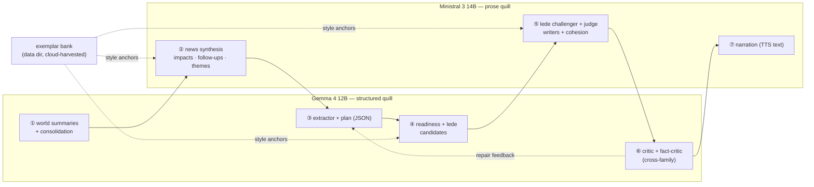

  <picture>
    <source media="(prefers-color-scheme: dark)" srcset="../../assets/brand/estormi-wordmark-dark.svg">
    
  </picture>

  <picture>
    <source media="(prefers-color-scheme: dark)" srcset="../../assets/brand/estormi-divider.svg">
    
  </picture>

# Briefing generation — the composition model

How `packages/estormi_briefing/run_briefing.py` turns the stored corpus into one
editorial briefing. This is the *composition* layer of the Briefing engine; for
where the engine sits, its cron and outputs, see [engines.md](engines.md) and
[Correlation via retrieval](engines.md#correlation-via-retrieval).

## The governing principle

> [!IMPORTANT]
> **Code owns the FACTS and the LINKS. The LLM only JUDGES and WRITES.**
> Everything trust-critical — which items are real, their source, who an event belongs to, which facts relate — is decided by deterministic code (and embeddings). The model is left the two things it is actually good at: judging a *curated shortlist* and turning it into fluent prose. The weaker the model, the more this division matters — it is what makes the local provider viable.

> [!IMPORTANT]
> **Strict Structural Isolation (Public-Safety Rule)**:
> The engine reasons only on **structural signals** (`group_type`, source `kind`, `working_location`, dates, embedding similarity) — never on personal identities or raw source names. All user-specific knowledge enters through exactly two UI-authored channels: the **profile** (`briefing_user_context`) and the **per-source guidance** (`pre_prompt`). No end-user's personal names are ever hardcoded in `packages/estormi_ingestion/`, `packages/estormi_server/`, or `prompts/`.

## The pipeline

Section split (`health · calendar · personal · world news · tech watch`) exists
to **reduce scope per call** — a narrow job a weak model can do reliably.
Correlation is **transversal** to the sections (a single graph feeding all of
them), never siloed inside one — that is what keeps cross-dimension links
(a chat ↔ a mail ↔ an event in three weeks) alive.

## Stage by stage

| # | Stage | Where | Key symbols |
|---|---|---|---|
| ① | Facts | code | `_fetch_daily_actions`, `_format_action` (carries `group_type`, `event_type`, `working_location`) |
| ② | Correlation | code + embeddings | `_fetch_upcoming_events`, `_correlate_event`, `graph.py` (anchors = shared person / place / topic) |
| ③ | Organize / summarize | code or LLM | `_summarize_world_source`, `_synthesize_news`, `_synthesize_themes` |
| ④ | Invariants | code | `resolve_news_citations`, `fallback_news_from_items`, `fallback_themes_from_items`; ownership tags in `knowledge_day_vision.j2` |
| ⑤ | Writer (day-vision) | LLM | `_generate_day_vision` → `_build_vision_prompt` → `knowledge_day_vision.j2` |
| ⑥ | Critic → repair | LLM | `critique_briefing`, `format_critic_feedback`, setting `briefing_repair_attempts` |

## Correlation — *anchored-now, unbounded-in-time*

Correlation is **not** done by the LLM scanning a flat dump (a weak model misses
the far link or invents one). It is a retrieval problem:

- **Anchor** on what is live *today* (events, open loops) — bounded.
- **Reach** across *all* time. `_CORR_HORIZON_DAYS` (forward, ~75 d) lets a trip
  two months out anchor; `_CORR_LOOKBACK_DAYS` (back, ~90 d) lets a chat from
  weeks ago link. Both env-tunable (`day_context.py` / `day_vision.py`).
- **Recall** via embeddings (`/search_memory` in `_correlate_event`); **precision**
  via hard anchors (same person/entity/place) enforced structurally in
  `graph.py`; **bound** via `_CORR_PER_EVENT` / `_CORR_MAX_EVENTS`.

Three tiers of correlation, by where each is solved — the local-vs-cloud
capability boundary the whole design turns on:

| Tier | What | Solved by | Available on |
|---|---|---|---|
| 1 | **Retrievable links** — A and B share an anchor | graph + embeddings (`graph.py`, `_correlate_event`) | local + cloud (model-agnostic) |
| 2 | **Reliability** — right source, right owner, no invention | code invariants (`resolve_news_citations`, ownership tags) | local + cloud (model-agnostic) |
| 3 | **Inferential leaps** — A + B ⟹ C | the model's reasoning | cloud only (`claude-cli`) — its remaining edge |

## Attribution & anti-hallucination (code-owned)

The synthesis model is **not trusted to format attribution** — weak models drop
or fabricate it. Instead:

- `_numbered_news` numbers each input bullet and maps `n → {source, date}`. The
  model cites `[n]`; `resolve_news_citations` turns those into real
  `[SOURCE: … | date]` and **drops any uncited bullet** (ungrounded → fabricated).
- When a model ignores citations entirely, `fallback_news_from_items` /
  `fallback_themes_from_items` render the real, already-sourced input bullets
  directly — **never an empty section, never a hallucinated one**. `_synthesize_themes`
  only trusts model output that actually follows the `THEME:`/`SOURCE:` structure.

## Ownership (generic)

`_format_action` carries each event's `group_type`. In the actionable schedule
(filtered to `me`/`partner`/`work`/`couple`), `knowledge_day_vision.j2` marks
only `partner` events inline as "NOT the user's"; the broader context calendars
(`family`/`friends`/`organisation`/`charity`/`sport`) arrive through the separate
context block, where the prompt's discipline section governs them. `critique_briefing`
flags `partner_event_misattributed`. The partner's *name* is never in code — it
only appears if the user wrote it in their profile, and only the LLM renders it.

## Critic → repair (best-of-N)

`critique_briefing` checks the day-vision against a known-error checklist; on
issues the loop regenerates with `format_critic_feedback` injected and keeps the
fewest-issue draft (`briefing_repair_attempts`, default 1, cap 3). The critic
must **trust graph-anchored links** — a cross-source connection that names a
shared place/person/project is the briefing's purpose, not a fusion error.

## Local vs cloud

Same pipeline both ways; only the day-vision/synthesis model changes
(`knowledge_llm_provider`). The local tier (`packages/memory_core/llm_local.py`, single decode under
`_infer_lock`) reaches retrievable correlation + reliable facts; the cloud tier
adds the inferential leaps and tighter prose. See
[local-llm notes](engines.md#ii--briefing--diurnale).

## Two quills — per-stage routing of the two local models

On the local tier the briefing routes each stage to one of two GGUFs, played
as a staff writer + an editor: **Gemma 4 12B** (sober, schema-faithful) owns
the structured/JSON stages, **Ministral 3 14B** (carries the impact/follow-up
layer) owns the prose/correlation stages. They fail *differently*, so pairing
them covers both gaps.

Each arrow across the subgraph boundary is one in-process model swap
(`memory_core.llm_local.get_llm(tier)`, ~15-30 s from page cache; two
14B-class GGUFs cannot co-reside on 16 GB). `compose_vision` orders its stages
to group consecutive same-tier calls, so one composition pays for two
residencies, not four.

| Stage class | Tier | Stages | Why |
|---|---|---|---|
| Structured / JSON / sober | Gemma 4 12B | summary, consolidation, extractor, plan, readiness, lede, profile | schema-faithful, doesn't drift |
| Prose / correlation | Ministral 3 14B | news synthesis, themes, writer, cohesion, narration, impact repair | carries impact + follow-up layer |
| Cross-family critique | the *other* family | critic, fact_critic, lede_alt, judge | a judge in the writer's own voice over-trusts it (self-preference) |

The routing preset (`decode_profiles.TWO_QUILLS_ROUTING`) is the source of
truth for the stage→tier map; the table above summarises it.

- **Stage names.** Every LLM call carries a `stage` in its decode-opts dict
  (`"writer"`, `"lede"`, `"news_synthesis"`, …); the local dispatch
  (`llm_dispatch._llm_call_dispatch`) keys everything below on it.
- **Per-tier decode profiles** (`decode_profiles.TIER_PROFILES`): style
  directives appended per stage (and an optional `max_tokens` scale) — the
  steering a tier needs without touching the shared templates.
- **Per-stage tier routing** is selected by setting `briefing_stage_routing`
  (`""` off · `"two-quills"` preset · JSON map; `decode_profiles.set_stage_routing`).
- **Cross-family lede tournament.** The lede pool carries a `lede_alt`
  challenger from the other family; the A/B judge (`bestof.judge_pick`) picks
  across the sober-vs-vivid trade-off instead of within it.
- **Exemplar bank** (`exemplars.py`): style anchors harvested from
  cloud-quality briefings into the data dir (`briefing_exemplars.json` —
  personal data, never in the repo) and injected as bounded `EXAMPLES`
  blocks into the lede/readiness/writer/impact prompts. In-context style
  transfer, 100 % local at runtime.
- **Deterministic correlation floor** (`synthesis.py`): follow-up markers
  are code-stamped from the persisted topic snapshot (`mark_followups`), and
  a world section under `BRIEFING_NEWS_MIN_IMPACTS` (default 2) earns one
  targeted, grounding-gated repair call (`_ensure_impact_floor`).

Iterate with `python -m estormi_briefing.stage_harness <stage> --ab`
(side-by-side per tier) and `--routing two-quills`; refill the bank with
`stage_harness harvest --from <briefing json> --label <src>`.

Benchmark appendix (16 GB M4, 2026-06-12 bench — not load-bearing)

The two-quills split came from a four-model bench (Ministral 3 14B, Gemma 4
12B, vs the cloud references on the same day's data): Gemma stopped at clock
adjacency and skipped the correlation markers; Ministral carried the
impact/follow-up layer but drifted (spelt-out wrong hours, empty metaphors).
The cross-family critique rule is empirical — the bench's one shipped
hallucination was a self-approved line.

Speed notes: Gemma 4 needs `flash_attn` (7.4 tok/s vs 2.3 without — set in
`llm_local._TIER_LOAD_OPTS`). Prompt-lookup speculative decoding was benched
and rejected (8.7 → 5.3 tok/s on Metal); Gemma's MTP drafter was not yet
reachable from the pinned llama-cpp-python — recheck on a bindings bump.

## Style distillation — QLoRA on the prose quill

Past the routing + exemplar layers, the remaining edge is the *editorial
gesture* (preparation advice, grounded impact phrasing, a sober lede). That is
distillable, and the gold is the user's **own briefing archive** — every day in
the vault, increasingly corrected by hand. The optional Distillation engine
trains a QLoRA adapter on that archive and fuses it into the local prose quill's
weights: zero runtime cost, deeper than in-context anchors, fully local, and
gated by a held-out eval that keeps the previous quill on any regression.

The full engine — harvest, dataset, train, eval gate, install, schedule, and
the on-device baselines — lives in [distillation.md](distillation.md). The only
rule worth restating here: every artefact is PII, so the archive, datasets,
adapters, and MLX models all live under `<data dir>/distill/`, never the repo.
