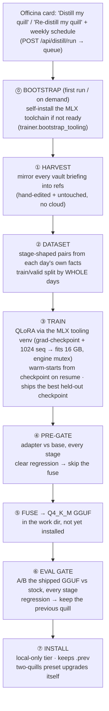
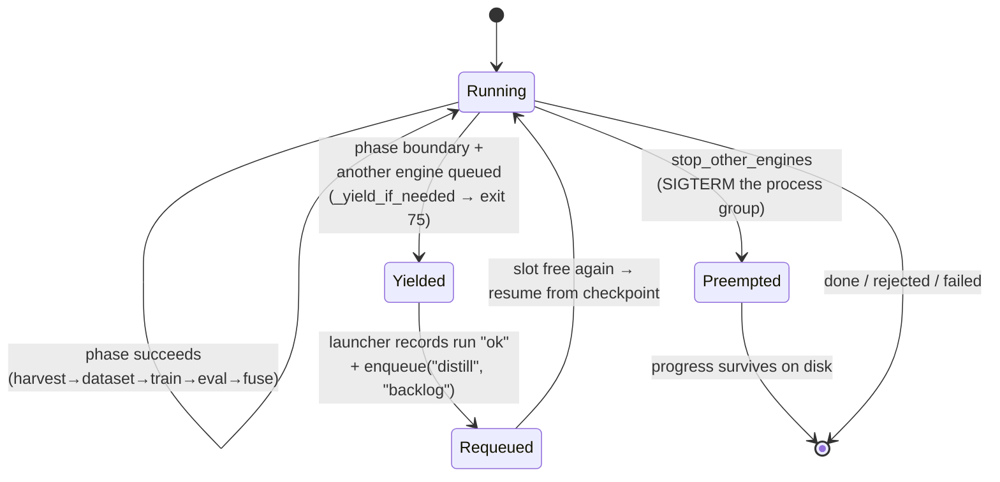

  <picture>
    <source media="(prefers-color-scheme: dark)" srcset="../../assets/brand/estormi-wordmark-dark.svg">
    
  </picture>

  <picture>
    <source media="(prefers-color-scheme: dark)" srcset="../../assets/brand/estormi-divider.svg">
    
  </picture>

# Distillation — train the local quill on your own briefings

How the **Distillation engine** (`packages/estormi_distill/`) turns the user's
**own briefing archive** into a permanently better *local* prose model — one
user gesture or a weekly schedule, fully on-device, nothing published. The
editorial rationale and the place of the distilled tier inside the two-quills
routing live in
[briefing-generation.md](briefing-generation.md#style-distillation--qlora-on-the-prose-quill);
this page is the engine itself.

## The chain

| Phase | Module | Checkpoint on disk |
|---|---|---|
| ① Harvest | `packages/estormi_distill/references.py` (`harvest_archive`) | `distill/refs/<date>.json` |
| ② Dataset | `packages/estormi_distill/dataset.py` | `distill/dataset/{train,valid}.jsonl` |
| ③ Train | `packages/estormi_distill/trainer.py` (`train`) | `distill/adapters/` (+ `train_marker.json`) |
| ④ Pre-gate | `trainer.evaluate` (adapter, all stages) | `status.json` verdict |
| ⑤ Fuse | `trainer.fuse_to_gguf` | `distill/work/…-Q4_K_M.gguf` |
| ⑥ Eval gate | `trainer.evaluate_gguf` (shipped GGUF A/B, all stages) | `status.json` verdict |
| ⑦ Install | `trainer.install_gguf` | `models/Ministral-3-14B-Estormi-SFT-Q4_K_M.gguf` (+ `.prev`) |

The orchestrator is `packages/estormi_distill/run_distill.py`; `distill/status.json`
is the single contract with `GET /api/distill/status` and the Officina card.

## The harvest (phase ①)

The training corpus is the user's own briefings — **not** synthetic cloud
compositions. `references.harvest_archive()` mirrors every
`briefings/<day>.json` in the vault into `distill/refs/<day>.json`, stamping
`referenceModel` so the mixed-stock readout can split the human-curated share
(`user-edited` when the briefing carries an `editedAt`, else `archive`) from the
untouched days. The refs workspace is kept as an exact mirror of the vault:
references whose briefing was deleted are dropped, so the next dataset never
trains on a stale day. The harvest is fast (a file copy per day) and free — no
subprocess, no cloud call.

**External edits need no hook.** The vault `briefings/<day>.json` is exactly
what the macOS edit endpoint *and* a hand-edit of the iCloud-Drive file both
write to, so any correction is picked up on the next harvest. Editing through
the SPA additionally registers the day immediately
(`references.register_edited_reference`) so it is available without waiting.

**Why train on local-composed briefings now?** The engine originally avoided
them ("the quill learns its own flaws"). That rule assumed un-curated output;
once the briefing archive is something the user reads and corrects, it *is* the
gold corpus — the better the quill, the fewer the edits, the cleaner the next
training set. The corpus includes every day (edited or not); old days whose
source chunks were pruned contribute only their world-impact pairs, since their
fact-grounded prompts would otherwise be empty (see `dataset.pairs_for_reference`).

## Queue citizenship — never break the other engines

The chain is long (the train+fuse phase alone is ~30-60 min) and runs as the
third engine kind (`distill`) through the same queue + engine mutex
(`server/launchers/distill.py`). Two mechanisms keep it from ever starving the
scheduled engines, both anchored on the on-disk checkpoints (refs, dataset,
adapter) that make every resume free:

- **Cooperative yield.** At every phase boundary `_yield_if_needed` polls
  `/api/jobs/state`; if any non-`distill` job is queued the child exits `75`
  (`YIELD_EXIT_CODE`). The launcher reads that as a clean hand-off — it records
  the run `ok` and re-enqueues `distill` at the tail so whoever was waiting runs
  first.
- **Preemption.** `stop_other_engines` can SIGTERM it like any engine (a manual
  briefing start kills it); progress survives in the checkpoints.

Training is the one RAM-exclusive, non-splittable phase (~30-45 min): it cannot
yield mid-run and holds the slot like any long engine.

## Safety rails

- **Two-stage eval gate before install** — a cheap adapter pre-gate
  (`trainer.evaluate`) rejects a clearly degenerate run before the expensive
  fuse, then the authoritative gate (`trainer.evaluate_gguf`) A/Bs the *fused
  Q4_K_M GGUF that actually ships* against the stock Ministral GGUF over the
  same llama-cpp serving path the briefing engine uses (quantization included),
  across **every** briefing stage (lede / readiness / writer / impact), not just
  the lede. Scoring is a per-stage degeneration floor
  (`vision_lint.stage_issues`): the candidate must come back with at least as
  many lint-clean outputs as the base on *unseen* days. The fused model only
  ever replaces the tier on a pass, and the previous GGUF stays as `.prev`.
- **Best-checkpoint, not last** — training evaluates every `_EVAL_EVERY` iters
  and checkpoints more often (`_SAVE_EVERY`, which divides it), and after
  training promotes the lowest held-out-loss checkpoint over the final (often
  overfit) one (`trainer._select_best_checkpoint`).
- **Transient-GPU-fault retry** — a 14B QLoRA on a 16 GB Mac shares the GPU with
  the live app's WebView; a command buffer can be discarded as an *innocent
  victim* of another process's GPU error/recovery (or hit momentary memory
  pressure). `train` recognises those crashes (`_is_transient_gpu_fault`) and
  re-runs — up to `_MAX_TRAIN_ATTEMPTS`, warm-started from the latest checkpoint
  (the frequent `_SAVE_EVERY` saves keep the lost work small) — instead of
  failing the whole distillation. `--grad-checkpoint` + a data-sized
  `--max-seq-length` pull the peak back under the ~10.7 GB Metal budget —
  grad-checkpoint trades ~20-30% train speed to recompute activations instead of
  holding them, the difference between an ~11.8 GB peak that OOMs and one that
  fits — so the *direct* OOM does not recur.
- **Local-only tier semantics** — `ministral3-14b-estormi` has no download
  source: hidden from the catalog until its file exists, refused by the
  download endpoints (`packages/memory_core/llm_local.py`, `api/model.py`).
- **Disk floor + relocatable workspace** — a full run needs ~40 GB transient
  (`MIN_FREE_GB`; the dequantized F16 fuse scratch alone is ~28 GB), which won't
  fit on a small boot volume. The workspace follows the single relocatable root
  storage location: `paths.distill_dir()` resolves `ESTORMI_DISTILL_DIR` (env) →
  `<data dir>/distill`, where `<data dir>` is the relocatable library root
  (`memory_core.datadir.resolve_data_dir`). `GET /api/distill/status` reports the
  workspace dir and its free GB (flagged red below the floor) so a run is steered
  to a roomy disk before it aborts; `ESTORMI_DISTILL_WORK_DIR` still overrides
  just the scratch work dir.
- **Everything is personal data.** The harvested archive copy, dataset,
  adapter, fused weights — a small-rank adapter on a small dataset *memorizes*
  the user's life (names, employer, health figures). It all lives under
  `<data dir>/distill/`, must never enter the repo, and belongs in the same
  backup category as the SQLite DB. The repo ships the loom, never the cloth.

## Trigger & schedule

Two ways to run, both through the queue (`POST /api/distill/run` →
`jobs.enqueue("distill", …)`):

- **On demand** — the Officina card's *Distill my quill* button (*Re-distill my
  quill* once a quill exists), enabled once the MLX toolchain is installed.
- **On a schedule** — the card exposes an on/off toggle + a manual cron field
  over `distill_schedule_cron` (validated in `services/settings.py`,
  (re)registered as the `weekly_distill` job in `api/settings.py`). **On by
  default, Sunday 03:00 local.** Set it to `manual` to disable autonomous
  retraining. This is the self-improvement loop: train on the curated archive →
  a better quill → better briefings → the user corrects them → the next run
  trains on the improved corpus.

## Tooling — self-bootstrapping

The chain needs an MLX toolchain (a dedicated venv with `mlx-lm` + the GGUF
converter, a `llama.cpp` clone, and `llama-quantize` via Homebrew when absent),
built from the running interpreter and kept under `<workspace>/tools/` — never in
the app bundle, ~1 GB. **It installs itself; no terminal required:**

- **On first run (phase ⓪).** `trainer.bootstrap_tooling()` installs it in-process,
  idempotently, before the harvest — so `POST /api/distill/run` (the scheduled and
  headless path) enqueues unconditionally, with no setup gate. In the card UI the
  *Distill my quill* button stays disabled until the toolchain is present.
- **On demand.** The card also carries a Download/Delete row
  (`GET /api/distill/tooling/install`, an EventSource that streams
  `trainer.bootstrap_events()`), so the toolkit installs exactly like a model.

`trainer.tooling()` is the readiness probe behind both, and the same steps are
mirrored in [`scripts/setup_distill.sh`](../../scripts/setup_distill.sh) for a
manual install. **Apple Silicon only.**

## Measured baselines

Point-in-time smoke result on an M4 / 16 GB Mac (2026-06-12/13) — indicative,
not a contract; the numbers shift with the corpus and the tooling versions.

- QLoRA 14B-4bit: 0.045 % trainable params, **~11.8 GB peak without
  `--grad-checkpoint`** (the OOM case the shipped grad-checkpoint config now
  avoids — see the safety-rail above), ~80 tok/s, ~10 s/iteration.
- An early run produced ~60 train / ~8 valid pairs from ~15 days of references.
- Same-day-only training transferred style but leaked memorized content onto
  unseen days — the cure is the broad whole-day archive (the held-out split
  above), not more iterations.
- On a 16 GB Mac the train phase needs that ~12 GB essentially exclusively. The
  engine mutex serialises the three engines but cannot see external processes —
  do **not** run the build gate (`scripts/build.sh`) or other heavy work while a
  train is in flight, or the machine will OOM.
