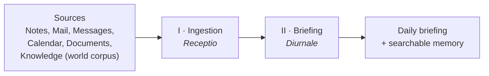
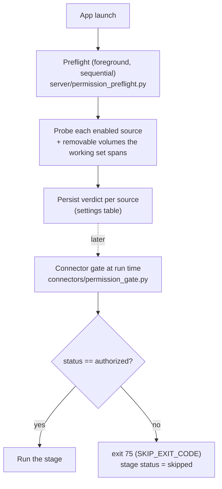
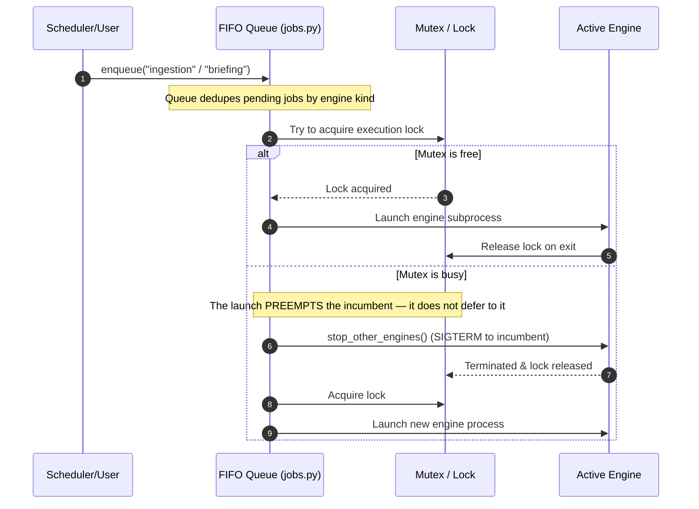

<p align="center">
  <picture>
    <source media="(prefers-color-scheme: dark)" srcset="../../assets/brand/estormi-wordmark-dark.svg">
    
  </picture>
</p>

<p align="center">
  <picture>
    <source media="(prefers-color-scheme: dark)" srcset="../../assets/brand/estormi-divider.svg">
    
  </picture>
</p>

# The Two Engines

Estormi turns scattered personal data into usable memory through **two
engines**. The first *builds and structures* the memory; the second *turns it
into daily value*.



Both engines are backend processes surfaced on the one-pager SPA — their live
state is published over SSE and rendered by `CardinalSection` /
`OnePagerTopBar`. They are decoupled: Briefing consumes what Ingestion stored
and writes its own output, so either can be re-run without the other.

> A third engine — **Distillation** (optional, Apple Silicon only) — periodically
> retrains the local prose model on the user's own briefing archive (every
> briefing in the vault, including hand-edited ones). It shares the
> same run-queue and engine mutex but sits off the daily path: a briefing
> composes identically whether or not it has ever run. It has its own page —
> [distillation.md](distillation.md).

| # | Engine | Reads | Produces | Runs as | Triggered by |
|---|--------|-------|----------|---------|--------------|
| I | **Ingestion** | Selected sources | `chunks` + vectors | The daily ingestion pipeline (`scripts/daily_ingestion.sh`) | APScheduler cron, or manual |
| II | **Briefing** | Fresh chunks (via time-window retrieval) | iCloud `briefings/<date>.json` (vault) | Subprocess (`packages/estormi_briefing/run_briefing.py`) | APScheduler cron (default `0 7 * * *`) |

Each engine is detailed below, followed by the **correlation-via-retrieval**
model — how correlation emerges from time-window retrieval rather than from a
stored engine.

## I · Ingestion — *Receptio*

> *Wherein the day is gathered in.*

**Role.** Read selected sources and turn their content into a local, deduplicated
archive of chunks.

**Flow.** Each source is read → long items are split into chunks → chunks are
hashed and deduplicated → stored as SQLite metadata plus Qdrant dense/sparse
vectors. Sync is idempotent: the same content produces the same hash and is not
stored twice.

**How it runs.** Ingestion is the **daily ingestion pipeline** — `scripts/daily_ingestion.sh`,
one connector per stage from `connectors`, run with bounded parallelism
(`ESTORMI_INGEST_PARALLELISM`, default 3; set to 1 to force serial). It is
scheduled by an in-process APScheduler job (default cron `0 2 * * *`) or triggered
manually from the sources panel. A failed stage is recorded and the run
continues — one broken source never blocks the others.

**macOS permissions & TCC preflight.** Every macOS privacy prompt is grouped at
app launch, never mid-run — so a dialog is always attributed to the Estormi
process and the nightly pipeline never blocks on one. The preflight probes once
at launch and persists each verdict; the connector gate reads that persisted
status at run time and skips (never re-prompts):



The scheduling lives **in-process** for the same reason: a detached `launchd`
job would carry a different TCC responsible-process and re-trigger the prompts.
The `preflight_extra_paths` setting (empty by default) folds in volumes the app
touches only *indirectly* — e.g. the briefing's `claude-cli` provider statting
external-drive projects — so those prompts also land at launch, grouped.

**Writes.** `chunks`, source watermarks, freshness state. Every chunk lands with
a real-world `date_ts` (and, for spanning items like calendar events, an
`end_date_ts`) and a `corpus` tag — see [Correlation via retrieval](#correlation-via-retrieval)
below.

## II · Briefing — *Diurnale*

> *At dawn, the day distilled.*

> **Naming.** The engine code lives in `packages/estormi_briefing/`
> (`packages/estormi_briefing/run_briefing.py`). The legacy **`knowledge`** label
> survives in the surrounding plumbing — the `/api/knowledge/*` routes, the
> `knowledge_*` settings keys, and the `knowledge.log` file — which all refer
> to this same engine.

**Role.** Synthesise the day into a single editorial briefing — the layer that
turns the structured memory into something to read.

**Flow.** The day's fresh chunks are read across a time window → the model
composes a daily briefing (cross-source news, theme-clustered watch, the day's
calendar/reminders, and follow-up threads). Because every chunk carries a
`date_ts` and a `corpus` tag, the briefing pulls personal and `world` material
from one time-window query without a precomputed correlation step.

**Provider switch.** The composing model is switchable at runtime via
`knowledge_llm_provider` (`local` | `claude-cli`) with
`knowledge_llm_model`. When the provider is `local`, the local-LLM model role
is the single `briefing` role (settings key `briefing_model_tier`) — and the
optional `briefing_stage_routing` setting (`"two-quills"`) splits the
editorial stages across BOTH catalog tiers with cross-family critique; see
[Two quills](briefing-generation.md#two-quills--per-stage-routing-of-the-two-local-models).

**How it runs.** Briefing is its own engine, **not** a pipeline stage. It runs as a
subprocess (`packages/estormi_briefing/run_briefing.py`) on its own APScheduler cron
(`briefing_schedule_cron`, default `0 7 * * *`) — after the nightly ingestion pipeline, so it
draws on freshly refreshed sources. Its output is written to the iCloud Drive
vault (`briefings/<date>.json`) for the iOS companion — it is **not** re-ingested
as chunks; the briefing lives in the vault, not the searchable archive
(`run_briefing.py`).

**Writes.** Briefing status fields; `briefings/<date>.json` in the vault.

**Composition.** How the stored corpus becomes one editorial briefing — the
facts→correlation→organize→invariants→writer→critic pipeline, the code-vs-LLM
split, and the citation/fallback/ownership rules — is documented in
[briefing-generation.md](briefing-generation.md).

## Correlation via retrieval

Correlation is **emergent from time-window retrieval** — there is no stored
correlation engine, no entity catalogue, no precomputed dossiers, and no
thread/commitment/decision tables.

Two ingredients make this work:

- **Accurate `date_ts` on every chunk.** Each chunk is stamped with the
  real-world timestamp of the thing it describes (and `end_date_ts` for items
  that span a range, like calendar events). Stored in the `chunks` table and
  indexed (`chunks_date_ts_idx`).
- **A `corpus` tag on every chunk** — `personal` (mail, calendar, chats, docs,
  code) vs `world` (the live `knowledge` source), mapped from the
  source by `_corpus_for_source` (in `packages/estormi_server/storage/writers.py`).
  (`rss` / `youtube` /
  `news` are legacy labels in `WORLD_SOURCES` kept only so pre-rename chunks
  still map to `world`; the one live world source is `knowledge`.) World
  sources merge into the briefing without polluting personal queries;
  `search_memory` takes a `corpus` filter to scope a query.

On top of those, an MCP tool returns every chunk whose `[date_ts, end_date_ts]`
interval overlaps a window, across sources:

```
fetch_around(date, window_days, sources?, corpus?)
```

The model in front (Claude via MCP) — and the Briefing engine —
weave threads and follow-ups out of that bundle on demand, rather
than reading them from precomputed tables.

## The daily ingestion pipeline

The Ingestion engine *is* the daily ingestion pipeline. Its canonical stage order
(`packages/estormi_server/services/pipeline_status.py` → `DAG_STAGES`, derived from the connector registry)
sets the launch sequence and the UI layout — it is **not** a dependency chain.
A launcher fans the stages out under bounded parallelism, so several are in
flight at once; **nine** stages exist, **seven** run in the default nightly run
(`connectors stages`) and **two** OAuth stages run only on demand:

```mermaid
flowchart TD
    L["Pipeline launch<br/>bounded parallelism"]
    subgraph default["Default-on (7) — nightly"]
        N["notes"]
        M["mail"]
        R["reminders"]
        IM["imessage"]
        W["whatsapp"]
        D["documents"]
        K["knowledge<br/><em>world corpus</em>"]
    end
    subgraph ondemand["On-demand (2) — default_stage=False, need OAuth"]
        G["gcal"]
        WH["whoop"]
    end
    L --> N & M & R & IM & W & D & K
    L -. opt-in .-> G & WH
```

`knowledge` ingests the external YouTube/RSS *world* corpus — it is a source
stage, distinct from the Briefing composition engine. Briefing is absent by
design — it runs on its own cron, in the gaps when the pipeline is idle.

## The engine mutex

Only **one heavy engine runs at a time**. The engine kinds contend for the same shared resources — the local LLM, the Qdrant client, and the SQLite database. Running more than one concurrently degrades performance and risks contradictory writes.

`packages/estormi_server/server/jobs.py` enforces serialization with a single FIFO run-queue: starts funnel through `enqueue` into `_queue_runner`, deduped by engine kind (`ENGINES = ("ingestion", "briefing", "distill")`). The runner waits for one engine to fully exit before launching the next. The optional **Distillation** engine (`distill`) is the third kind through this same queue — long, cooperative, and documented separately in [distillation.md](distillation.md).



Every launch — scheduler-driven nightly or manual, ingestion or briefing — preempts the running engine by calling `stop_other_engines` first; SIGTERM stops the incumbent and releases the lock before the new engine starts. The FIFO queue's role is only to order and de-duplicate pending starts (dedupe is by engine kind — re-enqueueing a kind already running or waiting is a no-op) and to wait for each engine to fully finish before dispatching the next — not to make any launch defer to an already-running engine.

### Runner state & self-healing

The runner coordinates three pieces of state; the **events bus is a read-model — `_running` is the source of truth**:

| State | Owner | Meaning |
|---|---|---|
| `_running` | `jobs.py` runner | the engine the runner is actually driving (or `None`) |
| `engine_events.current_kind()` | events bus | what the snapshot/UI shows as running |
| `engine_idle_event` | events bus | clear while an engine runs, set when the slot is free — the runner `await`s it before dispatching the next |

**Invariant (normal flow):** the bus only tracks a kind the runner owns, so `current_kind() != None ⟹ _running != None`, and the idle event is clear for exactly as long as `_running` is set.

**The one failure mode — a stale bus.** A preemption swaps the tracked kind (one engine SIGTERMs another), so the slow engine's real `emit_stopped` arrives for a kind the bus no longer tracks and is *swallowed* (a kind-mismatch stop is a deliberate no-op — otherwise it would clear the freshly-started engine). That can leave the bus tracking an engine no subprocess owns, idle event cleared. Two guards heal it so the runner never wedges and two engines never run at once:

- **Same-kind re-enqueue** (the common UI retry): `enqueue` sees `current_kind() == kind` while `_running is None`, logs `queue.bus_state_stale_clearing`, and calls `force_clear_current()` instead of rejecting with a phantom `already_running`.
- **Different-kind enqueue**: `_await_engine_idle` is *bounded* — it rechecks `_engine_process_alive` (in-process handle → engine-lock liveness) every `_IDLE_RECHECK_SECS` and, once the owner is *confirmed dead*, clears the bus and re-sets the idle event. A genuinely running engine is never healed away (the probe errs toward "alive").

```mermaid
stateDiagram-v2
    [*] --> Idle
    Idle --> Running: _pop_next sets _running; emit_started clears idle
    Running --> Idle: emit_stopped sets idle; _running=None
    Running --> Stale: preemption swaps the bus; the slow emit_stopped is swallowed
    Stale --> Idle: same-kind enqueue reconcile · _await_engine_idle heals a dead owner
```



These invariants are pinned by `tests/estormi_server/test_jobs.py` (`test_enqueue_reconciles_stale_bus_state`, `TestAwaitEngineIdle`, `TestEventsBusTransitions`), so a refactor that breaks "only one engine in flight" fails the gate.

## See also

- [overview.md](overview.md) — component map, layering, storage.
- [distillation.md](distillation.md) — the optional third engine: retraining the local prose model offline.
- [rationale.md](rationale.md) — why two engines (and why Extraction/Correlation were deleted), and why correlation is emergent.
