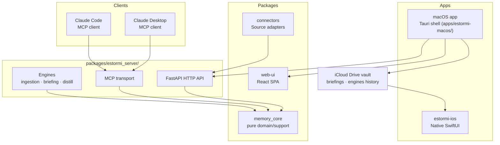
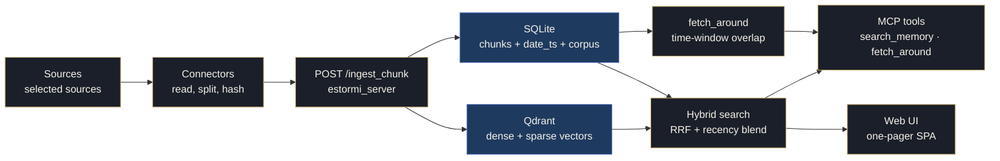

<p align="center">
  <picture>
    <source media="(prefers-color-scheme: dark)" srcset="../../assets/brand/estormi-wordmark-dark.svg">
    
  </picture>
</p>

<p align="center">
  <picture>
    <source media="(prefers-color-scheme: dark)" srcset="../../assets/brand/estormi-divider.svg">
    
  </picture>
</p>

# Architecture Overview

Estormi is a local-first memory system — every component runs on the user's
Mac. Ingesting, indexing, and embedding are fully local; that data never leaves
the machine.

A handful of features do reach the network (the cloud briefing provider,
weather, optional knowledge/calendar/health connectors, the WhatsApp sidecar,
first-use model downloads, the iCloud Drive vault sync, and the opt-in APNs
push). Each is enumerated with its on/off default in the egress table in
[SECURITY.md](../../.github/SECURITY.md#network-egress).

## Component map



`estormi-ios` is a read-only companion with two pages — Briefings and Metrics.
The macOS app writes the daily briefings and an engine-history log as JSON files
into a folder in the user's iCloud Drive, and the phone reads that folder. It
never talks to the FastAPI server directly.

## The two engines

`packages/estormi_server/` hosts the engines. The first two build and structure the
memory and turn it into daily value; an optional third (Distillation) retrains the
local prose model offline.

| # | Engine | Role | How it runs |
|---|--------|------|-------------|
| I | **Ingestion** (*Receptio*) | Sources → deduplicated chunks (each with a `date_ts` and `corpus` tag) | The daily ingestion pipeline (`scripts/daily_ingestion.sh`), scheduled or manual |
| II | **Briefing** (*Diurnale*) | The day → one editorial briefing | First-class engine (`packages/estormi_briefing/run_briefing.py`), guarded by the engine mutex in `packages/estormi_server/server/jobs.py`. See [engines.md](engines.md). |

Both engines share the local LLM, Qdrant and SQLite, so an **engine mutex** in
`packages/estormi_server/server/jobs.py` runs only one at a time. A third, optional engine —
**Distillation** (`distill`, Apple Silicon only) — shares that same mutex but sits
off the daily path; see [distillation.md](distillation.md). Correlation is no longer a
precomputed engine — it is emergent from time-window retrieval (`date_ts` +
the `fetch_around` MCP tool). Full reference: [engines.md](engines.md).

## Layer boundaries

The architecture enforces strict layering:

```
apps/*       →  packages/estormi_server/ (FastAPI HTTP)  →  memory_core
LLM clients  →  packages/estormi_server/ (MCP transport) →  memory_core
```

Rules that must never be broken:
- `memory_core` never imports FastAPI — it is the pure storage layer.
- Connectors live once in `packages/connectors/` and run only on the Mac — never duplicated per surface.

## Surfaces

| Surface | Package | Target | Role |
|---------|---------|--------|------|
| macOS app | root `apps/estormi-macos/` | Apple Silicon Mac | Full feature set, Tauri shell, runs the engines |
| estormi-ios | `apps/estormi-ios` | iOS 26+ | Read-only SwiftUI companion (Briefings / Metrics); reads JSON from an iCloud Drive folder |

> [!NOTE]
> The earlier Docker / Linux / RPi runtime variants — and the per-connector `RuntimeTag` they required — were dropped, so connectors no longer carry a runtime tag.

## Ingestion and search data flow

How a source becomes a chunk, then a search result (the Briefing leg is in
[engines.md](engines.md)):



## Storage

| Store | Technology | Location |
|-------|-----------|---------|
| Chunk metadata, settings | SQLite (aiosqlite) | `$ESTORMI_DATA_DIR/estormi.db` |
| Semantic vectors | Qdrant embedded | `$ESTORMI_DATA_DIR/qdrant/` |
| Audit log | JSONL (structlog) | `$ESTORMI_DATA_DIR/audit.log` |
| Distillation workspace | files (~40 GB transient) | `$ESTORMI_DATA_DIR/distill/` |

The whole library is **relocatable** to a single user-chosen base path (the
Maintenance → Storage card). Because the base path can't live in the database it
governs, it is a pointer file at the fixed config home (`memory_core/datadir.py`),
resolved `ESTORMI_DATA_DIR` env → pointer → default `~/Library/Application Support/Estormi`.
A change is queued (a marker) and applied at the next launch — copy → verify →
swap, old copy kept as a backup — before the DB opens (`estormi_server/main.py`
calls `bootstrap_relocate()` first). The iCloud vault stays separate.

## Security

> [!IMPORTANT]
> All server endpoints are loopback-only by default (`127.0.0.1:8000`). Remote access requires a bearer token configured via `ESTORMI_MCP_TOKEN`. The `security_boundary` middleware enforces this on every non-public path.

## See also

- [engines.md](engines.md) — the two engines (Ingestion, Briefing), the engine mutex, and correlation via retrieval (`date_ts` + `fetch_around`).
- [rationale.md](rationale.md) — *why* each load-bearing decision was made (local-first, two engines, emergent correlation, SQLite + Qdrant, the iCloud vault) and its trade-offs.
