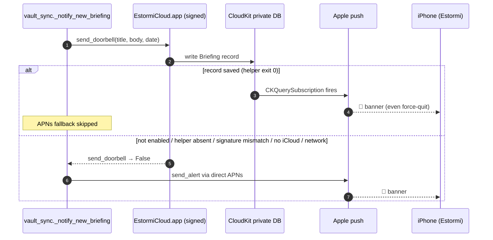
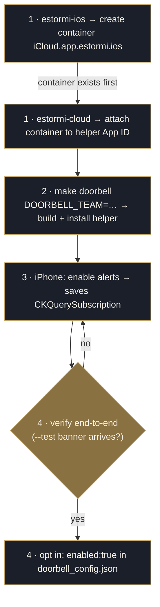

<p align="center">
  <picture>
    <source media="(prefers-color-scheme: dark)" srcset="../assets/brand/estormi-wordmark-dark.svg">
    
  </picture>
</p>

<p align="center">
  <picture>
    <source media="(prefers-color-scheme: dark)" srcset="../assets/brand/estormi-divider.svg">
    
  </picture>
</p>

# CloudKit doorbell (new-briefing alerts, no push key)

The CloudKit doorbell is **Option B** of the notification design: the Mac
holds no APNs key at all. A small signed helper writes one tiny `Briefing`
record into the **private** CloudKit database of the Mac's iCloud session; a
`CKQuerySubscription` saved by the iOS app makes **Apple** sign and deliver
the visible banner. Because no developer secret ever ships, this path works
for Store-distributed iOS builds — unlike Option A
([direct APNs](ios-push-notifications.md)), which needs the developer's
private `.p8` on the sending Mac.

CloudKit is a **doorbell only**: the record carries the alert text and a
date, nothing else. The iCloud Drive vault remains the sole data transport
(briefing JSON + audio), exactly as before.

One notification event, one channel, one banner: `_notify_new_briefing`
rings the doorbell first and only falls back to direct APNs when it returns
`False` — never both.



## Pieces

- **Helper** ([`apps/estormi-cloud/`](../apps/estormi-cloud/project.yml),
  [`main.swift`](../apps/estormi-cloud/Sources/main.swift)) — a faceless
  mini-.app, because CloudKit is a *restricted* entitlement that a bare
  executable can never claim (TN3125: the provisioning profile lives at
  `Contents/embedded.provisionprofile`). Installed **outside** the Estormi.app
  bundle, at the config home `~/Library/Application Support/Estormi/bin/EstormiCloud.app`,
  so the parent's signature seal is never broken and no `codesign --deep` can
  ever strip the helper's entitlements. It installs to the **config home**, not
  the data library: the config home never moves when the library is relocated
  (Settings → Move Library), so the doorbell survives a move. A legacy install
  under `$ESTORMI_DATA_DIR/bin` is still honoured and is promoted to the config
  home at the next app start (`cloudkit_doorbell.migrate_helper_to_config_home`).
  Exit codes (contract with `cloudkit_doorbell.py` — kept in sync):

  | Code | Meaning |
  |---|---|
  | `0` | record saved (or `--status`: account available) |
  | `1` | unexpected CloudKit / runtime error |
  | `2` | no iCloud account on this Mac (or access restricted) |
  | `3` | transient network / service failure — worth retrying |
  | `64` | usage error |
- **Mac caller** ([`packages/estormi_ingestion/shared/delivery/cloudkit_doorbell.py`](../packages/estormi_ingestion/shared/delivery/cloudkit_doorbell.py))
  — never-raise mirror of `apns_push`: gates on the opt-in config, verifies
  the helper's code-signing **Team ID** before spawning it, execs the inner
  Mach-O with a 30 s timeout. Wired into `_notify_new_briefing` in
  [`vault_sync.py`](../packages/estormi_ingestion/shared/delivery/vault_sync.py): doorbell
  first; on success the APNs fallback is **skipped** (one channel, one
  banner).
- **iOS subscription** ([`CloudKitDoorbell.swift`](../apps/estormi-ios/Sources/Notifications/CloudKitDoorbell.swift))
  — saves the `briefing-created` query subscription after the user enables
  alerts, retries on every launch, re-saves on iCloud account change, and
  deletes it when alerts are turned off. The banner text is rendered by the
  system from [`Localizable.strings`](../apps/estormi-ios/Sources/Localizable.strings)
  + the record's `date` field — the app may be force-quit at delivery, so no
  app code runs.

## One-time setup

Two ordering rules carry the correctness: the **container** must be created
via `apps/estormi-ios` *before* `apps/estormi-cloud` attaches it, and the
doorbell must **not** be opted in until the iPhone has saved its subscription
— a successful doorbell suppresses the APNs fallback, so a record nobody is
subscribed to rings nobody.



1. **Register the capability** (once per team): open each project in Xcode
   (`xcodegen generate` first), select the target → Signing & Capabilities →
   pick your Team. The iCloud/CloudKit capability and the container
   `iCloud.app.estormi.ios` are derived from the committed entitlements
   files; if the container shows **red**, click the ⟳ button under
   Containers to create it on the portal. Do this for `apps/estormi-ios`
   (creates the container) then `apps/estormi-cloud` (attaches it to the
   helper's App ID). `xcodebuild -allowProvisioningUpdates` cannot do this
   part headlessly. Freshly created container↔App ID associations can take
   a while to propagate — `"Invalid bundle ID for container"` on the first
   writes resolves by itself.
2. **Build + install the helper**:

   ```bash
   make doorbell DOORBELL_TEAM=<your team id>
   ```

   This builds with automatic signing (`-allowProvisioningUpdates`,
   registering the Mac as a development device on first run), installs to
   `~/Library/Application Support/Estormi/bin/EstormiCloud.app` (the config
   home — override with `ESTORMI_CONFIG_HOME`) and smoke-tests it (`--status`).
   This is the **maintainer's own dev path**: an Apple-Development, device-locked,
   CloudKit-**Development** helper. It only rings a dev/Xcode iOS build — see the
   environment matrix below.

   For the **distribution** path (the helper download users get — Developer ID +
   hardened + CloudKit **Production** + notarized, bundled into the GitHub
   `Estormi.app` and auto-installed on first run), see
   [Distribution](#distribution-signed-once-works-for-all-download-users).
3. **Enable alerts on the iPhone** (Metrics → Settings → New-briefing
   alerts) — this saves the CloudKit subscription.
4. **Verify end-to-end, then opt in** — only after the test banner arrives
   (the doorbell stays a no-op until you flip `enabled`, per the gate above):

   ```bash
   ESTORMI_DOORBELL_ENABLED=1 python -m estormi_ingestion.shared.delivery.cloudkit_doorbell --test
   # banner arrives → make it permanent:
   echo '{"enabled": true}' > "$HOME/Library/Application Support/Estormi/doorbell_config.json"
   # this is the config home (override with ESTORMI_CONFIG_HOME); it stays put
   # even after the data library is relocated elsewhere.
   ```

   `python -m estormi_ingestion.shared.delivery.cloudkit_doorbell --status` shows the
   helper, opt-in, signature and iCloud-session state at any time.

## The environment matrix (the #1 silent-failure trap)

CloudKit containers have two isolated environments. A record written into
one is invisible to subscriptions saved in the other — **no error anywhere,
just silence**:

| Build | Environment |
|---|---|
| Helper signed Apple Development (what `make doorbell` produces) | Development |
| Helper signed Developer ID (what `make doorbell-dist` produces) | Production |
| iOS app run from Xcode / `xcodebuild` (Debug) | Development |
| iOS app from TestFlight / App Store | Production |

Keep both sides on the same row. The helper's environment is pinned in
[`EstormiCloud.entitlements`](../apps/estormi-cloud/Sources/EstormiCloud.entitlements)
(`icloud-container-environment`), committed on `Development` for the dev path.
`make doorbell-dist` generates a transient `Production` copy and signs with it (it
does **not** edit the committed file), so the dev and distribution builds pick
their environment automatically. Promote the CloudKit schema to Production first
(CloudKit Console → Deploy Schema Changes). When promoting, also mark the
helper's custom `createdAt` field **Queryable** in the schema — Production has
no just-in-time indexing, so without it the old-record purge fails (logged to
stderr, non-fatal) and doorbell records accumulate.

## Distribution: signed once, works for all download users

The maintainer signs the helper once; every user who downloads the maintainer's
`Estormi.app` (and runs the App Store / TestFlight iOS app) gets new-briefing
banners — no per-user setup. The pieces:

1. `make doorbell-dist DOORBELL_TEAM=<team> DOORBELL_PROVISION_PROFILE='<name>'` —
   builds the helper with **Developer ID Application** signing, the **hardened
   runtime**, a transient `Production` entitlements file, and `--timestamp`. It
   needs a **Developer ID** provisioning profile authorizing the
   `iCloud.app.estormi.ios` container in Production (created once on the portal;
   the App Store iOS build resolves to the same Production container).
2. `make doorbell-notarize APPLE_API_KEY_ID=… APPLE_API_ISSUER=… APPLE_API_KEY_PATH=…`
   — submits the helper to the notary service and staples the ticket
   (submit + staple only; **never re-signs**, which would strip the CloudKit
   entitlement).
3. `make bundle` then **embeds** the stapled helper into `Estormi.app` as
   `Contents/Resources/EstormiCloud.app.zip` (+ a `EstormiCloud.version` marker and
   a team-pinned `doorbell_config.json` whose `team_id` is read from the helper's
   own signature) — *before* the parent is signed, and as a zip (opaque data) so
   the parent's non-`--deep` signature doesn't touch the helper's seal. Skipped
   automatically when no `doorbell-dist` helper was built.
4. On first launch the Rust shell ([`doorbell.rs`](../apps/estormi-macos/src/doorbell.rs))
   extracts the helper to `~/Library/Application Support/Estormi/bin` (preserving
   its signature + ticket) and drops the bundled config there — **synchronously,
   before the Python sidecar starts**, so the startup migration sees it and
   no-ops. It never clobbers an existing config (a `make doorbell` dev install or
   a user-pinned team/enable wins).

**Account-match requirement (silent if wrong):** the doorbell only delivers when
the user's **Mac and iPhone are signed into the same Apple ID** — records and
subscriptions are per-account, per-container, per-environment. A locally rebuilt
iOS *Debug* app talks to Development, so it won't see the Production helper's
records; the supported iOS path is App Store / TestFlight. A user who **re-signs
the helper under their own team** loses access to the maintainer's container — by
design (keep the maintainer's pre-signed helper, or pin `ESTORMI_DOORBELL_TEAM_ID`
to your own and point at your own container).

## Troubleshooting a silent doorbell

The helper carries repair flags that diagnose the CloudKit side from the Mac.
Only `--status` is proxied by the Python entrypoint
(`python -m estormi_ingestion.shared.delivery.cloudkit_doorbell --status`); the
subscription flags are helper-only and run on the signed binary directly:

```sh
HELPER="$HOME/Library/Application Support/Estormi/bin/EstormiCloud.app/Contents/MacOS/EstormiCloud"
"$HELPER" --subscriptions          # list saved CloudKit subscriptions
```

| Flag | Run via | What it does |
|---|---|---|
| `--status` | `python -m …cloudkit_doorbell --status` | Helper, opt-in, signature and iCloud-session state. |
| `--subscriptions` | helper binary | Lists the saved CloudKit subscriptions — the fastest way to spot a missing or duplicate `briefing-created` subscription. |
| `--subscribe` | helper binary | (Re)creates the `briefing-created` subscription. |
| `--unsubscribe <id>` | helper binary | Removes a stale/experimental subscription that would otherwise ring a duplicate banner. |

## Security model (why distributing the signed helper is fine)

The helper embeds **no secret**. Its authority comes from the iCloud session
of the Mac it runs on: it can only reach *that user's* private database, on
*that user's* iCloud quota. Compare with the `.p8` key of Option A, which
can push to every user of the app and must never ship. The Team ID pinned in
`cloudkit_doorbell.py` (`ESTORMI_DOORBELL_TEAM_ID` to override) is a public
identifier — it anchors *which* signature the Mac agrees to exec, it grants
nothing by itself. Self-builders rebuild the helper from source under their
own team + their own container, and pin their own Team ID.

Never put anything in the container's **public** database: it is the only
surface where one user's helper could affect others (developer quota,
world-readable records). The doorbell only ever touches the private DB.
