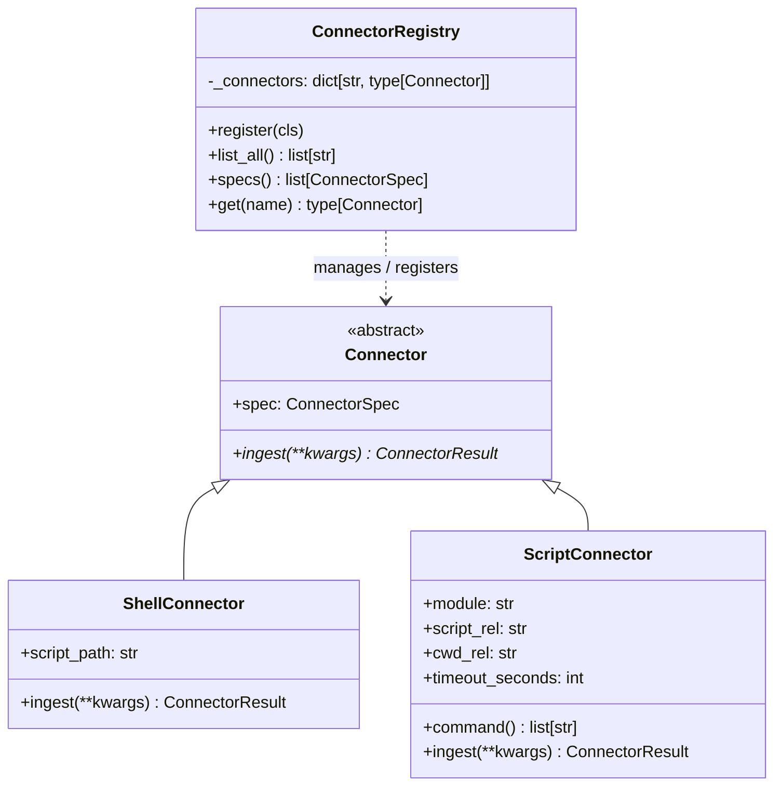

<p align="center">
  <picture>
    <source media="(prefers-color-scheme: dark)" srcset="../assets/brand/estormi-wordmark-dark.svg">
    
  </picture>
</p>

<p align="center">
  <picture>
    <source media="(prefers-color-scheme: dark)" srcset="../assets/brand/estormi-divider.svg">
    
  </picture>
</p>

# Connector framework

Every ingestion source (Apple Notes, WhatsApp, Google Calendar, …) is exposed
as a `Connector` class under [`packages/connectors/`](../packages/connectors).
The framework gives each source:

* a typed `ConnectorSpec` (name, title, description, required macOS
  permissions, and DAG-pipeline metadata);
* a uniform `ingest()` contract that returns a `ConnectorResult` and never
  raises;
* automatic registration with the shared `registry`;
* two ready-to-use base classes for the common implementations.

The goal is **trivial extensibility**: dropping in a new connector is a
20-line file plus a row in this document.

> **Two directories, one source — and why.** Each source appears as a *pair*
> with the same name: the adapter `packages/connectors/<name>.py` (spec + registration —
> *what* the source is) and the runnable implementation under
> `packages/estormi_ingestion/<name>/` (*how* it is ingested). The split is deliberate
> and one-way: `packages/connectors/` names the implementation only by **string path**
> (`script_path` / `module`) and never imports `estormi_ingestion`, so the
> adapter layer stays above the scripts it drives without forming an import
> cycle (enforced by the `[tool.importlinter]` contract *"connectors must not
> import the server/app layer or any engine package"* in `pyproject.toml`,
> which forbids `connectors` from importing `estormi_server`,
> `estormi_ingestion`, `estormi_briefing`, or `estormi_distill`). Read the connector stub first (what), then the ingestion
> module (how).

## Contract



* `Connector` — abstract base. Concrete classes declare `spec: ConnectorSpec` (class-level attribute) and implement `ingest(**kwargs) -> ConnectorResult`.
* `ConnectorSpec` — frozen dataclass describing the source (name, title, permissions, etc.). Validated by `registry.register()`.
* `ConnectorResult` — dataclass returned from every ingestion run (source, errors, duration_ms, and a derived `ok` boolean).

### Bases

* `ShellConnector` — delegates ingestion to a script under `packages/estormi_ingestion/<name>/`.
  Subclass overrides `script_path` (relative to the repo root). Base handles
  `cwd`, `timeout`, stderr capture, and exit-code propagation.
* `ScriptConnector` — for ingestion implemented as a Python script run
  out-of-process (the form `daily_ingestion.sh` used to launch directly).
  Subclass sets `module` (run via `python -m <module>`) **or** `script_rel`
  (path relative to the repo root). `cwd_rel` overrides the working directory
  (default: the repo root) and `timeout_seconds` caps the run.

## How to add a new connector

1. **Pick a base class.** Shell script under `packages/estormi_ingestion/<name>/foo.sh`?
   `ShellConnector`. Python script that owns its own `argparse` /
   `sys.exit` lifecycle and should run out-of-process? `ScriptConnector`.

2. **Drop `packages/connectors/<name>.py`:**

   ```python
   """Foo — short, one-line description of what's ingested."""

   from __future__ import annotations

   from .base import ConnectorSpec, ShellConnector, registry


   @registry.register
   class FooConnector(ShellConnector):
       spec = ConnectorSpec(
           name="foo",
           title="Foo",
           description="Indexes data from the Foo source.",
           macos_permissions=("AppleEvents:Foo",),
       )
       script_path = "packages/estormi_ingestion/foo/watch_and_ingest.sh"
   ```

   > The Python module file name and the `ConnectorSpec(name=...)` need not
   > match — several connectors diverge (e.g. `apple_mail.py` → spec `mail`,
   > `google_calendar.py` → spec `gcal`). The import in step 3 uses the **file
   > name**; the `EXPECTED_CONNECTORS` entry in step 5 uses the **spec name**.

3. **Wire the side-effect import.** Add the module (its **file name**) to the
   alphabetical list in `packages/connectors/__init__.py`. This is what triggers
   the class decorator at import time.

4. **Document it.** Add a row to the table below.

5. **Test it.** `tests/connectors/test_connectors.py::test_registry_has_all_known_connectors`
   asserts every connector is registered. Add `"foo"` to `EXPECTED_CONNECTORS`.
   For Python connectors, mirror the production schema in any fixture DB the
   tests create (see `tests/estormi_ingestion/test_google_calendar_connector.py`).

## Available connectors

The `Order` and `Nightly?` columns are the connectors' `dag_order` and
`default_stage` spec fields, so this table doubles as the nightly-pipeline order
reference. `Nightly? ✗` connectors are on-demand (run only when explicitly
triggered), not part of the scheduled nightly run.

| Name | Title | macOS perms | Order | Nightly? | Description |
|---|---|---|---|---|---|
| `notes` | Apple Notes | AppleEvents:Notes | 1 | ✓ | Indexes recent Apple Notes via AppleScript export. |
| `mail` | Apple Mail | AppleEvents:Mail | 2 | ✓ | Indexes recent messages from local Apple Mail accounts via AppleScript. |
| `gcal` | Google Calendar | — | 4 | ✗ | OAuth2 incremental sync via the Google Calendar API (on-demand). |
| `reminders` | Apple Reminders | Reminders | 5 | ✓ | Indexes Apple Reminders via EventKit. |
| `imessage` | iMessage | FullDiskAccess | 6 | ✓ | Reads ~/Library/Messages/chat.db (read-only). |
| `whatsapp` | WhatsApp | Contacts | 7 | ✓ | Polls the Rust sidecar (loopback :9877) for staged messages. |
| `documents` | Documents | FilesAndFolders | 8 | ✓ | PDF, DOCX, ODT, PPTX, XLSX, plain text. |
| `knowledge` | External knowledge | — | 11 | ✓ | Ingests external YouTube transcripts + RSS articles as world-corpus memory. |
| `whoop` | WHOOP | — | 12 | ✗ | OAuth2 sync of daily recovery, sleep, strain and workouts from the WHOOP Cloud API (on-demand). |

## Registry API surface

```python
from connectors import registry

registry.list_all()         # ["documents", "gcal", "imessage", …] — alphabetical
registry.specs()            # list[ConnectorSpec] for the Settings UI / docs
registry.get("foo")         # class | None
```

The registry refuses to bind two connectors to the same `spec.name`, and
refuses any class that doesn't declare a `ConnectorSpec` — both are
contract-tested in `tests/connectors/test_connectors.py`.
