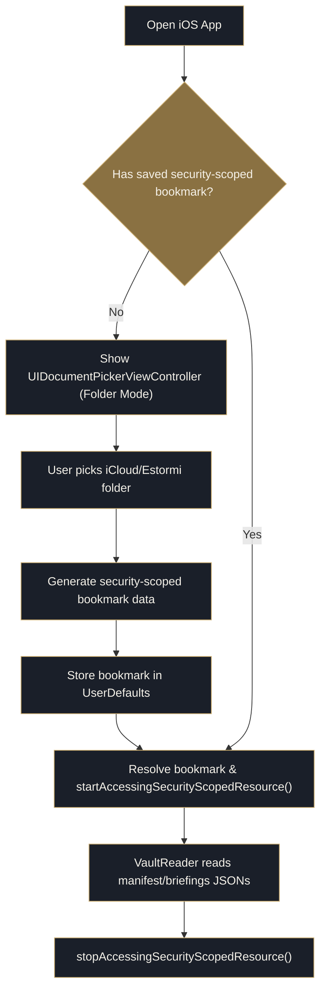

<p align="center">
  <picture>
    <source media="(prefers-color-scheme: dark)" srcset="../assets/brand/estormi-wordmark-dark.svg">
    
  </picture>
</p>

<p align="center">
  <picture>
    <source media="(prefers-color-scheme: dark)" srcset="../assets/brand/estormi-divider.svg">
    
  </picture>
</p>

# Estormi iOS — Native Companion App

The Estormi iOS companion (`apps/estormi-ios/`) is a **read-only viewer** with
two pages — Briefings and Metrics — behind a floating Liquid Glass tab bar. It
is a native SwiftUI app (iOS 26+). All ingestion and briefing composition
happen on the Mac; the phone only reads.

## The two pages

Each page binds to the vault payloads the Mac writes and reads them through the
shared `Sources/Vault/` reader. Nothing is synthesized on the phone.

| Page | Vault payload it renders | Swift source |
|------|--------------------------|--------------|
| **Briefings** | `briefings/<date>.json` (+ `briefings/<date>.m4a` narration) | `Sources/Briefings/` |
| **Metrics** | `metrics.json` + `engines_history.json` | `Sources/Metrics/` |

## First-run setup

1. On the Mac, the vault folder defaults to
   `~/Library/Mobile Documents/com~apple~CloudDocs/Estormi` (override with
   the `ESTORMI_VAULT_DIR` environment variable). The pipeline creates and
   fills it on its next run.
2. On the phone, open the app and pick the same `Estormi` folder in iCloud
   Drive from the first-run prompt.
3. Both devices must be signed into the **same iCloud account**.

No Apple Developer account, no CloudKit container, no entitlement for the
iCloud-vault path. (Opt-in push alerts are the one exception — they require a
paid Apple Developer Program membership; see Caveats and
[ios-push-notifications.md](ios-push-notifications.md).)

## Architecture

The companion reads from a **folder in the user's iCloud Drive** — the
"vault". The macOS pipeline writes several payloads into that folder
(`packages/estormi_ingestion/shared/delivery/vault_sync.py`):

| File | Written by | Read by |
|------|------------|---------|
| `briefings/<date>.json` | each daily briefing run | the Briefings page |
| `metrics.json` | every engine completion | the Metrics page |
| `engines_history.json` | every engine completion | the Metrics page |
| `engine-logs/<run_id>.log` | each engine run (last 10 kept) | the per-run log sheet |
| `manifest.json` | every write | cheap change detection |

The schema is documented in [specs/vault-schema.md](specs/vault-schema.md).

The phone never talks to the FastAPI server: no pairing, no direct-HTTP mode.
The briefing and metrics come from a plain iCloud Drive folder, not CloudKit —
the optional new-briefing push is the one feature that uses CloudKit (see
[ios-push-notifications.md](ios-push-notifications.md)).

### The vault reader — `Sources/Vault/`

- `VaultFolder.swift` — presents `UIDocumentPickerViewController` in folder mode and stores a security-scoped bookmark in `UserDefaults`.
- `VaultReader.swift` — resolves the bookmark, triggers an iCloud download of any evicted files, then coordinate-reads the JSON payloads (`briefings/<date>.json`, `metrics.json`, `engines_history.json`, `manifest.json`).
- `VaultStore.swift` — observable store exposed via the environment; pages bind to it directly.
- `VaultModels.swift` + `MockVault.swift` — decoded payload types and the preview/test fixtures.

### Why a plain folder, not CloudKit

CloudKit needs an iCloud entitlement, which needs a paid Apple Developer Program membership. A user-selected iCloud Drive folder needs neither: the companion asks the user to pick the folder once via the system document picker, persists a **security-scoped bookmark**, and re-reads it on demand. The app therefore builds and installs on a **free Apple ID**.



## Build instructions

Prereqs: Xcode 26 (ships with iOS 26 SDK) and `xcodegen` (`brew install xcodegen`).

```bash
cd apps/estormi-ios
xcodegen generate
open Estormi.xcodeproj
```

In Xcode, select the `Estormi` scheme, set your real iPhone as the run
destination, hit ⌘R.

The `.xcodeproj` is generated from `project.yml` — feel free to delete and
regenerate it. The `sources:` block points at the whole `Sources/`
directory, so new `.swift` files are picked up automatically on the next
`xcodegen generate`.

Unit tests live in the `EstormiTests` target (`apps/estormi-ios/Tests/`, Swift
Testing) and run from Xcode.

## Narration

The Briefings page can read the briefing aloud, but the phone does **no
synthesis** — the Mac first re-voices the briefing into a "spoken edition" (an
LLM rewrite: same facts, built for listening, no visual scaffolding), then
synthesizes it with Voxtral TTS (`packages/memory_core/tts_local.py`) and writes a
`briefings/<date>.m4a` next to the JSON in the iCloud vault. The companion just plays that file: `BriefingAudioPlayer`
(an `AVAudioPlayer` wrapper) plus `BriefingAudioBar`, both in
`Sources/Briefings/`; `VaultReader.prepareBriefingAudio(date:)` pulls the `.m4a`
from iCloud. The audio bar appears only when the briefing carries narration
(its `audioPath` is set). This replaces the old bundled sherpa-onnx / Piper
on-device voice, which has been removed.

`Sources/Notifications/` (`RemotePushRegistrar`) handles APNs registration for
the opt-in new-briefing push alerts — see
[ios-push-notifications.md](ios-push-notifications.md).

## Caveats

- **Not live.** The companion sees new data on open / pull-to-refresh, after
  iCloud Drive has propagated the files (which can take minutes). New-briefing
  **push alerts** are the exception — the Mac pushes them over APNs the moment a
  briefing is written (see [ios-push-notifications.md](ios-push-notifications.md)).
- **iCloud Drive must be enabled** on both the Mac and the phone.
- A free Apple ID re-signs every 7 days; the picked-folder bookmark survives
  a re-sign but not a full delete-and-reinstall.
- **iOS 26 only** — the floating Liquid Glass tab bar is the stock SwiftUI
  `TabView` (`Sources/RootView.swift`), which iOS 26 renders automatically as a
  glass bar; the app lets the platform own it rather than hand-rolling a glass
  menu.
