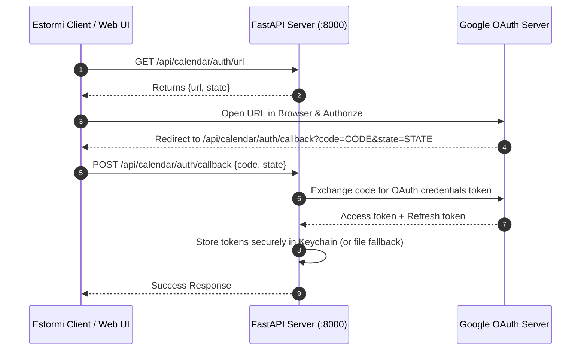
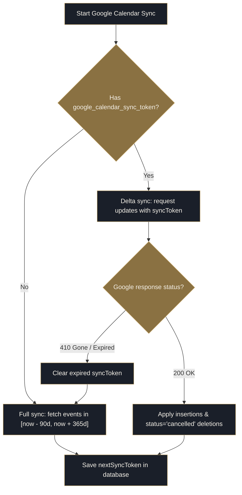

<p align="center">
  <picture>
    <source media="(prefers-color-scheme: dark)" srcset="../assets/brand/estormi-wordmark-dark.svg">
    
  </picture>
</p>

<p align="center">
  <picture>
    <source media="(prefers-color-scheme: dark)" srcset="../assets/brand/estormi-divider.svg">
    
  </picture>
</p>

# Google Calendar incremental sync

Sections **1–4** are end-user setup: create a Cloud project, authorise
Estormi, pick calendars. If you only want to connect your calendar, stop at
section 4. Sections **5–6** are contributor internals: how incremental sync
and the sync-token reset work.

## HTTP API surface

All Google Calendar routes live in
[`packages/estormi_server/api/calendar_oauth.py`](../packages/estormi_server/api/calendar_oauth.py).
They split across two prefixes by concern: **OAuth/account** lives under
`/api/calendar/`, **calendar data and sync state** under
`/api/google-calendar/`.

| Method   | Path                                          | Body                          | Purpose                                            | Prefix              |
| -------- | --------------------------------------------- | ----------------------------- | -------------------------------------------------- | ------------------- |
| `GET`    | `/api/calendar/auth/url`                      | —                             | Returns `{url, state}` to open in a browser        | `/api/calendar`     |
| `POST`   | `/api/calendar/auth/callback`                 | `{code, state}`               | Exchange the code Google redirects you with        | `/api/calendar`     |
| `DELETE` | `/api/calendar/auth`                          | —                             | Revoke token + drop the stored sync-token map      | `/api/calendar`     |
| `GET`    | `/api/google-calendar/calendars`              | —                             | List calendars, each with `selected` + `group_type`| `/api/google-calendar` |
| `PATCH`  | `/api/google-calendar/calendars/{id}`         | `{selected?, group_type?}`    | Toggle sync and/or set the calendar's group        | `/api/google-calendar` |
| `POST`   | `/api/google-calendar/sync-token/reset`       | —                             | Drop the sync-token map → full resync (keeps OAuth)| `/api/google-calendar` |

## 1. Create a Google Cloud project

1. Go to <https://console.cloud.google.com/> and create (or pick) a project.
2. Enable the **Google Calendar API** under *APIs & Services → Library*.
3. *APIs & Services → Credentials → Create credentials → OAuth client ID*.
   - Application type: **Desktop**.
   - Download the JSON.
4. In Estormi, open the Google Calendar source panel and drop the downloaded
   JSON onto the upload target (or click to pick it). Estormi validates it and
   stores the client securely in the **macOS Keychain** (service
   `estormi.google_calendar`, key `client_secrets`) — it is never written as a
   cleartext file. A legacy `google_client_secrets.json` left in the data dir by
   an older build is migrated into the Keychain on first use, then deleted.

## 2. Authorise Estormi

The OAuth dance uses the three `/api/calendar/auth*` endpoints above. The
redirect URI registered with Google is
`http://localhost:8000/api/calendar/auth/callback` (port = `MCP_SERVER_PORT`).



The access + refresh token is stored in the macOS Keychain under service
`estormi.google_calendar`. If the keychain is unavailable (e.g. a locked
session), it falls back to a `chmod 600` file at `DATA_DIR/.gcal_token` and
emits a warning.

## 3. Pick which calendars to sync

List calendars with `GET /api/google-calendar/calendars`, then toggle each
with `PATCH /api/google-calendar/calendars/{id}` (see the API table above).

If no calendars are explicitly selected, **all** calendars on the account
are synced. The selection is persisted as a JSON array in the `settings`
table under the key `google_calendar_selected_ids`.

## 4. Scope

Only `https://www.googleapis.com/auth/calendar.readonly` is requested.
Estormi never writes to your calendar.

## 5. Incremental sync internals



Control flow above; the parameters and behaviours it relies on:

| Behaviour          | Value                                                   | Source                                                                 |
| ------------------ | ------------------------------------------------------- | ---------------------------------------------------------------------- |
| First-run window   | `timeMin = now − 90 days` (`singleEvents=True`)         | `GCAL_DAYS_WINDOW` env (default `90`; Manage modal's depth picker sets it) |
| Forward bound      | `timeMax = now + 365 days`                              | `GCAL_DAYS_FORWARD` env (default `365`) — caps recurring-event expansion[^fwd] |
| Subsequent runs    | only `syncToken` sent; Google returns the delta         | stored `nextSyncToken`                                                  |
| Sync-token storage | per calendar, JSON object keyed by calendar id          | `settings.google_calendar_sync_token`                                  |
| Deletions          | `status == 'cancelled'` → chunk delete by `source_id`   | `events.list` delta                                                    |
| Deduplication      | recurring instances fold to their `recurringEventId` master | one chunk per series, not per instance                             |

[^fwd]: With `singleEvents=True` and no `timeMax`, Google expands "repeats
    forever" series without end (year-2038 instances were observed), so the
    forward bound is required.

## 6. Resetting the sync token

If a sync token expires (Google returns HTTP `410 Gone`), Estormi clears
the stored token automatically and falls back to a full window resync.

To reset manually:

```bash
# preferred: dedicated in-app reset — drops the stored sync tokens so the
# next run does a full windowed resync (keeps the OAuth token)
curl -X POST http://localhost:8000/api/google-calendar/sync-token/reset

# or: forget the whole token map directly in SQLite
sqlite3 ~/Library/Application\ Support/Estormi/estormi.db \
  "DELETE FROM settings WHERE key='google_calendar_sync_token';"

# or: full reauth + token wipe
curl -X DELETE http://localhost:8000/api/calendar/auth
```
