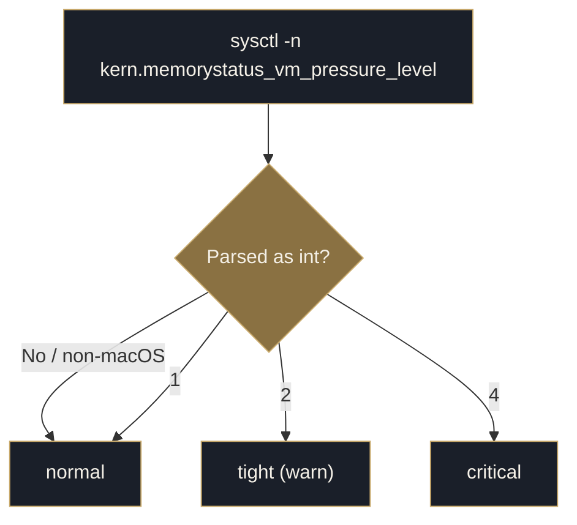

  <picture>
    <source media="(prefers-color-scheme: dark)" srcset="../assets/brand/estormi-wordmark-dark.svg">
    
  </picture>

  <picture>
    <source media="(prefers-color-scheme: dark)" srcset="../assets/brand/estormi-divider.svg">
    
  </picture>

# Governor — memory-pressure subsystem

The governor is a cross-cutting mechanism that keeps the engine pipeline from
exhausting system memory. It lives in `packages/memory_core/resource_guard.py`
— no DB, no heavy dependencies, just `sysctl` and a decision log.

## Probes

Two independent `sysctl` reads, each with a safe fallback so a probe that
cannot be measured never wedges the pipeline:

| Function | Reads | Returns | Fallback |
|---|---|---|---|
| `memory_pressure()` | `kern.memorystatus_vm_pressure_level` | `normal` / `tight` / `critical` | `normal` |
| `total_ram_gb()` | `hw.memsize` | Physical RAM in GiB | `16.0` |

`memory_pressure()` maps the OS pressure level the same way macOS does when it
decides to start terminating apps:

The two probes are independent: VM pressure is a read-only signal, while RAM
sizing is a separate static lookup (see [The consumers](#the-consumers)).

## The consumers

The governor has no scheduler of its own — callers read it. Today there is a
single live consumer plus a read-only readout:

1. **`llm_local`** — sizes the model to the machine before loading it:
   `_start_rung()` picks the starting index into `_LLM_LADDER` from
   `total_ram_gb()` (table below). `_load_with_fallback()` begins there and
   steps to a **higher** index — a lighter rung — every time a load raises, so
   the model always negotiates a config that fits.
2. **`api/overview.py`** — surfaces `memory_pressure()` (and the rung the
   governor sized to) in the governor readout for the SPA (read-only; it never
   gates anything).

`_LLM_LADDER` runs heaviest → lightest, so **index `0` is the heaviest rung**
and the index *increases* toward lighter configs. `_start_rung()` maps RAM to
that starting index:

| `total_ram_gb()` | Start index | Rung config (`_LLM_LADDER[idx]`) |
|---|---|---|
| ≥ 32 GB | `0` | `n_ctx 16384`, `n_gpu_layers -1` (heaviest — all layers on GPU) |
| ≥ 16 GB | `1` | `n_ctx 13312`, `n_gpu_layers -1` |
| < 16 GB | `3` | `n_ctx 11264`, `n_gpu_layers 30` (lighter — partial GPU offload) |

> `server/jobs.py` does not consult the governor: the engine launch schedules
> it manages aren't gated on memory pressure — the local model loader sizes
> itself instead (see `llm_local` above).

## Persistence

| Path | Contents |
|---|---|
| `<data-dir>/logs/resource_guard.log` | timestamped governor decisions |

`<data-dir>` is `ESTORMI_DATA_DIR`, defaulting to
`~/Library/Application Support/Estormi`. Log writes are best-effort: a failure
there must never break the pipeline.

`governor_log()` is the single auditable sink — whichever process made the
decision (ingestion pipeline, briefing worker, LLM loader) appends to the same log.
