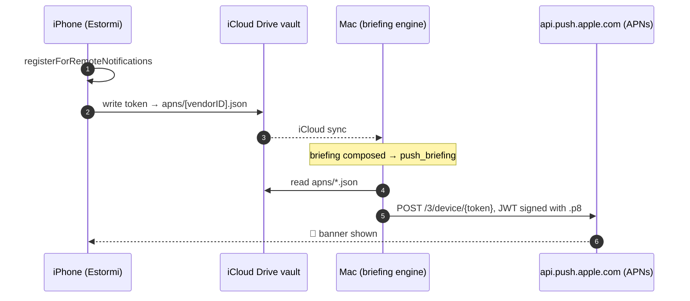

<p align="center">
  <picture>
    <source media="(prefers-color-scheme: dark)" srcset="../assets/brand/estormi-wordmark-dark.svg">
    
  </picture>
</p>

<p align="center">
  <picture>
    <source media="(prefers-color-scheme: dark)" srcset="../assets/brand/estormi-divider.svg">
    
  </picture>
</p>

# iOS push notifications (new-briefing alerts)

The iOS companion alerts you when the Mac writes a new briefing. This page
covers **Option A**: a true push delivered over APNs, with the **Mac itself
as the push provider** — no cloud server, no third party. It supports any
number of devices, but requires the developer's private `.p8` key on the
sending Mac, so it cannot serve Store-distributed iOS builds.

**Option B — the [CloudKit doorbell](cloudkit-doorbell.md) — is the
preferred path.** `_notify_new_briefing` (in `vault_sync.py`) rings the
doorbell first and only falls back to this APNs path when it returns `False`
— never both.

| | **Option B — doorbell** (preferred) | **Option A — direct APNs** (this page) |
|---|---|---|
| Banner delivered by | Apple (CloudKit push) | Apple (APNs), Mac is the provider |
| Secret on the Mac | none | the developer's `.p8` push key |
| App Store / TestFlight builds | yes | no — `.p8` keys can't serve Store builds |
| Apple Developer Program | required | required |
| Fired by `_notify_new_briefing` | first | fallback when the doorbell is absent / disabled |

A token-sync round trip and one signed push, end to end:



- iOS side: [`RemotePushRegistrar`](../apps/estormi-ios/Sources/Notifications/RemotePushRegistrar.swift)
  + the `AppDelegate` in
  [`EstormiApp.swift`](../apps/estormi-ios/Sources/EstormiApp.swift).
- Mac side: [`packages/estormi_ingestion/shared/delivery/apns_push.py`](../packages/estormi_ingestion/shared/delivery/apns_push.py),
  fired from `push_briefing` in
  [`packages/estormi_ingestion/shared/delivery/vault_sync.py`](../packages/estormi_ingestion/shared/delivery/vault_sync.py).

Until the setup below is done, the Mac side is a **silent no-op** (no key →
nothing sent) and the iOS toggle simply never produces a token. Nothing breaks.

## One-time setup (requires the Apple Developer Program — $99/yr)

A free Apple account cannot enable Push Notifications: the `aps-environment`
entitlement is rejected at signing. These steps need a paid membership.

### 1. Apple Developer portal

1. **Certificates, Identifiers & Profiles → Identifiers** → the `app.estormi.ios`
   App ID → enable the **Push Notifications** capability.
2. **Keys → +** → enable **Apple Push Notifications service (APNs)** → download
   the **`.p8`** file (you can only download it once). Note its **Key ID**
   (10 chars).
3. Note your **Team ID** (10 chars, top-right of the portal / Membership page).

One `.p8` works for both the sandbox and production APNs hosts and for every app
under the team.

### 2. Xcode

Open the project (`cd apps/estormi-ios && xcodegen generate && open
Estormi.xcodeproj`) → target **Estormi** → **Signing & Capabilities** → **+
Capability → Push Notifications**. The entitlement file
[`Sources/Estormi.entitlements`](../apps/estormi-ios/Sources/Estormi.entitlements)
is already wired via `CODE_SIGN_ENTITLEMENTS` in `project.yml`; Xcode just needs
the capability enabled on the App ID so signing succeeds.

### 3. Mac credentials

Drop the key and config into the Estormi data dir
(`~/Library/Application Support/Estormi`, or `$ESTORMI_DATA_DIR`):

> **Relocated library?** The data dir is resolved by `resolve_data_dir()`, whose
> precedence is `$ESTORMI_DATA_DIR` → the relocation-pointer file → the default
> config home. If you have moved the library elsewhere (e.g. an external volume),
> the credentials must go in the *relocated* data dir — set `$ESTORMI_DATA_DIR`
> (or use the pointer-file location) rather than the default path below, or APNs
> won't find them.

```bash
cp ~/Downloads/AuthKey_XXXXXXXXXX.p8 "$HOME/Library/Application Support/Estormi/apns_auth_key.p8"
chmod 600 "$HOME/Library/Application Support/Estormi/apns_auth_key.p8"
cat > "$HOME/Library/Application Support/Estormi/apns_config.json" <<'JSON'
{ "key_id": "XXXXXXXXXX", "team_id": "YYYYYYYYYY", "bundle_id": "app.estormi.ios" }
JSON
```

Env-var overrides exist for all of these: `ESTORMI_APNS_KEY_PATH`,
`ESTORMI_APNS_KEY_ID`, `ESTORMI_APNS_TEAM_ID`, `ESTORMI_APNS_BUNDLE_ID`.

### 4. On the phone

Open Estormi → **Metrics → Settings → New-briefing alerts** → allow
notifications. The app registers with APNs and writes its token into the vault's
`apns/` folder. Give iCloud Drive a moment to sync the token up to the Mac.

## Verifying

```bash
# from the repo root
python -m estormi_ingestion.shared.delivery.apns_push --list   # device tokens the Mac can see
python -m estormi_ingestion.shared.delivery.apns_push --test   # send a test alert to all of them
```

The first surfaces what synced from the phone; the second pushes a real alert
without waiting for a briefing.

## The sandbox vs production gotcha

A token is only reachable at the host matching its `aps-environment`; sending
to the wrong host fails with a silent `BadDeviceToken`. The app records its
environment in the `environment` field of `apns/<vendorID>.json` and the Mac
picks the matching host per device.

| Build | `aps-environment` | Token | APNs host |
|---|---|---|---|
| Run from Xcode (`#if DEBUG`) | `development` | sandbox | `api.sandbox.push.apple.com` |
| TestFlight / App Store | `production` | production | `api.push.apple.com` |

To force one host for every device, set `ESTORMI_APNS_ENV=sandbox` (or
`production`).

The Mac prunes a device's token file only when Apple says it is permanently
dead — the app rewrites the file only when the token actually rotates, so a
still-valid token must never be deleted:

| APNs reason | Pruned? | Why |
|---|---|---|
| `410` / `Unregistered` | yes | app uninstalled — token is permanently dead |
| `BadDeviceToken` | no | usually a sandbox/production mismatch, not a dead token |
