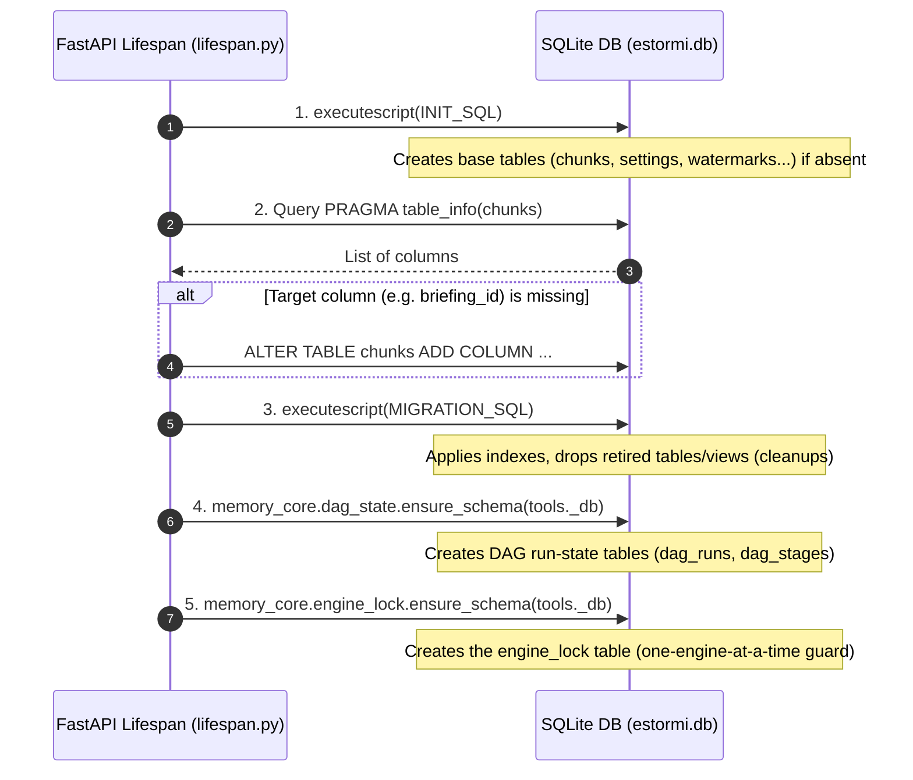

<p align="center">
  <picture>
    <source media="(prefers-color-scheme: dark)" srcset="../assets/brand/estormi-wordmark-dark.svg">
    
  </picture>
</p>

<p align="center">
  <picture>
    <source media="(prefers-color-scheme: dark)" srcset="../assets/brand/estormi-divider.svg">
    
  </picture>
</p>

# Database Migrations

Estormi uses a single SQLite database (`estormi.db`). The schema is imported
from the `packages/estormi_server/sql/schema.py` facade, which re-exports three
home modules: `INIT_SQL` (defined in `schema_init.py`), `CHUNK_COLUMN_MIGRATIONS`
(in `schema_columns.py`), and `MIGRATION_SQL` (in `schema_migrations.py`). Edit a
symbol in its home module — `schema.py` only re-exports them.

## How migrations work

On startup, the FastAPI lifespan (`packages/estormi_server/server/lifespan.py`) applies migrations in this order:



1. **`tools._db.executescript(INIT_SQL)`** — creates all base tables if they don't exist (using idempotent `CREATE TABLE IF NOT EXISTS`).
2. **`_apply_chunk_column_migrations(tools._db)`** — SQLite has no idempotent `ADD COLUMN`, so this probes `PRAGMA table_info(chunks)` and only issues `ALTER TABLE … ADD COLUMN …` for columns that are actually absent.
3. **`tools._db.executescript(MIGRATION_SQL)`** — runs the script as one unit (creates indexes, executes `DROP TABLE IF EXISTS` for retired legacy tables, and performs cleanup `UPDATE`s). It is applied whole, never split on `;`, because it carries SQL comments that contain `;`.
4. **`memory_core.dag_state.ensure_schema(tools._db)`** — the DAG-state package owns its own DDL (`dag_runs`, `dag_stages`) and applies it here.
5. **`memory_core.engine_lock.ensure_schema(tools._db)`** — the engine-lock package owns the `engine_lock` table (the cross-process "one engine at a time" guard) and creates it here.

All migration steps use `IF NOT EXISTS`, explicit column probes, or catch `OperationalError: duplicate column name`, making them safe to re-run on every startup.

## Adding a migration

1. Pick the right home module under `packages/estormi_server/sql/`:
   - **New column on `chunks`** → append a `(name, decl)` row to
     `CHUNK_COLUMN_MIGRATIONS` (in `schema_columns.py`).
     `_apply_chunk_column_migrations` probes
     `PRAGMA table_info(chunks)` and only issues `ALTER TABLE … ADD COLUMN`
     when the column is absent (SQLite has no `ADD COLUMN IF NOT EXISTS`).
   - **New index, table drop, or cleanup `DELETE`** → add the statement to
     `MIGRATION_SQL` (in `schema_migrations.py`), using `CREATE INDEX IF NOT EXISTS` /
     `DROP TABLE IF EXISTS` so it stays idempotent.
   - **New table on the base schema** → add a `CREATE TABLE IF NOT EXISTS …`
     to `INIT_SQL` (in `schema_init.py`).
2. SQLite does **not** support `ALTER TABLE … ADD COLUMN IF NOT EXISTS`. For
   new columns on tables other than `chunks`, follow the same probe pattern
   as `_apply_chunk_column_migrations` (`packages/estormi_server/sql/schema_columns.py`).
3. Add a test under `tests/` exercising the new schema. The shared helper
   in `tests/helpers/database.py` (`apply_runtime_schema`) is what test
   fixtures call to apply the same migrations to an in-memory DB —
   add a test, not code to that helper.
4. Run the full test suite to confirm no existing test breaks.

### Example

Adding a new index goes straight into `MIGRATION_SQL`:

```python
MIGRATION_SQL = """
-- existing migrations …

-- Phase 17: index briefing_id for faster lookup joins
CREATE INDEX IF NOT EXISTS chunks_briefing_id_idx ON chunks(briefing_id);
"""
```

Adding a new column to `chunks` goes into `CHUNK_COLUMN_MIGRATIONS` instead,
which `_apply_chunk_column_migrations` consumes:

```python
# packages/estormi_server/sql/schema_columns.py
CHUNK_COLUMN_MIGRATIONS: tuple[tuple[str, str], ...] = (
    # … existing rows …
    ("briefing_id", "INTEGER REFERENCES briefings(id)"),
)
```

## Tables

| Table | Purpose | Added |
|-------|---------|-------|
| `chunks` | All ingested text with metadata, source, `date_ts`, `end_date_ts`, `corpus`, group_type | Initial |
| `settings` | Key-value store for app settings | Initial |
| `ingestion_watermarks` | Per-source last-fetch cursor | Initial |
| `whatsapp_chats` | WhatsApp chat registry | Phase 6 |
| `whatsapp_messages` | Durable, replayable WhatsApp message log (raw un-redacted text; local source of truth for re-chunking) | Phase 6 |
| `briefing_runs` | Briefing engine run records | — |

Correlation is not a stored engine anymore: the `date_ts` column (base schema,
`INIT_SQL`) together with `end_date_ts` and `corpus` (added via
`CHUNK_COLUMN_MIGRATIONS`) are what powers correlation-via-retrieval now.

### Retired tables (dropped on startup)

`MIGRATION_SQL` (`packages/estormi_server/sql/schema_migrations.py`) issues
`DROP TABLE IF EXISTS` / `DROP VIEW IF EXISTS` for every object below so an existing
DB converges on the live schema; none is created anymore. Grouped by the feature
that was removed:

| Object (table / view) | Removed because |
|-----------------------|-----------------|
| `entities`, `entity`, `entity_extraction_runs`, `entity_annotations`, `entity_clinic_proposals`, `resolved_entities` (view) | Extraction engine retired |
| `commitments`, `decisions`, `correlation_runs`, `chunk_links`, `chunk_link_runs`, `topics`, `topic_chunks`, `correlations`, `correlation_feedback`, `correlation_meta`, `correlation_judgments`, `whatsapp_commitments`, `whatsapp_processed_chunks` | Correlation engine retired |
| `pipeline_ai_analyses` | pipeline-log-analysis feature removed |
| `chunk_annotations` | chunk-annotation (label/note/pin) feature removed |

## Testing migrations

The test suite uses an in-memory SQLite database with the full schema applied before each test:

```python
# tests/helpers/database.py
async def apply_runtime_schema(conn: aiosqlite.Connection) -> None:
    from estormi_server.sql.schema import (
        INIT_SQL,
        MIGRATION_SQL,
        _apply_chunk_column_migrations,
    )
    from memory_core.dag_state import ensure_schema as ensure_dag_state_schema
    from memory_core.engine_lock import ensure_schema as ensure_engine_lock_schema

    await conn.execute("PRAGMA journal_mode=WAL")
    await conn.execute("PRAGMA busy_timeout=10000")
    await conn.execute("PRAGMA foreign_keys=ON")
    await conn.executescript(INIT_SQL)
    await _apply_chunk_column_migrations(conn)   # additive ALTERs, BEFORE MIGRATION_SQL
    await conn.executescript(MIGRATION_SQL)
    await conn.commit()
    await ensure_dag_state_schema(conn)
    await ensure_engine_lock_schema(conn)
```

The three ordered steps — `INIT_SQL` → `_apply_chunk_column_migrations` →
`MIGRATION_SQL` — mirror the production startup path (`server.lifespan` /
`chunk_admin.reset_db`) exactly, down to the `memory_core.engine_lock` table. The
additive column pass MUST run *between* the two scripts: `MIGRATION_SQL`'s indexes
and backfills reference columns it adds (e.g. `end_date_ts`), so on an
upgrade-from-old DB the script fails without it. Each block is applied as **one
script** — never split on `;` — because the SQL comments contain `;` a naive
splitter would corrupt. The `db` fixture in `tests/conftest.py` provides it to all
async tests automatically.

## Production migration

The macOS app applies migrations automatically on launch via the lifespan
handler in `packages/estormi_server/server/lifespan.py` (imported by
`packages/estormi_server/main.py`). There is no separate migration runner — schema
changes are always backward-compatible additions.

## Rollback

SQLite's `ALTER TABLE DROP COLUMN` (SQLite 3.35+) is available on the Python
3.12+ baseline we ship, but historically unreliable on the system SQLite
bundled with older macOS — prefer the create-new-table-and-copy pattern for
column removal. Tag the migration with the phase number in a comment.

## Qdrant migrations

Qdrant collection changes (adding fields, changing distance metrics) require
creating a new collection and re-indexing all chunks.

New payload fields can be added without re-indexing — Qdrant ignores unknown fields.
