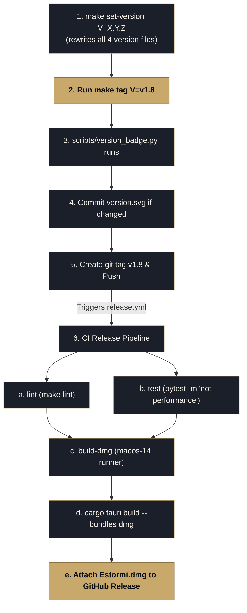

<p align="center">
  <picture>
    <source media="(prefers-color-scheme: dark)" srcset="../assets/brand/estormi-wordmark-dark.svg">
    
  </picture>
</p>

<p align="center">
  <picture>
    <source media="(prefers-color-scheme: dark)" srcset="../assets/brand/estormi-divider.svg">
    
  </picture>
</p>

# Release process

Estormi ships in two macOS distribution formats:

- **DMG (CI)** — built by GitHub Actions and attached to a GitHub Release.
  Releases are cut by pushing a tag (see below).
- **Zip (local)** — `make bundle` (see [`Makefile`](../Makefile), the
  `bundle` target) builds the Tauri app and packages `dist/Estormi.zip`,
  bundling [`scripts/install.sh`](../scripts/install.sh) next to
  `Estormi.app`. `install.sh` strips the Gatekeeper quarantine flag, copies the
  prebuilt app to `/Applications`, and launches it; it is live build tooling
  staged into the zip, not a source-install helper. `scripts/build.sh`
  drives the same `make bundle` for the local rebuild + install loop.

## Before tagging

Run the local gates first — CI cannot stand in for them while it is
billing-disabled (it goes live again once the repo is public):

- **`make check`** — the full hermetic gate across all three compiled surfaces:
  ruff + pyright + the JS lint/typecheck + the whole pytest and vitest suites +
  the Rust gate (`cargo fmt --check` + clippy + `cargo test`).
- **`make audit-deps`** — CVE audit of the exact `==` pins that ship in the
  macOS bundle ([`requirements/requirements-bundle.txt`](../requirements/requirements-bundle.txt)).
  It queries the online advisory DB and needs `pip-audit`, so it is deliberately
  **not** part of `make check`; run it by hand before every release so a
  known-vulnerable shipped dependency can't slip out.
- **Native + e2e surfaces** (need a browser download / Xcode, so they are kept
  out of `make check` and run in CI instead — run them by hand before a release):
  `make test-e2e-frontend` (web-ui Playwright; needs a one-time
  `playwright install`) and the iOS `EstormiTests` target from Xcode
  (`apps/estormi-ios/Tests/`, also run by `.github/workflows/ios.yml`).

## Cutting a release



```bash
make tag V=v1.8
```

The `tag` target (see [`Makefile`](../Makefile)):

1. Regenerates the version badge with [`scripts/version_badge.py`](../scripts/version_badge.py) $\rightarrow$ `assets/badges/version.svg`.
2. Commits the updated badge if it changed.
3. Creates the tag and pushes the branch + the tag.

The push to `v*` is what triggers the release workflow ([`.github/workflows/release.yml`](../.github/workflows/release.yml)).

## What CI does

`release.yml` ([`.github/workflows/release.yml`](../.github/workflows/release.yml))
has three jobs; `build-dmg` runs only after `lint` and `test` both pass:

| Job         | Runner       | Runs                                                  | Produces                                       |
| ----------- | ------------ | ----------------------------------------------------- | ---------------------------------------------- |
| `lint`      | `ubuntu-latest`, Python 3.12 | `make lint` (`ruff check` + `ruff format --check` over `scripts packages tests`) | — (gate)                            |
| `test`      | `ubuntu-latest`, Python 3.12 | `pytest tests/ -m 'not performance' --tb=short -q`    | — (gate)                                       |
| `build-dmg` | `macos-14`   | `cargo tauri build --target aarch64-apple-darwin --bundles dmg` (after `lint` + `test`) | `Estormi.dmg` (+ `.sha256`) on a GitHub Release |

`build-dmg` substeps, in order:

1. Install `cargo-tauri` (cached across runs).
2. Write the pushed tag into `packages/estormi_server/build_version.txt` for the
   packaged UI footer.
3. Build the DMG from `apps/estormi-macos/`.
4. Copy the bundle to the stable filename `Estormi.dmg` and compute its
   SHA-256 (`Estormi.dmg.sha256`).
5. Publish a GitHub Release named `Estormi <tag>` with auto-generated notes,
   attaching `Estormi.dmg` and its checksum.

The DMG is Apple-silicon only today (`aarch64-apple-darwin`). Intel and
universal builds aren't shipped; add a matrix to `build-dmg` if that
changes.

## Where the version string lives

The macOS app version lives in **four** declaring files kept in lockstep by
`make set-version V=X.Y.Z` (which runs [`scripts/set_version.py`](../scripts/set_version.py),
rewriting all four in one command) and enforced by
`tests/contract/test_version_consistency.py::test_macos_app_version_in_sync`
(it asserts the four are identical, so drift fails the gate). Two further entries
are derived tracks, not part of that four-file version:

| Location                          | Today's value | Notes                                         |
| --------------------------------- | ------------- | --------------------------------------------- |
| `packages/estormi_server/__init__.py` | `0.0.2`  | `__version__` — the Python source of truth; FastAPI `version=` and the MCP `serverInfo.version` both forward it. |
| `apps/estormi-macos/tauri.conf.json`       | `0.0.2`       | Bundle / app version surfaced in macOS About. |
| `apps/estormi-macos/Cargo.toml`            | `0.0.2`       | Rust crate version.                           |
| `pyproject.toml`                  | `0.0.2`       | `[project].version`. One of the four files `make set-version` keeps in lockstep. |
| `packages/estormi_server/build_version.txt`    | tag or SHA (e.g. `v1.8`)    | Derived: holds the exact git tag when HEAD is tagged, otherwise the short commit SHA (per `make build-version`). Not touched by `make set-version`. |
| `assets/badges/version.svg`       | tag name      | Derived: regenerated by `make tag`.           |

Run `make set-version V=X.Y.Z` to bump the four declaring files together before
running `make tag`. `build_version.txt` and `version.svg` are written from the
git tag/SHA by `make build-version` / `make tag`, so they are not set by hand.

## Badges

[`assets/badges/`](../assets/badges/) holds four SVG badges rendered into
the README:

| Badge              | Generator                                                  |
| ------------------ | ---------------------------------------------------------- |
| `version.svg`      | `scripts/version_badge.py` — invoked by `make tag`         |
| `coverage.svg`     | `scripts/qa_metrics.py` (run from `make test-metrics`)     |
| `tests.svg`        | `scripts/qa_metrics.py`                                    |
| `qa-layers.svg`    | `scripts/qa_metrics.py`                                    |

`coverage.svg`, `tests.svg`, and `qa-layers.svg` regenerate from the latest
`build/coverage/coverage.json` via `make test-metrics` (kept out of `make test` so local runs
don't dirty the tree). `version.svg` is only refreshed when you cut a tag.

## Per-release changes

Per-release additions, changes, and hardening notes live in
[`CHANGELOG.md`](../CHANGELOG.md) (Keep a Changelog format); the `[Unreleased]`
section there accrues entries until the next `make tag`.
