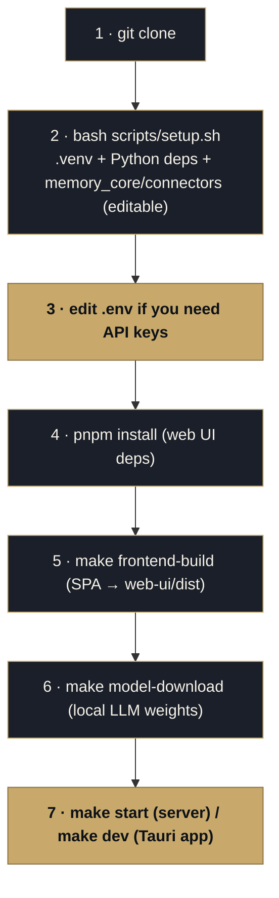

<p align="center">
  <picture>
    <source media="(prefers-color-scheme: dark)" srcset="../assets/brand/estormi-wordmark-dark.svg">
    
  </picture>
</p>

<p align="center">
  <picture>
    <source media="(prefers-color-scheme: dark)" srcset="../assets/brand/estormi-divider.svg">
    
  </picture>
</p>

# Developer Setup

This guide gets you from a fresh clone to a running development environment.

## Prerequisites

- macOS 13 or later (Apple Silicon recommended)
- Python 3.12+ (`python3 --version`)
- Node.js 20+ (`node --version`)
- pnpm 9+ (`pnpm --version`)
- Rust toolchain for Tauri (`rustup show`) — the macOS shell needs **nightly**
  (a transitive crate uses `portable_simd`); rustup auto-installs the pinned
  nightly from `apps/estormi-macos/rust-toolchain.toml` when you build from that
  directory, so no manual `rustup` step is required.

## Setup workflow

This is the **canonical from-source guide** (the root README links here). From a
fresh clone to a running dev environment:



---

## Step-by-Step Installation

### 1. Clone the repository

```bash
git clone https://github.com/francoisdeverdun/Estormi.git
cd Estormi
```

### 2. Python Environment Setup
One run of the bootstrap script creates the virtualenv, installs the server +
test dependencies, editable-installs `memory_core` + `connectors`, seeds the
graphify graph, and copies `.env` from `.env.example` if it is missing:

```bash
bash scripts/setup.sh
# → if it created .env, fill in any API keys/tokens you need before `make start`.
```

If you prefer to perform the setup manually:

```bash
python3.12 -m venv .venv
.venv/bin/pip install -r packages/estormi_server/requirements.txt
.venv/bin/pip install -r tests/requirements-test.txt
make install-dev   # editable-installs all six first-party packages
```

> [!NOTE]
> `make install-dev` editable-installs all six first-party Python packages
> (`memory_core`, `connectors`, `estormi_server`, `estormi_ingestion`,
> `estormi_briefing`, `estormi_distill`). Tests and `make start` also work
> without it via the conftest/`--app-dir` `sys.path` shim; the editable installs
> add real distribution metadata and import resolution.

### 3. Node/pnpm Frontend Setup

Install the web-UI dependencies, then build the SPA bundle (`make start` serves
the **built** SPA from `packages/web-ui/dist/`, which is gitignored — so a fresh
clone must build it once; `make dev` and `make bundle` build it automatically):

```bash
pnpm install
make frontend-build      # → packages/web-ui/dist/
```

### 4. Downloading the Local LLM Model

Before running the server or briefing engine locally, fetch the required model files:

```bash
make model-download
```

---

## Running the App

### Running the server locally

```bash
make start
# Equivalent manual command (loopback only). --app-dir packages is what puts
# estormi_server on sys.path; add --reload for auto-restart while iterating.
.venv/bin/uvicorn estormi_server.main:app --host 127.0.0.1 --port 8000 --app-dir packages
```

Open `http://127.0.0.1:8000/app/` in your browser. Estormi features a compact single-page application (SPA) where controls are placed right alongside the resource they manage.

### LAN Access

| `MCP_SERVER_HOST` | Reachable from | Bearer token | Use when |
|---|---|---|---|
| `127.0.0.1` (default) | This Mac only | Not required | Normal local dev |
| `0.0.0.0` | Any device on your network | **Required** (`ESTORMI_MCP_TOKEN`) | An MCP client on another machine |

The server binds to `127.0.0.1` (loopback only) by default. To expose it to other
devices on your local network, set `MCP_SERVER_HOST=0.0.0.0` in `.env` and restart.

> [!WARNING]
> When binding to `0.0.0.0`, always set `ESTORMI_MCP_TOKEN` in `.env` to require bearer-token authentication. This is critical on untrusted shared networks (e.g. coffee shops, hotels, offices). Generate a token using:
> `openssl rand -base64 32`

**Find your machine's local IP (macOS):**

```bash
ipconfig getifaddr en0   # WiFi
# or
ipconfig getifaddr en1   # Ethernet
```

**Connect from another device:**

```
http://<your-local-ip>:8000
```


To return to loopback-only access, set `MCP_SERVER_HOST=127.0.0.1` in `.env`
(or remove the override — `127.0.0.1` is the default).

## Running tests

```bash
# Full suite
python -m pytest tests/ -q

# With coverage (the six first-party roots `make test` measures)
python -m pytest tests/ --cov=estormi_server --cov=memory_core --cov=connectors \
  --cov=estormi_ingestion --cov=estormi_briefing --cov=estormi_distill \
  --cov-report=term-missing -q

# Single file
python -m pytest tests/estormi_server/test_tools.py -v

# Single test
python -m pytest tests/contract/test_quality_contracts.py::TestDocumentationContracts -v
```

## Running the macOS app (Tauri)

```bash
make dev
```

This runs `cargo tauri dev` inside `apps/estormi-macos/` — it builds the Tauri shell in
development mode (with hot reload) and opens a native window. There is no
separate web-ui dev server; the SPA is served directly by the FastAPI backend
that the Tauri shell starts as a sidecar.

## Environment variables

Copy the example and fill in what you need:

```bash
cp .env.example .env
```

Key variables for local dev:

| Variable | Value for dev |
|----------|--------------|
| `ESTORMI_DATA_DIR` | Leave unset to use `~/Library/Application Support/Estormi` |
| `MCP_SERVER_URL` | `http://127.0.0.1:8000` (default) |
| `ESTORMI_MCP_TOKEN` | Leave unset for loopback-only access |

## Linting and formatting

```bash
# Python
ruff check scripts packages tests
ruff format scripts packages tests

# TypeScript
pnpm -r typecheck
```

## Git hooks

Estormi's commit hook lives in `.githooks/` (ruff lint of staged Python + a
secret/PII scan + a local code-graph rebuild). Wire it up once:

```bash
scripts/setup-graphify-skill.sh   # sets core.hooksPath=.githooks
```

Do **not** run `pre-commit install` — it conflicts with `core.hooksPath`. The
`.pre-commit-config.yaml` is kept as the ruff-version pin; run it by hand with
`pre-commit run --all-files` if you like. The full security suite runs in CI.

## Command cheat-sheet

| Command | What it does | When |
|---|---|---|
| `make start` | FastAPI server on `MCP_SERVER_PORT` (default 8000) | Day-to-day backend dev |
| `make dev` | Tauri desktop app (server + native shell, hot reload) | Working on the macOS app |
| `make model-download` | Fetch the local LLM weights | Once, before first local briefing |
| `make daily-dag` | Run the ingestion pipeline manually | Re-ingest sources on demand |
| `make health` | Server + source-freshness checks | Diagnosing a stale source |
| `make reset` | Wipe Qdrant + truncate chunks (keeps settings) | Start the archive over |
| `make test` | Pytest suite with the coverage gate | Before every PR |
| `make check` | Full local gate (lint + typecheck + tests) | Before every PR |

For *where each package lives* and the layering invariants, see
[`ARCHITECTURE.md`](../ARCHITECTURE.md).

## Common tasks

### Reset the local database

`make reset` runs `scripts/reset_data.py`: it wipes the Qdrant collection and
truncates the `chunks` table and ingestion watermarks, but **keeps** settings. For a full nuke (including settings and model cache), delete
the data dir yourself:

```bash
make reset                                          # surgical: chunks + Qdrant
rm -rf ~/"Library/Application Support/Estormi"      # nuclear: everything
```

### Run the daily ingestion pipeline manually

```bash
bash scripts/daily_ingestion.sh
```

### Check server health

```bash
curl http://127.0.0.1:8000/health
# {"status":"ok"}
```
