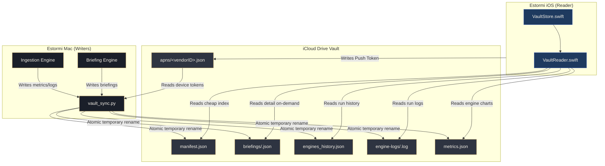

# iCloud Drive vault — payload schema

The macOS app and the iOS companion talk through a shared folder in the
user's iCloud Drive (default
`~/Library/Mobile Documents/com~apple~CloudDocs/Estormi`, override via
`ESTORMI_VAULT_DIR`). The Mac writes everything except the iOS companion's
APNs device-token file (under `apns/`) — that one is written by the iPhone
so the Mac can fan out new-briefing push notifications. iOS reads all other
vault files.

Writer:
[`packages/estormi_ingestion/shared/delivery/vault_sync.py`](../../packages/estormi_ingestion/shared/delivery/vault_sync.py).
Reader:
[`apps/estormi-ios/Sources/Vault/`](../../apps/estormi-ios/Sources/Vault/)
(`VaultReader.swift` + `VaultStore.swift`).
There is no HTTP status endpoint — the iOS app reads the vault folder
directly via a security-scoped bookmark and never talks to the server.

## File layout & Data Flow



```text
<vault_dir>/
├── manifest.json                 index + generatedAt, for cheap change detection
├── briefings/
│   └── <YYYY-MM-DD>.json         one file per daily briefing (dated history)
├── engines_history.json          rolling per-engine run log (bounded)
├── engine-logs/
│   └── <run_id>.log              full captured output of recent runs (bounded)
├── metrics.json                  whole-store snapshot, overwritten each run
└── apns/                         written by the iPhone (not the Mac)
    └── <vendorID>.json           APNs device token for push notifications
```

All writes are atomic: the writer creates a PID-namespaced temp file (`<name>.<pid>.tmp`) next to the target and then renames it, so the companion never observes a half-written file (the PID keeps two concurrent writers — the in-process engine and a manual `make daily-dag` — from clobbering each other's temp file). Every push refreshes `manifest.json` so the companion can detect changes by re-reading one small file.

## `manifest.json`

```json
{
  "generatedAt": "2026-05-24T18:41:02Z",
  "briefings": ["2026-05-24", "2026-05-23", "2026-05-22"],
  "hasEnginesHistory": true,
  "hasMetrics": true
}
```

- `generatedAt` — ISO-8601 UTC, second precision, suffix `Z`.
- `briefings` — list of available briefing dates, newest first (matches the
  filenames under `briefings/`).
- `hasEnginesHistory` — boolean advertising whether the rolling engines-history
  file has been written (advisory hint for the reader).
- `hasMetrics` — boolean advertising whether the `metrics.json` snapshot has
  been written (advisory hint for the reader).

## `briefings/<YYYY-MM-DD>.json`

One file per daily briefing. The filename is the briefing date and the same
value appears in `manifest.briefings`. The companion reads only `date` (the
filename, which also appears in `manifest.briefings`) to build the list view; it
reads the full briefing record lazily from `briefings/<date>.json` when a row is
opened for the detail screen.

```json
{
  "id": "briefing-2026-05-24",
  "title": "Briefing — May 24, 2026",
  "date": "2026-05-24",
  "htmlBody": "<article>…</article>",
  "sourceCount": 11,
  "videoCount": 3,
  "articleCount": 7,
  "generatedAt": "2026-05-24T18:41:02Z",
  "audioPath": "briefings/2026-05-24.m4a",
  "lang": "fr",
  "fields": { "objective": "…", "readiness": "…", "myDay": "…" }
}
```

- `id` — stable client key, formatted `briefing-<date>` by the writer
  (`run_briefing.py`); distinct from the bare `date` field.
- `htmlBody` — full briefing body as HTML. The writer does not emit a separate
  `excerpt`; the companion derives the list-view excerpt by stripping tags from
  `htmlBody`.
- `sourceCount` / `videoCount` / `articleCount` — counts the briefing drew on
  (sources consulted, external videos, external articles), shown on the detail
  screen.
- `generatedAt` — ISO-8601 UTC timestamp of when the briefing was composed.
- `audioPath` — **optional**, present only when the Mac synthesized narration
  for this briefing (Voxtral TTS — see `packages/memory_core/tts_local.py`). Vault-relative
  path of the `.m4a`, always `briefings/<date>.m4a`, written next to the JSON.
  The companion shows its audio player only when this is set and the file
  resolves; absent (or with the model not downloaded / TTS disabled) the
  briefing is text-only.
- `lang` — locale code of the composed briefing (e.g. `"fr"`). Rides along so the
  SPA's briefing PUT endpoint can re-render an edited field with the right
  localisation. The iOS reader currently ignores it.
- `fields` — the plain-text source of each user-editable prose section
  (`objective`, `readiness`, `myDay`), consumed by the SPA's structured field
  editor (which round-trips them back into `htmlBody`). The iOS reader currently
  ignores it.

## `briefings/<YYYY-MM-DD>.m4a`

Optional narration audio, written beside the briefing JSON when TTS is enabled
(default) and the Voxtral model is present. AAC in an MPEG-4 container, mono
24 kHz, produced on the Mac and played by the iOS companion. Written **before**
the JSON push so the APNs "ready" alert only fires once the audio exists.

## `engines_history.json`

Bounded rolling log: one record per engine completion, trimmed to the most
recent runs by `_HISTORY_MAX_RUNS`. The companion projects this into the
Metrics page (Ingestion and Briefing engine cards).

```json
{
  "version": 1,
  "generatedAt": "2026-05-24T18:41:02Z",
  "runs": [
    {
      "engine": "ingestion",
      "startedAt": "2026-05-24T02:00:00Z",
      "endedAt":   "2026-05-24T02:18:31Z",
      "durationMs": 1111000,
      "status": "ok",
      "counters": {"chunks_added": 814, "by_source": {"notes": 312, "mail": 502}},
      "logId": "ingestion-20260524T020000Z"
    }
  ]
}
```

`counters` is engine-specific (readers must tolerate unknown keys):

| Engine      | Counter keys                              |
| ----------- | ----------------------------------------- |
| `ingestion` | `chunks_added`, `by_source` (per-source map) |
| `briefing`  | `briefings_total`, `last_date`            |

A run sets `status: "ok"` or `"failed"`. The extra top-level `vaultSyncFailed:
true` marks a run that itself succeeded but whose vault snapshot push did not.

`logId`, when present, names this run's captured-log file at
`engine-logs/<logId>.log` (see below). It is absent for older runs whose log
has been pruned, and for runs that produced no output.

## `engine-logs/<run_id>.log`

Plain-text capture of one engine run's full stdout/stderr slice, written
alongside its `engines_history.json` record (`run_id` == that record's
`logId`). Only the most recent runs keep a file — `vault_sync.py` prunes the
directory to `_ENGINE_LOG_MAX_FILES` (10) — so the index stays cheap to read
and the bulky logs are fetched on demand. The companion's Metrics page loads
the matching file when the user taps a run, showing it in a modal. Each file
is capped (`_RUN_LOG_MAX_BYTES`, ~200 KB — defined and applied in
`packages/estormi_server/server/jobs.py`, via `_read_log_slice`) with a truncation marker
when the run overflowed it.

## `metrics.json`

A point-in-time mirror of the whole store, **overwritten** each engine run
(unlike `engines_history.json`, which appends). Built on the Mac by
`packages/estormi_server/server/vault_metrics.py::_build_vault_metrics` — it reads SQLite +
the connector registry, so it lives there rather than in the pure file-writer
`vault_sync.py`, which only persists the finished dict via
`push_vault_metrics`. Backs the companion's Metrics page: the total-chunk
count, the cumulative-memory stacked-area chart, and the read-only source
catalogue. (The `ingestion` timeseries is still written for compatibility
but the iOS app renders only the `memory` chart.)

```json
{
  "version": 1,
  "generatedAt": "2026-05-30T02:18:31Z",
  "totalChunks": 48210,
  "corpus": {"personal": 39500, "world": 8710},
  "bySource": {"whatsapp": 18400, "mail": 11900, "notes": 7200},
  "ingestion": {
    "days": ["2026-05-17", "…", "2026-05-30"],
    "sources": ["mail", "notes"],
    "series": [
      {"day": "2026-05-17", "total": 120, "by_source": {"mail": 80, "notes": 40}}
    ]
  },
  "memory": {
    "days": ["2026-05-17", "…", "2026-05-30"],
    "sources": ["whatsapp", "mail", "notes"],
    "series": [
      {"day": "2026-05-17", "total": 47900, "by_source": {"whatsapp": 18400}}
    ]
  },
  "sources": [
    {
      "name": "notes",
      "title": "Apple Notes",
      "description": "…",
      "chunks": 7200,
      "enabled": true,
      "lastFetchedAt": "2026-05-29T02:00:00Z",
      "historicDepth": "1y",
      "depthWindowEnv": "NOTES_DAYS_WINDOW",
      "root": null,
      "permissions": ["AppleEvents:Notes"],
      "usesWatermark": true,
      "requiresRoot": false,
      "dagStage": true,
      "dagOrder": 1
    }
  ]
}
```

- `totalChunks` / `corpus` / `bySource` — current composition (all-time counts).
- `ingestion` — daily chunks *added* per source over the window (deltas),
  bucketed by `date(ingested_at)`. The "Pulse · by source" chart.
- `memory` — cumulative chunks per source over the same window (running
  store, ending on the all-time totals). Same stacked-area idiom.
- Both time-series blocks share the `{days, sources, series[].by_source}`
  shape the web-ui SPA's `MemoriaPulse` stacked-area chart consumes (via
  `/api/timeseries`), so that renderer reads either block unchanged.
- `sources` — every registered connector with its spec metadata joined to
  live config. Read-only: the phone never mutates source settings. Sorted by
  chunk count, busiest first.
- Window length is `_VAULT_METRICS_WINDOW_DAYS` (14, matching the SPA's
  `MemoriaPulse` request of `days=14`).

## Versioning

`engines_history.json` and `metrics.json` already carry a top-level
`version: 1`. Still unversioned: `manifest.json` and `briefings/*.json` — adding
`version: int` there is the recommended next step. The companion should treat a
missing `version` as `1` and refuse files with a `version` higher than it knows
about, surfacing an "Update the companion" hint instead of best-effort parsing.
The writer should bump the field whenever
the shape changes in a way readers cannot ignore (renamed keys, dropped
fields). Tolerated extra keys do not require a bump — readers already
ignore unknown fields.
