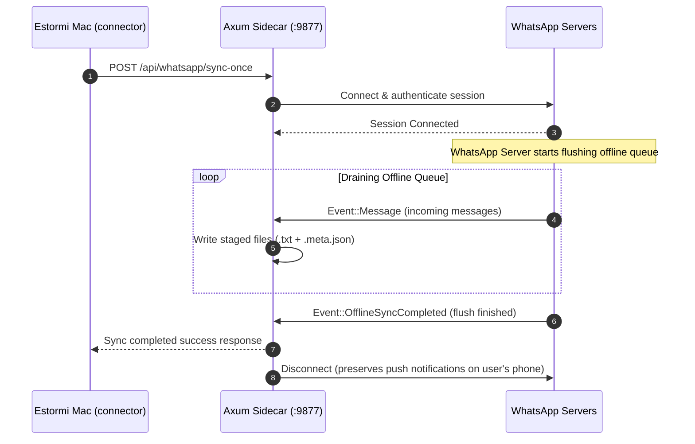
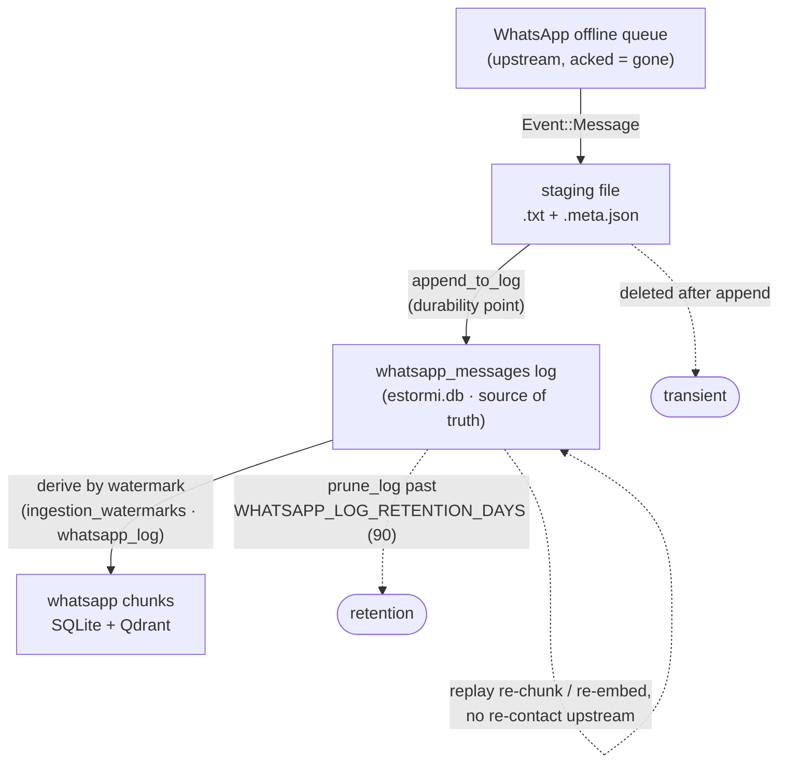
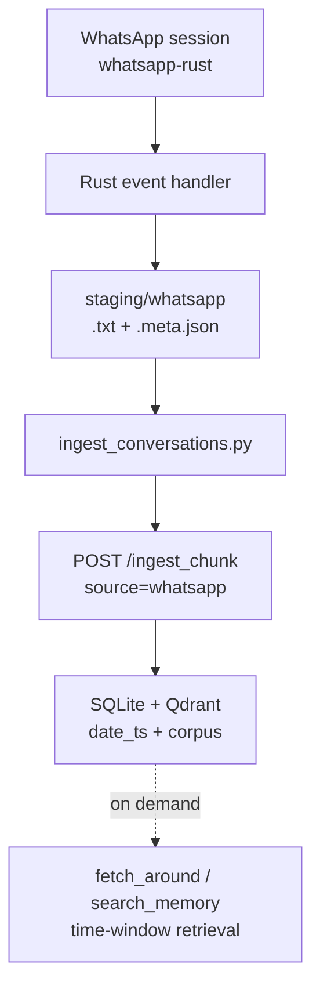

# WhatsApp Rust sidecar

This document records the current WhatsApp sidecar architecture. The old WAHA
Docker path and Python webhook receiver are no longer present in the repository.

## Summary

WhatsApp is handled by `apps/estormi-macos/src/whatsapp/`, a Rust task launched by the
Tauri app. It uses `whatsapp-rust`, stores pairing state in `wa.db`, exposes a
loopback Axum API on `127.0.0.1:9877`, writes staged message files, and leaves
conversation grouping to `packages/estormi_ingestion/whatsapp/ingest_conversations.py`.

## Runtime modes

| Mode | Behavior |
|---|---|
| Default idle mode | The Axum API starts, but the WhatsApp bot only runs during a bounded sync window. |
| `ESTORMI_WHATSAPP_ALWAYS_ON=true` | The bot runs continuously until app shutdown. |

The bounded sync window is triggered by `POST /api/whatsapp/sync-once` or lazily
when the Settings QR modal polls `/api/whatsapp/qr.png` and no QR is available.

### Why idle mode is the default — and why always-on is NOT a fix for missed messages

It is tempting to run the bridge continuously (`ESTORMI_WHATSAPP_ALWAYS_ON`) so
it captures every message live, including the user's own replies. **Do not make
this the default.** A linked WhatsApp device that stays connected is treated by
WhatsApp as *actively viewing the conversation*: it sends presence/receipts and
marks messages delivered-and-seen to the companion, which **suppresses the push
notifications on the user's real phone** — the user stops being notified of new
messages on the device they actually use. That trade is unacceptable: the
companion is a read-only memory feed, never a replacement WhatsApp client, and it
must not degrade the user's primary app.

How "since last time" is captured **without** staying online: when the bridge
reconnects for its bounded run, WhatsApp's server flushes its **offline queue**
— every message addressed to the companion while it was offline — as ordinary
`Event::Message`s. The protocol has no "fetch since timestamp T"; that queue is
the server's own watermark of what we haven't acked, so this push is the only
path for *new* messages.



The sync therefore **drains the queue to completion**: `sync_once` waits for `Event::OfflineSyncCompleted` (the server's "you now have everything" marker) instead of cutting off after a fixed idle gap — the old 20 s idle exit is now only a fallback for when nothing was queued. See `wait_for_sync_completion` in `whatsapp/sync.rs`.

### On-demand history backfill — getting more than the recent window

The offline-queue drain only delivers *new* messages and whatever **recent**
window WhatsApp volunteers when a device links — typically a few months, never
the full thread history. To reach further back, the sidecar drives WhatsApp's
**on-demand history sync** (`Client::fetch_message_history`, a PDO
`HistorySyncOnDemand` request to the user's own phone). Its responses arrive as
ordinary `Event::JoinedGroup` HistorySync pages — the same path the initial sync
uses — so they flow straight into staging.

The backfill is **reactive and one-shot per pairing**:

- On each HistorySync page, `maybe_page_older` (`whatsapp/bot.rs`) takes the
  page's oldest-message anchor and, if it's still newer than the depth horizon,
  asks the phone for the next-older batch for that chat. The response re-enters
  the same handler, walking each chat backward until the horizon is reached or
  the phone returns nothing older (`should_request_older` in `whatsapp/helpers.rs`
  gates the decision and prevents resent/overlapping pages from looping).
- The **horizon** is the source's historic-depth setting (default 2 y),
  forwarded as `backfill_days` in the `sync-once` body by
  `watch_and_ingest.sh` (`WHATSAPP_HISTORY_DAYS`, set from
  `whatsapp_historic_depth` via `apply_ingest_env_overrides`). A manual QR scan
  with no DAG context falls back to `default_backfill_days` (env
  `ESTORMI_WA_BACKFILL_DAYS`, default 730).
- It runs **once per pairing**, gated on the `wa.backfilled` marker (written
  next to `wa.db` when a backfill window ends). Subsequent nightly syncs skip the
  deep paging and just drain new messages; `reset` deletes the marker (alongside
  the session) so a re-pair re-pages the full depth.
- A backfill window uses a larger cap (`BACKFILL_CAP_SECONDS`) and a longer idle
  gap, and deliberately does **not** exit on `OfflineSyncCompleted` — the
  on-demand pages keep streaming after the offline queue drains, so only the
  idle gap signals that paging is truly done.

Depth (how far back) is ultimately bounded by what the user's phone still
stores, and the phone must be online and reachable for the duration.

### Durability — the replayable local log

WhatsApp never re-delivers an acked message, so once it leaves the offline queue
it is gone upstream. The durability chain stages each message into the local
`whatsapp_messages` log *before* deriving chunks from it, so the only true loss
window is a bridge crash between receiving a message and appending it:



The log — not staging — is the retry source: a failed chunk POST leaves the
watermark unmoved and retries next run (`content_hash` dedup makes that a no-op
for what already landed), and re-chunking / re-embedding replays from the log
without re-contacting WhatsApp. Raw text is stored verbatim; PII redaction
happens downstream at chunk time. See `ingest_conversations.py`.

> The old per-chunk `pending_reply` flag (a sender-based "last message isn't from
> me" boolean computed at ingestion) was **removed** — it was content-blind and
> went stale the moment the user replied. The briefing now pulls the recent
> conversation *tails* (`_fetch_recent_whatsapp` in `day_context.py`) and the
> day-vision judges what actually needs a reply.

## Components

| Component | Path | Role |
|---|---|---|
| Tauri launcher | `apps/estormi-macos/src/main.rs` | Starts FastAPI, tray, health loop, and WhatsApp sidecar |
| WhatsApp sidecar | `apps/estormi-macos/src/whatsapp/` | Manages session, QR, chat cache, backfill, staging, Axum API |
| Settings proxy | `packages/estormi_server/api/whatsapp_settings.py` | Proxies status, QR, reset, chats, and chat category updates |
| WhatsApp ingestion | `packages/estormi_ingestion/whatsapp/watch_and_ingest.sh` | Triggers bounded sync, then ingests |
| Conversation ingestor | `packages/estormi_ingestion/whatsapp/ingest_conversations.py` | Appends staging → durable `whatsapp_messages` log, then derives chunks from the log by timestamp watermark |
| Durable log | `whatsapp_messages` table (estormi.db) | Replayable source of truth; staging is only the transient hop |

WhatsApp ingestion stops at chunks. There is no per-source commitment or
correlation pass — follow-ups and threads are derived on demand from
time-window retrieval (`date_ts` + the `fetch_around` MCP tool) over all
already-ingested conversation chunks. See
[../architecture/engines.md](../architecture/engines.md).

## Sidecar API

The sidecar binds only to loopback:

```text
http://127.0.0.1:9877
```

**Authentication.** Every sidecar endpoint requires the per-launch shared
secret in the `x-estormi-wa-token` request header. The Tauri host generates
the token at startup, exports it as `ESTORMI_WA_TOKEN`, and the in-process
Axum API rejects any request without a constant-time match (the `ct_eq`
compare against the `ESTORMI_WA_TOKEN` env value in
`apps/estormi-macos/src/whatsapp/`). Requests missing or mismatching the
header return `401 unauthorized`.

| Method | Endpoint | Description |
|---|---|---|
| `GET` | `/api/whatsapp/status` | Returns `connected`, `paired`, `session_state`, and `always_on` |
| `POST` | `/api/whatsapp/reset` | Clears in-memory QR/status/chat cache state and (in idle mode) the `wa.db` session store |
| `GET` | `/api/whatsapp/qr.png` | Returns latest QR PNG or `204`; in idle mode it can trigger a bounded bot run |
| `GET` | `/api/whatsapp/chats` | Returns cached chat IDs, names, `status` (About fallback), and `is_group` |
| `POST` | `/api/whatsapp/sync-once` | Runs a bounded sync window; JSON body can set `seconds` and `backfill_days` |

`sync-once.seconds` is clamped between 30 and 1800 seconds. The default is 300.
`sync-once.backfill_days` sets the on-demand history horizon for a fresh-pair
backfill (see [On-demand history backfill](#on-demand-history-backfill--getting-more-than-the-recent-window));
omitted, it falls back to `default_backfill_days` (2 y).

## Data flow



Staged files are plaintext until ingestion cleanup. They live under the Tauri
application data directory, currently
`~/Library/Application Support/app.estormi.local`.

## Staging format

Each message is written as a text file plus metadata file using a stable hashed
file name:

```text
<sha256-prefix>.txt
<sha256-prefix>.meta.json
```

Metadata fields currently written by the sidecar:

| Field | Meaning |
|---|---|
| `id` | WhatsApp message ID, or `chat_id:message_id` for history backfill |
| `chat_id` | Raw chat JID |
| `chat_name` | Cached group/DM display name when known |
| `name` | Sender display name, `Me`, participant JID, or fallback |
| `timestamp_iso` | ISO timestamp |
| `is_group` | Boolean group hint |

## Conversation ingestion

`ingest_conversations.py` groups staged messages by chat and by a silence window
(`WHATSAPP_WINDOW_GAP_SECONDS`, default 1800). It skips trivial windows and
posts chunks with:

| Field | Value |
|---|---|
| `source` | `whatsapp` |
| `source_id` | `{chat_id}:{window_start_ts}` |
| `group_type` | Category from `whatsapp_chats`, or the literal `"unknown"` when the chat is not in the cache (`_group_type_for`) |
| `chat_id_raw` | Raw chat JID |

The ingestor no longer computes a `pending_reply` flag (removed — see the note in
[Runtime modes](#why-idle-mode-is-the-default--and-why-always-on-is-not-a-fix-for-missed-messages)).
The `chunks.pending_reply` column and the `search_memory` filter param remain in
the storage/MCP layer for now but are inert; a later cleanup can drop them.

After successful ingestion, the script cleans up processed staging files unless
run in dry-run mode.

## Settings integration

Settings proxies the sidecar rather than exposing `:9877` directly to the user:

| App endpoint | Sidecar endpoint |
|---|---|
| `/api/whatsapp/status` | `/api/whatsapp/status` |
| `/api/whatsapp/qr.png` | `/api/whatsapp/qr.png` |
| `/api/whatsapp/reset` | `/api/whatsapp/reset` plus local `wa.db` removal |
| `/api/whatsapp/chats` | Sidecar chat cache plus SQLite `whatsapp_chats` categories |

Chat categories are stored in SQLite through the Settings API.

## Useful commands

```bash
# Every sidecar call must carry the per-launch token (see ESTORMI_WA_TOKEN).
export WA_TOKEN="$ESTORMI_WA_TOKEN"

curl -H "x-estormi-wa-token: $WA_TOKEN" \
  http://127.0.0.1:9877/api/whatsapp/status
curl -H "x-estormi-wa-token: $WA_TOKEN" \
  http://127.0.0.1:9877/api/whatsapp/chats
curl -H "x-estormi-wa-token: $WA_TOKEN" \
  -o qr.png http://127.0.0.1:9877/api/whatsapp/qr.png
curl -X POST http://127.0.0.1:9877/api/whatsapp/sync-once \
  -H "x-estormi-wa-token: $WA_TOKEN" \
  -H 'Content-Type: application/json' \
  -d '{"seconds":60}'
bash packages/estormi_ingestion/whatsapp/watch_and_ingest.sh
```

## Known risks

| Risk | Current mitigation |
|---|---|
| Sidecar port conflict | Logs the bind error and leaves the main app running |
| Session invalidation | Status becomes `UNPAIRED`; Settings can show a QR again |
| Large history backfill | On-demand paging runs once per pairing within a bounded window, capped at `MAX_BACKFILL_REQUESTS`; writes per conversation asynchronously. A window that hits its cap mid-page still stamps `wa.backfilled` (re-paging every run would hammer the phone) — `reset` + re-pair to retry a deeper pull. |
| WhatsApp only volunteers a recent window on pairing | On-demand history sync (`fetch_message_history`) pages older messages per chat back to the depth horizon; bounded by what the phone still stores, and requires the phone online for the run. |
| Plaintext staging | Staging remains inside the local app data directory and is cleaned after ingestion |
| Messages sent while the bridge is idle | Captured on next reconnect by draining the offline queue to `Event::OfflineSyncCompleted` (not a fixed idle gap). Continuous capture (`ESTORMI_WHATSAPP_ALWAYS_ON`) is rejected — it suppresses phone notifications. See [Why idle mode is the default](#why-idle-mode-is-the-default--and-why-always-on-is-not-a-fix-for-missed-messages). |
| WhatsApp never re-delivers an acked message | The durable `whatsapp_messages` log is the local source of truth; chunks are derived from it by watermark, so a failed/changed ingestion replays from the log without re-contacting WhatsApp. |
