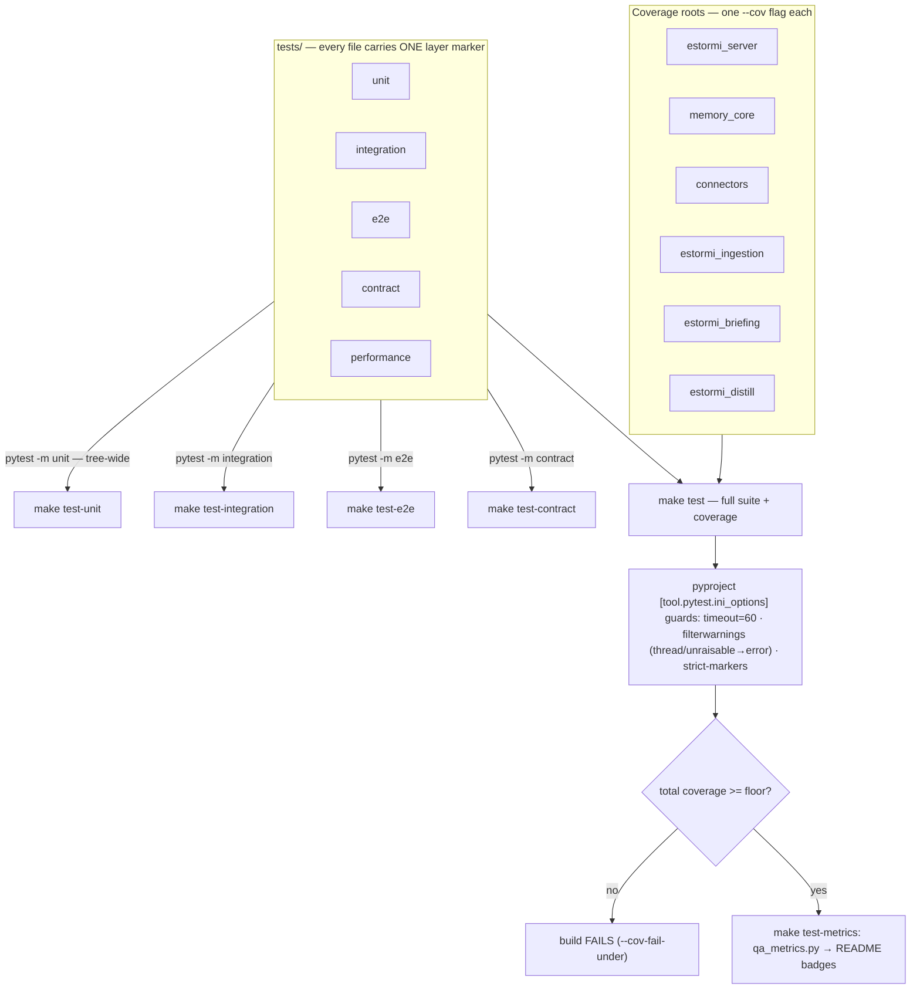
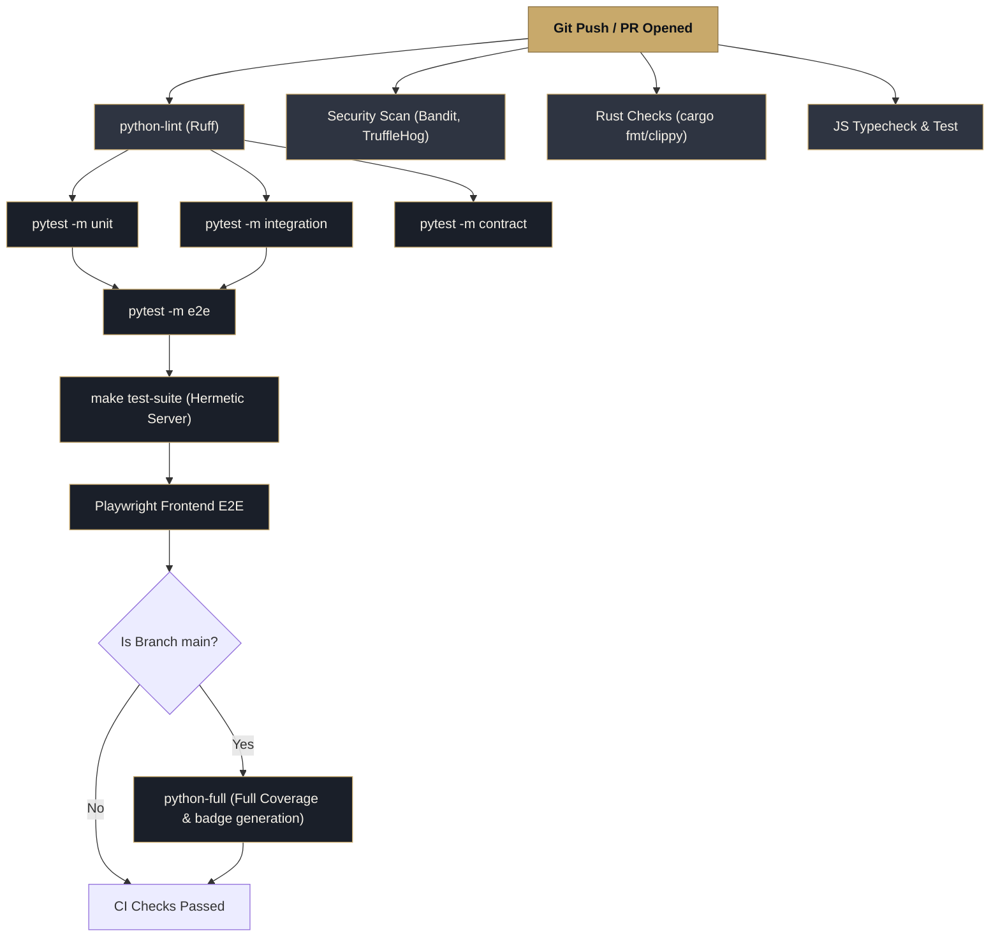

<p align="center">
  <picture>
    <source media="(prefers-color-scheme: dark)" srcset="../assets/brand/estormi-wordmark-dark.svg">
    
  </picture>
</p>

<p align="center">
  <picture>
    <source media="(prefers-color-scheme: dark)" srcset="../assets/brand/estormi-divider.svg">
    
  </picture>
</p>

# Testing and validation

Use this page when you want to know whether Estormi is healthy from the app or
from a source checkout. App checks prove the local installation is usable.
Developer tests prove the repository behavior has not regressed.

## Healthy app checklist

| Check | Where | Healthy result |
|---|---|---|
| Server status | sources panel | Server is reachable. |
| Source freshness | sources panel | Enabled sources are fresh or explainably aging. |
| Ingestion pipeline | sources panel | Last run completed or failures are isolated. |
| Model status | Maintenance modal | Local model is downloaded when the briefing needs it. |
| Search | Assistant | Known memory can be found. |
| Briefing | Briefing modal | A scheduled run produces a dated briefing. |

## After first setup

Open the sources panel and confirm source cards appear. Counts may be zero for sources
you did not enable. A newly enabled source can remain busy until the first
pipeline run completes.

Then search for something easy and unique: a recent note title, a project name,
or a phrase from a document. If search works, the ingestion and retrieval path
is alive.

## After changing settings

Change one setting, run or wait for sync, then inspect the sources panel and its
ingestion pipeline panel. This makes it clear which change caused any regression.

## After enabling Claude

Ask Claude to search for a narrow memory. Then check the audit log for that
search. The query should be visible, and the result count should match
what you expected.

## Common validation patterns

| Goal | Best check |
|---|---|
| "Did a source sync?" | sources panel freshness plus ingestion pipeline stage status. |
| "Did search index it?" | Search for a unique phrase from that source. |
| "Did the briefing run?" | Briefing modal shows a fresh dated briefing. |
| "Did Claude use Estormi?" | Recent searches in the audit log. |
| "Is LAN access safe?" | The app should show local-only unless you enabled LAN intentionally. |

## Developer validation

> **TL;DR — run `make test` before committing.** It runs the full pytest suite
> with coverage and is the one command the 90% case needs.

### Which command do I run?

| Situation | Command |
|---|---|
| About to commit (the default) | `make test` |
| Iterating on one layer | `make test-unit` / `make test-integration` / `make test-e2e` / `make test-contract` |
| Fast inner loop (skip slow/E2E/perf) | `make test-fast` |
| Latency/throughput benchmarks | `make test-performance` |
| End-to-end runtime smoke (hermetic server) | `make test-suite` |
| The SPA + design-system suites | `make test-frontend` |
| The macOS Rust shell | `make test-rust` |
| The full local release gate | `make check` |

```bash
make test
```

`make test` runs the full pytest suite with coverage over the six Python
package roots — `estormi_server`, `memory_core`, `connectors`,
`estormi_ingestion`, `estormi_briefing`, and `estormi_distill` (each passed as
its own `--cov` flag) — and fails if total line coverage drops below the floor
(see the `test` target in [`make/test.mk`](../make/test.mk) for the exact
invocation). The README QA badges are refreshed from the resulting
`build/coverage/coverage.json` by `make test-metrics` (`scripts/qa_metrics.py`).

Each layer target selects tests by marker across the whole `tests/` tree, so a
test runs under its layer regardless of which directory holds the file. The
union of `test-unit`, `test-integration`, `test-e2e`, and `test-contract` is the
full correctness suite; `make test` runs it at once with coverage. The
`performance` benchmarks are a separate fifth layer — wall-clock latency/
throughput thresholds, run on demand via `make test-performance` and kept out of
`make test` so a loaded machine can't redden the coverage gate.

The full suite covers pure helpers, FastAPI routes, MCP JSON-RPC behavior,
ingestion regressions, pipeline parsing, knowledge/briefing runs,
setup/settings pages, docs rendering, Mermaid blocks, sanitizer behavior, and
end-to-end API lifecycle scenarios.

`tests/e2e/test_search_roundtrip_real.py` is the one exception to the mocking
convention: it exercises a **real embedded Qdrant + real fastembed embeddings**
(marked `e2e` + `slow`) where the rest of the suite mocks both boundaries.

### Frontend tests

The Python suite does not cover the SPA. `make test-frontend` runs the Vitest
suites locally — `@estormi/ui-kit` plus `@estormi/web-ui`. The web-ui's
Playwright end-to-end suite (`packages/web-ui/e2e/`) runs via
`make test-e2e-frontend` (needs `playwright install` first) and in the
`frontend` CI job; it is not part of `make test-frontend` or the local
`make check` gate.

The macOS Tauri shell's Rust unit tests (the iMessage FDA-snapshot and WhatsApp
staging modules, `apps/estormi-macos/src/`) run via `make test-rust` (`cargo
test`); they are not part of `make test`.

iOS has its own test target, `EstormiTests` (`apps/estormi-ios/Tests/`, Swift
Testing). It is built and run via Xcode, not the `make` targets above.

## Test architecture

Every test carries **at least one** layer marker — usually exactly one, though a
few cross-cutting tests (e.g. a runtime-vs-schema check that is both
`integration` and `contract`) carry two and run under each. The marker — not the
directory — decides which `make` target runs it, and a contract test
(`tests/contract/test_marker_convention.py`) enforces that no test is left
unmarked.



`make test` runs everything at once, measures coverage across all six package
roots, and enforces the `--cov-fail-under` floor; the badge refresh lives in
its own target, `make test-metrics`. The
orthogonal markers `regression` and `slow` are added *alongside* a layer marker,
never instead of one.

| Marker | Role |
|---|---|
| `unit` | Pure functions and tooling. No app server or external boundary. |
| `integration` | Cross-module tests with SQLite, mocked Qdrant, or runtime contracts. |
| `e2e` | Public API scenarios that exercise real user flows through the FastAPI app. |
| `contract` | Documentation, schema, Makefile, and CI-workflow contracts. |
| `performance` | Latency and throughput benchmarks with explicit thresholds. |

Secondary markers (`regression`, `slow`) are orthogonal: a test keeps its layer
marker and adds these when applicable.

The suite mirrors the source tree — each package has a matching test dir
(`tests/estormi_server/`, `tests/estormi_ingestion/`, `tests/estormi_briefing/`,
`tests/estormi_distill/`, `tests/memory_core/`, `tests/connectors/`); the
cross-cutting category dirs (`tests/e2e/`, `tests/contract/`,
`tests/performance/`, `tests/tooling/`) group by test layer.
Layer selection is by marker, not path, so a file runs under its
`make test-<layer>` target wherever it lives. Put a new test in the file that
already owns the module under test and give it the right marker.
`tests/helpers/` holds shared fixtures — do not duplicate production schema
there.

The README badge reports the active QA layers as
`unit+integration+e2e+contract` when all four markers have tests. The
repository contract tests keep this documentation, the Makefile, and the CI
workflow commands aligned.

Fixture databases are built from the production SQLite schema: `tests/conftest.py`
calls `apply_runtime_schema` from `tests/helpers/database.py`, which imports the
real `INIT_SQL` and `MIGRATION_SQL` from `estormi_server.sql.schema`. This keeps
fixture databases aligned with runtime startup and prevents AI-agent edits from
silently forking the test schema.

## CI validation

GitHub Actions runs the `QA` workflow (`.github/workflows/test.yml`) on pull requests and pushes to `main`. It performs Python linting, the unit/integration/E2E/contract layer checks, the frontend Vitest + Playwright checks, the hermetic runtime suite, and (on pushes to `main`) the full coverage suite with JUnit and badge artifacts. Security and Rust checks live in their own workflows.



The table below is the canonical map of every CI job:

| Job | Workflow | Runs | When |
|---|---|---|---|
| `python-lint` | QA (`test.yml`) | `ruff check` + `ruff format --check` | PR + push |
| `python-typecheck` | QA (`test.yml`) | `pyright` (mirrors `make typecheck`) | PR + push |
| `python-unit` | QA (`test.yml`) | `pytest -m unit` | PR + push |
| `python-integration` | QA (`test.yml`) | `pytest -m integration` | PR + push |
| `python-e2e` | QA (`test.yml`) | `pytest -m e2e` | PR + push |
| `python-contract` | QA (`test.yml`) | `pytest -m contract` | PR + push |
| `frontend` | QA (`test.yml`) | `pnpm --filter @estormi/web-ui test:coverage` (Vitest) + `test:e2e` (Playwright) | PR + push |
| `runtime-suite` | QA (`test.yml`) | `make test-suite` (hermetic server + synthetic sources) | PR + push |
| `python-full` | QA (`test.yml`) | full `pytest` + coverage + JUnit + badge artifacts | push to `main` only |
| Security | `security.yml` | bandit, pip-audit, TruffleHog history scan | PR + push |
| Rust | `rust.yml` | `cargo fmt` / clippy / audit | PR + push (on macOS-shell paths) |
| iOS | `ios.yml` | XcodeGen + `xcodebuild test` for the SwiftUI companion | PR + push (on iOS / ui-kit paths) |
| JS | `js.yml` | `pnpm -r typecheck` + `pnpm -r test` for web-ui / ui-kit | PR + push (on package paths) |
| CodeQL | `codeql.yml` | Static analysis for Python + TypeScript/JavaScript | PR + push + weekly schedule |

The separate `Release` workflow (`release.yml`) is tag-only (`v*`). It lints and tests before
building the macOS DMG, and should not run during normal documentation, test, or
pipeline review work unless a version tag is pushed intentionally.

The `runtime-suite` job runs `make test-suite` — also runnable locally for an
end-to-end runtime check. It starts its own Estormi server, points it at a
temporary `ESTORMI_DATA_DIR`, seeds synthetic source data, and checks search
filters, sanitizer behavior, deduplication, date filters, result shape, semantic
retrieval, and basic datastore integrity. It does not require `.env`, a running
server, real local memories, Qdrant data from a previous run, or LaunchAgents.
Prefix with `ESTORMI_KEEP_TEST_DATA=1` to inspect the temporary database, Qdrant
index, or server log after a failure.

## Coverage expectations

Coverage is reported in the terminal by `make test` and gated by
`--cov-fail-under=80`: the run fails if total line coverage across the six
package roots (`estormi_server`, `memory_core`, `connectors`,
`estormi_ingestion`, `estormi_briefing`, `estormi_distill`) drops below the
floor. Raise the floor as coverage improves — never lower it to make
a red build pass. Lower line coverage is still expected in individual modules
that orchestrate subprocesses, local models, launchd, Tauri/WhatsApp, or large
HTML-rendered UI pages; those paths are also covered through targeted behavior
tests and smoke validation.

When a change touches shared retrieval, ingestion, settings, security,
or API contracts, add or update focused tests in `tests/` and keep
the full suite green. If coverage drops materially, explain why or add tests for
the missing branch.

To refresh the README badge after a coverage run:

```bash
.venv/bin/python scripts/qa_metrics.py build/coverage/coverage.json assets/badges
```

The badge banner tracks coverage, collected pytest count, and active QA layers.
CI uploads `test-results.xml` as a pytest report artifact and updates the badges
on `main`.
