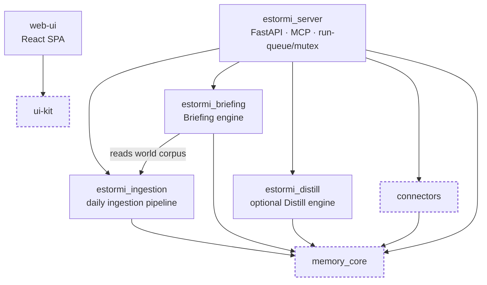

# packages

Shared packages for the Estormi monorepo — the six first-party Python packages
and the JS workspaces side by side. The live server is
`packages/estormi_server/`, which drives the **three engines**: Ingestion →
Briefing, plus the optional off-path Distill.

## Dependency direction

The four `estormi_` packages are the engine/server layer; `memory_core`,
`connectors`, and `ui-kit` are the pure-library leaves they build on. Every edge
points **down** — `estormi_briefing` reads back through `estormi_ingestion`, but
no engine ever imports up into `estormi_server`, and `connectors` drives the
ingestion scripts by path/module string without importing the engine (which
would invert the direction).

*Dashed = pure-library leaves (no upward imports). `connectors` drives ingestion
scripts but never imports the engine.*

## Python packages

Each package ships its own `README.md`; the lines below are pointers, not a
restatement.

- `packages/estormi_server/` — live backend; SQLite chunk store + Qdrant vectors
  under `storage/`. See `docs/architecture/engines.md`.
- `packages/estormi_ingestion/` — the daily ingestion pipeline. See
  `docs/connectors.md`.
- `packages/estormi_briefing/` — the Briefing engine (entrypoint
  `run_briefing.py`).
- `packages/estormi_distill/` — the optional Distill engine (Apple Silicon
  only). See `docs/architecture/distillation.md`.
- `packages/memory_core/` — pure domain/support: settings, DAG run-state,
  embeddings, sanitizer, audit.
- `packages/connectors/` — per-source connector bases (`ConnectorRegistry`,
  `ShellConnector` / `ScriptConnector`). See `docs/connectors.md`.

## Frontend packages

- `web-ui/` — React SPA (compact one-pager) served by the server.
- `ui-kit/` — React component library; the Estormi manuscript design system.
  Design tokens live in `ui-kit/src/tokens.css`; brand artwork and the
  self-hosted webfonts live in repo-root `assets/` (`assets/brand`, `assets/fonts`).

## Layer rules (never violate)

- `memory_core`: no HTTP imports — pure storage/retrieval.
- `connectors`: shared, never duplicated per app; never imports the engine it drives.
