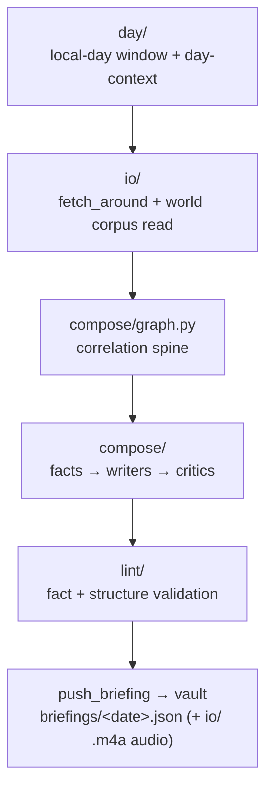

# estormi_briefing

The **Briefing** engine: turns the structured memory into the daily briefing.
It runs through the same run-queue and engine mutex as Ingestion (one engine at
a time) and is launched as a subprocess by
`packages/estormi_server/server/launchers/briefing.py`. How it composes the
briefing — facts, writers, and critics — is documented in
[`../../docs/architecture/briefing-generation.md`](../../docs/architecture/briefing-generation.md).

Quick map:

| Path | Role |
|---|---|
| `run_briefing.py` | Engine entrypoint (the process the launcher spawns); pushes the finished `briefings/<date>.json` to the vault via `push_briefing` from `estormi_ingestion.shared.delivery.vault_sync`. |
| `compose/` | Composition stages; `compose/graph.py` is the deterministic correlation graph that threads events across sources from `fetch_around` results (correlation is emergent from time-window retrieval, not a stored engine). |
| `day/` | Local-day windowing and day-context assembly. |
| `llm/` | Provider-switchable model calls and per-stage routing. |
| `lint/` | Output linting/validation of the composed briefing. |
| `io/` | Read/enrich path: reads the `world` corpus back (`world_corpus.py`), the MCP read wrappers (`mcp_io.py`), keyless weather enrichment (`enrichments.py`), and the spoken-edition `.m4a` audio write (`delivery.py`). |
| `stage_harness.py` | Iterate on a single composition stage in isolation. |

A run threads through the subdirectories in this order (the *stage* model —
facts, writers, critics — is in
[`../../docs/architecture/briefing-generation.md`](../../docs/architecture/briefing-generation.md)):

Layering: this package depends on `memory_core` and reads down into
`packages/estormi_ingestion/`, but never reaches up into
`packages/estormi_server/`. See
[`../../docs/architecture/engines.md`](../../docs/architecture/engines.md).
