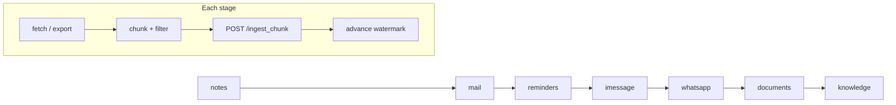

# estormi_ingestion

Per-source ingestion scripts driven by the connector framework in
`packages/connectors/`. The full skill is
[`.claude/skills/ingestion/SKILL.md`](../../.claude/skills/ingestion/SKILL.md)
— it covers the nightly pipeline, watermarks, the Briefing pipeline, vault
sync, and how to add a new source.

## Nightly pipeline

The unattended nightly run is the **seven default stages**, in `dag_order`.
Each stage runs the same loop: fetch/export the source, chunk and filter the
text, `POST /ingest_chunk`, then advance its watermark.

Stages are owned by the connector registry in `packages/connectors/`;
`scripts/daily_ingestion.sh` derives the ordered list from
`python -m connectors stages`. The two on-demand stages (`gcal`, `whoop`,
`default_stage=False`) are pipeline stages (`dag_stage=True`) but sit out the
nightly run-all; they appear under `connectors stages --all` and fire only on
a per-source ▶ or a scoped pipeline run.

| `dag_order` | Source | Stored source | On-demand? | Corpus |
|---|---|---|---|---|
| 1 | `apple_notes/` | `notes` | | personal |
| 2 | `apple_mail/` | `mail` | | personal |
| 4 | `google_calendar/` | `gcal` | on-demand | personal |
| 5 | `reminders/` | `reminders` | | personal |
| 6 | `imessage/` | `imessage` | | personal |
| 7 | `whatsapp/` | `whatsapp` | | personal |
| 8 | `documents/` | `documents` | | personal |
| 11 | `knowledge/` | `knowledge` | | world |
| 12 | `whoop/` | `whoop` | on-demand | personal |

*Corpus* is not a stage field: chunks derive `corpus=world` server-side when
the stored source is in `WORLD_SOURCES`
(`packages/estormi_server/storage/writers.py`), else `personal`. `knowledge/`
is world-corpus ingestion (`ingest_world.py`, `knowledge_fetch.py`); the
Briefing engine that reads it back lives in `packages/estormi_briefing/`.

## Shared layer

- `shared/` — chunking (`chunker.py`), watermarks (`watermark.py`), the
  shared chunk-emit loop (`emit.py`), and vault sync to iCloud Drive
  (`shared/delivery/vault_sync.py`). PII redaction is **not** here — it is the
  server-side text-safety layer in `packages/memory_core/pii_filter.py`.

Rule: connector logic lives in `packages/connectors/`, never here or in
the apps. Scripts here are thin orchestration around the connector
specs.
